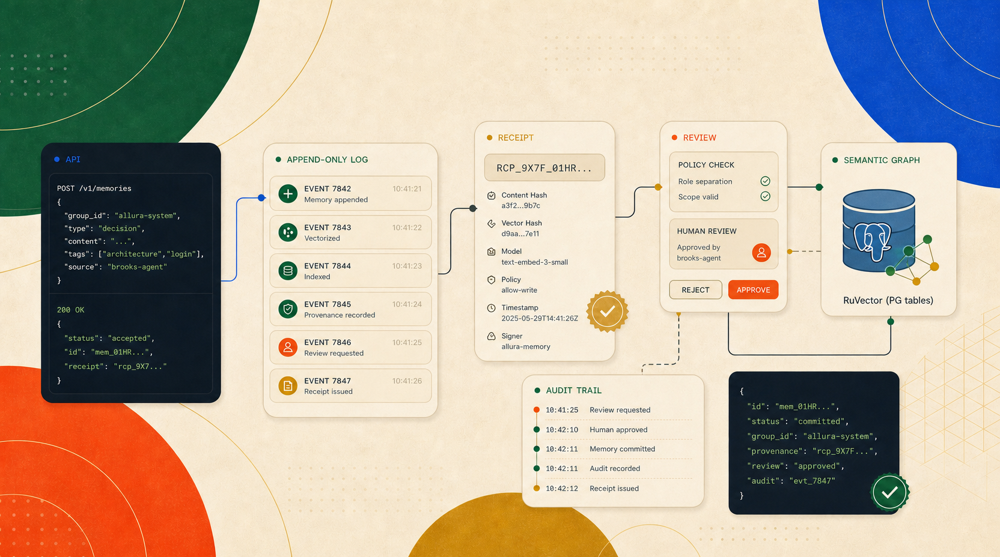
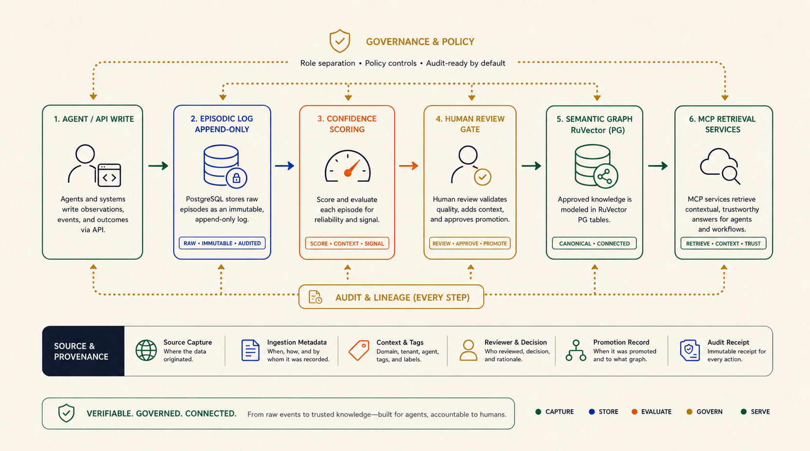
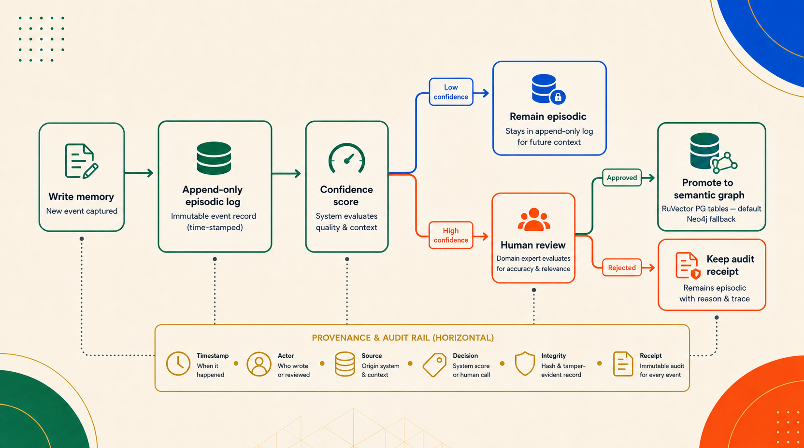

<p align="center">
  
</p>

<h1 align="center">Memory That Shows Its Work</h1>

<p align="center">
  <strong>Self-hosted, governed AI memory</strong><br/>
  Traceable capture, human-in-the-loop curation, and dual-layer storage for agents that need context they can explain.
</p>

<p align="center">
  <a href="#start-here">Start Here</a> · <a href="#quick-start">Quick Start</a> · <a href="#architecture">Architecture</a> · <a href="#features">Features</a> · <a href="#allura-cowork-plugin">Cowork Plugin</a> · <a href="#deployment">Deployment</a> · <a href="catalog/README.md">Catalog</a> · <a href="docs/allura/BLUEPRINT.md">Blueprint</a>
</p>

---

<p align="center">
  
</p>

## Why Allura?

AI agents forget. Sessions end, context evaporates, and your team's hard-won knowledge disappears into the void.

Allura gives your agents **persistent, inspectable memory** — not a black box that silently decides what matters. Every memory is captured, scored, and routed through a clear pipeline where human judgment stays in the loop.

**Allura is for teams that want:**
- 🔍 **Inspectability** — trace what was recorded, when, and why it was promoted
- 🏛️ **Governance** — approval gates between raw capture and long-term knowledge
- 🔒 **Self-hosting** — your data, your infrastructure, your rules
- 🧩 **MCP-native** — plug into Claude, Cursor, OpenCode, or any MCP-compatible agent
- 💻 **API-first operations** — MCP, CLI, and service endpoints with inspectable receipts

---
## Start Here

New to Allura? Pick your path:

| I want to… | Start with |
|------------|-----------|
| **Understand what Allura does** | Read [Why Allura?](#why-allura) above, then [Architecture](#architecture) |
| **Install and connect my agent** | [`docs/user-guide/getting-started.md`](docs/user-guide/getting-started.md) |
| **Use Claude Code with Allura** | [`docs/user-guide/claude.md`](docs/user-guide/claude.md) |
| **Use Codex with Allura** | [`docs/user-guide/codex.md`](docs/user-guide/codex.md) |
| **Use Claude + Codex together** | [`docs/user-guide/cowork.md`](docs/user-guide/cowork.md) |
| **Browse plugins** | [`catalog/plugins.md`](catalog/plugins.md) |
| **See integration examples** | [`catalog/examples.md`](catalog/examples.md) |
| **Understand governance rules** | [`catalog/gates.md`](catalog/gates.md) |
| **Read the canonical architecture** | [`docs/allura/BLUEPRINT.md`](docs/allura/BLUEPRINT.md) |

**Quick verification after install:**
```bash
docker compose up -d
curl http://localhost:3201/health
```

---
## Architecture

<p align="center">
  
</p>

Allura uses a **dual-layer memory architecture** — two purpose-built stores, each doing what it does best:

| Layer | Store | Role | Write Pattern |
|-------|-------|------|---------------|
| **Episodic** | PostgreSQL | Raw event capture, audit trail, high-volume traces | Append-only |
| **Semantic** | Neo4j | Curated knowledge, versioned relationships, promotion-gated | Review → Promote |

**The rule:** Every memory starts in PostgreSQL. Knowledge moves to Neo4j only after scoring and (optionally) curator review. History is never overwritten — superseded nodes are deprecated, not deleted.

### Memory Flow

<p align="center">
  
</p>

```
Agent writes memory
  ↓
PostgreSQL stores append-only event (episodic layer)
  ↓
Content is scored (0–1 confidence)
  ↓
┌─ score < threshold → stays episodic (retrievable, not promoted)
└─ score ≥ threshold → enters review queue
      ↓
  Curator approves or rejects
      ↓
  Approved → promoted to Neo4j (semantic layer)
  Rejected → stays episodic with audit record
```

### Vector Search

Allura embeds every memory at write time using **Qwen3 Matryoshka embeddings** (1024d) via Ollama. Queries use **hybrid ANN + BM25 ranking** through pgvector HNSW indexes for semantic retrieval across both stores.

---

## Features

<p align="center">
  
</p>

| Feature | Description |
|---------|-------------|
| **Dual-layer storage** | PostgreSQL (episodic) + Neo4j (semantic) with clear promotion boundary |
| **Append-only audit trail** | Every write is an immutable event — reconstruct any point in time |
| **Human-in-the-loop curation** | Score-gated review queue before knowledge promotion |
| **Multi-tenant isolation** | `group_id`-based boundaries at the schema level |
| **MCP protocol native** | Stdio + Streamable HTTP gateway for any MCP-compatible agent |
| **Vector search** | pgvector HNSW (episodic) + Neo4j (semantic) via hybrid ANN + BM25 ranking |
| **Plugin harness** | MCP server discovery, approval, and routing |
| **Claude/Codex cowork plugin** | Shared handoff protocol, runtime honesty rules, validation reminders, and receipt-first collaboration |
| **Self-hostable** | Docker Compose — no external auth dependencies |
| **Versioned knowledge** | `SUPERSEDES` relationships in Neo4j — old facts are deprecated, not erased |
| **API-first operations** | MCP, CLI, and HTTP endpoints with inspectable receipts |

---

## Allura Cowork Plugin

Allura includes a local plugin package for teams pairing Claude Code and Codex:
[`plugins/allura-cowork/`](plugins/allura-cowork/).

The plugin gives new users a governed workflow before they know every Allura
rule. It helps agents:

- identify the active runtime instead of blurring Claude, Codex, OpenCode, and
  OpenClaw together;
- search Allura Brain before planning when prior decisions or preferences
  matter;
- create structured handoff packets between Claude and Codex;
- validate claims before calling work done;
- write receipts after substantive work;
- keep approval-required actions separate from completed work.

It does **not** claim to prevent hallucinations. It reduces unsupported claims by
making missing memory search, missing validation, and unexecuted handoffs visible
before they become Done claims.

Included surfaces:

| Path | Purpose |
|------|---------|
| [`plugins/allura-cowork/.codex-plugin/plugin.json`](plugins/allura-cowork/.codex-plugin/plugin.json) | Codex plugin manifest |
| [`plugins/allura-cowork/.claude-plugin/plugin.json`](plugins/allura-cowork/.claude-plugin/plugin.json) | Claude plugin manifest |
| [`plugins/allura-cowork/skills/allura-cowork/SKILL.md`](plugins/allura-cowork/skills/allura-cowork/SKILL.md) | Shared cowork rules and handoff format |
| [`plugins/allura-cowork/commands/`](plugins/allura-cowork/commands/) | `cowork-start`, `cowork-handoff`, `cowork-validate`, and `cowork-close` command docs |
| [`plugins/allura-cowork/schemas/handoff.schema.json`](plugins/allura-cowork/schemas/handoff.schema.json) | Machine-readable handoff packet schema |
| [`plugins/allura-cowork/scripts/validate_plugin.py`](plugins/allura-cowork/scripts/validate_plugin.py) | Local package validator |

Validate the package from the repo root:

```bash
python3 plugins/allura-cowork/scripts/validate_plugin.py plugins/allura-cowork
```

---

## Quick Start

### Prerequisites

- **Docker** + Docker Compose
- **Bun** 1.0+
- **Ollama** (for local embeddings — pull `qwen3-embedding:8b`)

### 1. Clone & Configure

```bash
git clone https://github.com/Charitablebusinessronin/Allura_Memory.git
cd Allura_Memory
bun install

cp .env.example .env
# Edit .env with your database credentials and JWT secret
```

### 2. Start Infrastructure

```bash
docker compose up -d
```

This brings up PostgreSQL, Neo4j, and the Allura Brain HTTP gateway.

### 3. Verify

The MCP HTTP gateway runs on port **3201** by default. Check availability:

```bash
# MCP Streamable HTTP endpoint (primary integration path)
curl -X POST http://localhost:3201/mcp \
  -H "Content-Type: application/json" \
  -d '{"jsonrpc":"2.0","method":"tools/list","id":1}'

# Health check (MCP HTTP gateway)
curl http://localhost:3201/health
# → { "status": "healthy", "interface": "mcp-http", "transports": ["streamable-http"], ... }

# Liveness check (process heartbeat)  
curl http://localhost:3201/live
# → { "alive": true, "uptime": 123.45, "timestamp": "2026-04-20..." }

# Readiness check (PostgreSQL, Neo4j, MCP initialized)
curl http://localhost:3201/ready
# → { "ready": true, ... }
```

### 4. Connect Your Agent

Add to your MCP client config (Claude Desktop, Cursor, etc.):

**Stdio:**
```json
{
  "mcpServers": {
    "allura": {
      "command": "bun",
      "args": ["src/mcp/memory-server-canonical.ts"]
    }
  }
}
```

**HTTP Gateway:**
```json
{
  "mcpServers": {
    "allura": {
      "url": "http://localhost:3201/mcp"
    }
  }
}
```

### 5. Use the Tools

All memory operations require `group_id` and `user_id` for multi-tenant isolation.

```typescript
// Store a memory
memory_add({
  group_id: "allura-myteam",
  user_id: "alice",
  content: "Alice prefers dark mode for all UIs",
  metadata: {
    source: "conversation"
  },
  threshold: 0.85
})

// Search memories
memory_search({
  query: "dark mode preferences",
  group_id: "allura-myteam",
  user_id: "alice"
})

// Retrieve a specific memory
memory_get({
  id: "mem_7f9e2c3a1b5d",
  group_id: "allura-myteam"
})

// List all memories for a user
memory_list({
  group_id: "allura-myteam",
  user_id: "alice"
})

// Delete (soft — recoverable within 30 days)
memory_delete({
  id: "mem_7f9e2c3a1b5d",
  group_id: "allura-myteam",
  user_id: "alice"
})
```

---

## Configuration

All configuration lives in `.env`:

```bash
# ── Core (all required in production) ───────────
POSTGRES_HOST=localhost
POSTGRES_PORT=5432
POSTGRES_DB=allura
POSTGRES_USER=allura
POSTGRES_PASSWORD=<required — no default>
NEO4J_URI=neo4j://localhost:7687
NEO4J_USER=neo4j
NEO4J_PASSWORD=<required — no default>

# ── Governance ────────────────────────
PROMOTION_MODE=soc2          # "soc2" (review-gated) or "auto" (auto-promote)
AUTO_APPROVAL_THRESHOLD=0.85 # minimum score for promotion eligibility

# ── Security ──────────────────────────
JWT_SECRET=$(openssl rand -base64 32)
ENCRYPTION_KEY=$(openssl rand -hex 32)

# ── Embeddings ────────────────────────
# Runtime embedding service URL used by RuVector embedding code.
# For host execution use http://localhost:11434.
# For Docker services use http://host.docker.internal:11434 with extra_hosts host-gateway.
RUVECTOR_EMBEDDING_BASE_URL=http://localhost:11434  # Ollama for host execution
EMBEDDING_MODEL=qwen3-embedding:8b
```

### Promotion Modes

| Mode | Behavior | Best For |
|------|----------|----------|
| `soc2` | Score ≥ threshold → curator review queue | Production, audit-conscious teams |
| `auto` | Score ≥ threshold → automatic promotion | Development, experimentation |

> **Note:** `soc2` is an internal workflow label for a stricter review path. It does **not** imply current SOC 2 certification.

---

## Deployment

### Docker Compose (recommended for most teams)

```bash
docker compose up -d
curl http://localhost:3201/health
```

Services started:
- `postgres` — PostgreSQL 16 + pgvector (port 5432)
- `neo4j` — Neo4j 5.26 knowledge graph (ports 7474, 7687)
- `neo4j-init` — Schema initializer (runs once)
- `mcp` — MCP HTTP gateway (port 3201 mapped to 5888)

### Pull from GHCR

> **Note:** GHCR images are published from CI but not yet verified for standalone pull-deploy. Use `docker compose up -d` from source for the recommended path.

```bash
# Available but not yet verified for standalone deployment
docker pull ghcr.io/charitablebusinessronin/allura_memory:latest
```

### Kubernetes

For teams running production infrastructure — see [`.github/DEPLOYMENT.md`](.github/DEPLOYMENT.md).

---

## API Reference

Full API documentation lives in [`.github/API-REFERENCE.md`](.github/API-REFERENCE.md).

### Core Tools

| Tool | Description |
|------|-------------|
| `memory_add` | Store a new memory (episodic → score → promote/queue) |
| `memory_search` | Hybrid semantic + fulltext search across both stores |
| `memory_get` | Retrieve a single memory by ID |
| `memory_list` | List all memories for a user within a tenant |
| `memory_update` | Append-only versioned update (creates SUPERSEDES chain) |
| `memory_delete` | Soft-delete with 30-day recovery window |
| `memory_restore` | Recover a soft-deleted memory |
| `memory_promote` | Request curator promotion for an episodic memory |
| `memory_export` | Export memories filtered by group and canonical status |
| `memory_list_deleted` | List soft-deleted memories within recovery window |

---

## Development

```bash
bun install
bun run typecheck    # TypeScript check
bun test             # Unit tests
bun run test:e2e     # Integration tests
bun run test:all     # Full suite (typecheck + lint + unit + e2e + MCP)
```

### Key Scripts

| Command | Description |
|---------|-------------|
| `bun run mcp` | Start canonical MCP server (stdio) |
| `bun run mcp:http` | Start MCP HTTP gateway |
| `bun run curator:run` | Run curator scoring and queue |
| `bun run curator:approve` | Approve pending proposals |
| `bun run curator:reject` | Reject pending proposals |
| `bun run backfill:embeddings` | One-shot embedding backfill |
| `bun run benchmark` | Performance benchmark |

---

## Documentation

### Public Surface (Start Here)

| Document | Description |
|----------|-------------|
| [`catalog/README.md`](catalog/README.md) | Public index — plugins, adapters, workflows, gates, examples |
| [`catalog/plugins.md`](catalog/plugins.md) | Plugin catalog with install and validation steps |
| [`catalog/adapters.md`](catalog/adapters.md) | MCP client configurations for Claude, Codex, Cursor, OpenCode |
| [`catalog/workflows.md`](catalog/workflows.md) | End-to-end memory pipeline from capture to promotion |
| [`catalog/gates.md`](catalog/gates.md) | Governance invariants, approval boundaries, and risk register |
| [`catalog/examples.md`](catalog/examples.md) | Integration examples and verification snippets |
| [`docs/user-guide/`](docs/user-guide/) | Getting started guides for each runtime |
| [`docs/plugins/`](docs/plugins/) | Plugin system documentation and authoring guide |
| [`docs/reference/`](docs/reference/) | MCP tools, API reference, and glossary |

### Canonical Architecture (Source of Truth)

| Document | Description |
|----------|-------------|
| [`docs/allura/BLUEPRINT.md`](docs/allura/BLUEPRINT.md) | Core design reference and requirements |
| [`docs/allura/SOLUTION-ARCHITECTURE.md`](docs/allura/SOLUTION-ARCHITECTURE.md) | System topology, actors, and integration boundaries |
| [`docs/allura/DESIGN-ALLURA.md`](docs/allura/DESIGN-ALLURA.md) | API, workflow, and implementation design decisions |
| [`docs/allura/REQUIREMENTS-MATRIX.md`](docs/allura/REQUIREMENTS-MATRIX.md) | Requirements traceability and coverage |
| [`docs/allura/RISKS-AND-DECISIONS.md`](docs/allura/RISKS-AND-DECISIONS.md) | Architectural decisions, risks, and accepted tradeoffs |
| [`docs/allura/DATA-DICTIONARY.md`](docs/allura/DATA-DICTIONARY.md) | Schema and field reference |

> **Governance note:** The public surface is a navigation layer. If any public doc conflicts with `docs/allura/`, the canonical architecture docs win.

---

## Tech Stack

| Layer | Technology |
|-------|-----------|
| Runtime | Bun + TypeScript |
| Episodic Store | PostgreSQL 16 + pgvector |
| Semantic Store | Neo4j 5.26 |
| Embeddings | Qwen3 Matryoshka 1024d (Ollama) |
| Containerization | Docker + Docker Compose |
| Protocol | Model Context Protocol (MCP) |

---

## What We Claim — And What We Don't

**We do claim:**
- Dual-layer memory with traceable capture and promotion
- Append-only audit trail by design
- Human-in-the-loop curation as a first-class feature
- Self-hosted deployment on your infrastructure
- MCP-native integration
- API-first operations with an optional RuVix-governed Memory Command Center

**We do not claim:**
- Current SOC 2 certification or banking-grade approval
- Zero hallucinations or flawless accuracy
- Autonomous truth without review
- A launched production dashboard until the Memory Command Center passes source-of-truth, no-fabricated-data, auth, accessibility, route-smoke, and rollback gates
- Benchmark superiority unless specifically verified

Where the product is directional, we describe it as **designed to**, **built to support**, or **positioned to help** — never as a verified claim.

---

## Design Principles

Allura follows a Brooksian approach to system design:

1. **Conceptual integrity** — one coherent vision, not a patchwork of best practices
2. **Explicit approval** — no silent automation around what becomes knowledge
3. **Surgical team specialization** — each component does one thing well
4. **Separation of concerns** — episodic and semantic are architecturally distinct
5. **Append-only audit** — history is preserved, never overwritten
6. **No silver bullet** — essential complexity can't be wished away
7. **Terminal-first** — APIs and CLI over UI; automation over manual interaction

> **Allura governs. Runtimes execute. Curators promote.**

---

## License

MIT

---

Built by [ronin704](https://github.com/ronin704). Allura is a self-hosted, governance-oriented memory system — presented honestly, without unverified compliance claims.
