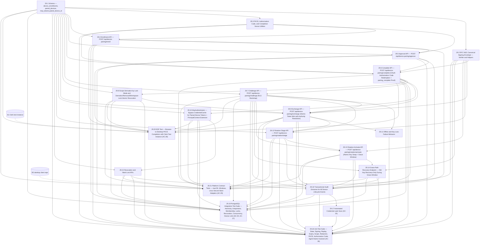

# Epic 29 — Desktop Device Pairing and Persistent Authentication

## Outcome

An authorized user signs in with Clerk once, approves a desktop device, and then reconnects automatically through OS-keystore proof of possession and short-lived MCP tokens. Current tenant, workspace, role, lock mode, and scopes remain server-derived on every exchange. Reauthentication occurs only after key loss, revocation/loss, membership recovery, device replacement, or explicit security re-enrollment.

## Source Authority

1. `_bmad-output/specs/spec-desktop-device-pairing/SPEC.md` — approved requirements and AC-01..AC-29.
2. `_bmad-output/specs/spec-desktop-device-pairing/STATE-MACHINE.md` — lifecycle authority.
3. `_bmad-output/specs/spec-desktop-device-pairing/THREAT-MODEL.md` — security controls.
4. `_bmad-output/specs/spec-desktop-device-pairing/REVIEW-RESOLUTION.md` — resolved spec findings.
5. `_bmad-output/planning-artifacts/epic-29-desktop-device-pairing-architecture.md` — revision 4, `approved-for-stories`.
6. `_bmad-output/planning-artifacts/epic-29-architecture-final-review.md` — PASS; residual findings closed.

## Requirements Inventory

### Functional Requirements

Extracted from SPEC.md §1–§12 (29 acceptance criteria AC-01..AC-29 are the authoritative functional requirements; each maps to exactly one story — see §5 Traceability Matrix):

- **FR-UX:** Authorized users can complete Connect → Clerk → approve → connected without copying a token or editing config; later startups reconnect without Clerk (SPEC §1).
- **FR-Reauth:** Clerk sign-in is required again only for key loss, revocation/lost recovery, membership recovery, or explicit admin re-enrollment — not for reboot/update/outage/token-expiry/rotation (SPEC §2).
- **FR-PoP:** Private key generated and retained by OS secure store; Allura stores only the public key; enrollment 10-min TTL single-use; PKCE+state binding; copied credentials cannot mint access; five-device default limit (SPEC §3, §4).
- **FR-Authority:** Exchange derives principal/tenant/workspace/role/scopes/lock from current server records; demotion downscopes; removal blocks; cross-tenant selectors fail; full_lockdown blocks; PrincipalContext principalId is the human (SPEC §3.2, §3.3, §5).
- **FR-Rotation:** 90-day rotation succeeds without Clerk; crash-before-activation leaves current key usable; crash-after-activation recovers via receipt/grace; replays return same state; concurrent exchanges finish with one active token; concurrent rotations converge (SPEC §6).
- **FR-Revocation:** Revocation/loss atomically blocks new exchanges, invalidates all linked tokens + caches, and is terminal; replacement requires new pairing (SPEC §8).
- **FR-Audit:** Every lifecycle/security decision creates an append-only event; automated scans prove no credentials in events/logs/errors (SPEC §11).
- **FR-Validation:** Unit tests cover state/signing/replay/expiry/scope/redaction; PostgreSQL integration tests prove atomicity/uniqueness/membership/locks/revocation/concurrency; E2E tests use Clerk test instance; macOS/Windows/Linux adapter contract tests prove secure-store persistence (SPEC §13).

### NonFunctional Requirements

- **NFR1:** No private device key ever leaves the OS secure store; no reusable device bearer credential is returned by any API; Clerk tokens/cookies never reach the desktop bridge (SPEC §3.1, THREAT-MODEL.md Security Properties).
- **NFR2:** Device keys use asymmetric signature verification (ECDSA P-256 mandatory v1, Ed25519 optional, RSA-PSS-2048 legacy); MCP tokens use HMAC-SHA256 — separate cryptographic mechanisms (SPEC §6, AD-60, AD-66).
- **NFR3:** `group_id` on every DB read/write matching `^allura-[a-z0-9]([a-z0-9-]*[a-z0-9])?$` (CLAUDE.md Non-Negotiable Invariants).
- **NFR4:** PostgreSQL events are append-only — no UPDATE/DELETE on trace rows (CLAUDE.md, migration 37 immutable trigger).
- **NFR5:** Device-lifecycle audit events use transactional `insertEvent` (fail-closed); MCP auth-decision events use fire-and-forget `emitAuthAudit` (architecture §11.1).
- **NFR6:** Paired-device MCP tokens bypass `CredentialCache` entirely — always hit DB on every auth (AD-66, architecture §7).
- **NFR7:** Migrations are additive (CREATE + ALTER ADD); rollback is ordered, no CASCADE, append rollback-marker to `schema_versions` (AD-61, architecture §3.4).
- **NFR8:** All API operations through MCP_DOCKER tools — never `docker exec` (CLAUDE.md MCP Integration).
- **NFR9:** No new port allocated by Epic 29; inherits `ALLURA_DASHBOARD_PORT` (AD-45, architecture §8.5).
- **NFR10:** ECDSA P-256 signatures are IEEE P1363 fixed r‖s (64 bytes), normalized by adapters before RFC 9421 base64 (architecture §4.4, AD-64).

### Additional Requirements (from Architecture)

- **AR1:** Migrations 060 and 064 `device_enrollments` — pre-auth PENDING + post-approval completion state; no tenant RLS; direct privileges revoked from PUBLIC/allura_app; access only through six scoped SECURITY DEFINER functions with fixed `search_path`. Migration 064 adds `device_enrollment_approval_context()` so approval can retrieve only callback/audit context without direct table reads (architecture §3.1, AD-61).
- **AR2:** Migration 061 `paired_devices` — post-auth APPROVED/REVOKED/LOST only, all authority NOT NULL by construction; `enrollment_id` is audit correlation only, NOT an FK; RLS-bound (architecture §3.1b, AD-61).
- **AR3:** Migration 062 `mcp_tokens.paired_device_id` — nullable FK; partial unique index `idx_mcp_tokens_one_active_per_device`; DEFERRABLE CONSTRAINT TRIGGER `trg_mcp_tokens_device_agent_name` enforces `agent_name = paired_devices.principal_id` at COMMIT (architecture §3.2, AD-61).
- **AR4:** Migration 063 `device_challenges` — post-device only, `group_id` + RLS + `purpose` discriminator (`exchange`/`rotation_stage`/`rotation_activate`/`recovery_status`), 60s TTL, consumed state; plus `resolve_device_route()` SECURITY DEFINER for RLS bootstrap (architecture §3.3, §3.4a, AD-61).
- **AR5:** RFC 9421 HTTP Message Signatures + RFC 9530 Content-Digest as the single canonical signing envelope for all purposes (`pairing_complete`/`exchange`/`rotation_stage`/`rotation_activate`/`recovery_status`); `@target-uri` from configured origin `ALLURA_DEVICE_AUTH_ORIGIN`, not Host; audience = `ALLURA_DEVICE_AUTH_AUDIENCE` (architecture §4.4, AD-64).
- **AR6:** OAuth-style authorization code completion (AD-65): PKCE verifier never in URL/browser; `/approve` issues 256-bit code (SHA-256 stored) + `completion_nonce` (bound to code/enrollment/PK, 60s TTL); `/complete` redeems code + verifier + nonce + RFC 9421 `pairing_complete` proof (architecture §4.2, §4.2b, §8.2).
- **AR7:** Device-count enforcement via `pg_advisory_xact_lock` on stable SHA-256-derived 64-bit key for `(group_id, workspace_id, principal_id)` (architecture §4.2c, HIGH-F4).
- **AR8:** Demotion/removal/workspace-lock changes atomically revoke all linked device tokens at the mutation path in the same transaction — no 15-minute window (architecture §5.4, consistency fix L).
- **AR9:** `curator → reviewer` scope translation in `scopesForRole` — factor out `deriveScopesForMembershipRole(role)` shared helper used by both existing principal-context factory and device-token mint path (architecture §5.3, HIGH-F5).
- **AR10:** Grace window is recovery-only (24h default, configurable `ALLURA_DEVICE_KEY_GRACE_HOURS` 1–72): no normal MCP token mint; returns scoped recovery token or `403 RECOVERY_REQUIRED`; rate-limited per device via `grace_exchange_count` under row lock (architecture §6.5, HIGH-F2).
- **AR11:** Pre-human enrollment events use `group_id = 'allura-system'`, `agent_id = 'device-enrollment'`; post-approval events use approved tenant/principal (architecture §11.1, MED-F3).
- **AR12:** Lazy/probabilistic delete on insert/access + `bun run device-pairing:cleanup` maintenance command; no new scheduled job implied — scheduling requires explicit operator approval (architecture §3.3b, consistency fix K).
- **AR13:** `PrincipalContext` extended with optional `pairedDeviceId?: string`; `pairedDeviceId` is part of `canRebindSession` equality; `buildAuthAuditEvent` projects it as `paired_device_id` in metadata (architecture §2.2, B5).

### UX Design Requirements

No UX design contract was an input document to Epic 29. The desktop client UI is out of this repo (B2). The server defines API contracts only. No UX-DRs are extracted.

### AC Coverage Map (Requirement → Workstream)

See §5 Requirement-to-Story Traceability Matrix for the authoritative mapping. Summary:

- Workstream A: AC-01, AC-02, AC-06, AC-07, AC-08, AC-09, AC-10
- Workstream B: AC-03, AC-04, AC-05, AC-11, AC-12, AC-13, AC-14, AC-15
- Workstream C: AC-16, AC-17, AC-18, AC-19, AC-21
- Workstream D: AC-22, AC-23
- Workstream E: AC-24, AC-25
- Workstream F: AC-20, AC-26, AC-27, AC-28, AC-29

## Workstreams

| Workstream | User value | ACs |
|---|---|---|
| A — Pair a Desktop Device | Clerk-mediated approval creates a bound device without token copying or config editing. | AC-01, AC-02, AC-06–AC-10 |
| B — Persistent Runtime Reconnection | Startup proof automatically mints current, server-authorized short-lived access. | AC-03–AC-05, AC-11–AC-15 |
| C — Automatic Device-Key Rotation | Keys rotate crash-safely and idempotently without Clerk. | AC-16–AC-19, AC-21 |
| D — Revocation and Recovery | Lost or revoked devices stop immediately and terminally. | AC-22, AC-23 |
| E — Audit and Credential Hygiene | All decisions are auditable without credential leakage. | AC-24, AC-25 |
| F — Validation Evidence | Unit, PostgreSQL, Clerk E2E, and platform evidence prove the contract. | AC-20, AC-26–AC-29 |

## Story Map

| Story | Workstream | Slice | AC participation | Depends on | Status |
|---|---|---|---|---|---|
| [29.1](../stories/29-1-schema-foundation.md) | A | Schema — device_enrollments, paired_devices, mcp_tokens.paired_device_id | AC-06, AC-10 | None | backlog |
| [29.2](../stories/29-2-rfc9421-signing-envelope.md) | A | RFC 9421 Canonical Signing Envelope — Verifier and Helpers | AC-09 | 29.1 | backlog |
| [29.3](../stories/29-3-pkce-authorization-code.md) | A | PKCE, Authorization Code, and Completion Nonce Utilities | AC-08, AC-09 | 29.1 | backlog |
| [29.4](../stories/29-4-enrollment-api.md) | A | Enrollment API — POST /api/device-pairing/enroll | AC-07, AC-09 | 29.1, 29.3 | backlog |
| [29.5](../stories/29-5-approval-api.md) | A | Approval API — POST /api/device-pairing/approve | AC-02, AC-07, AC-08, AC-10 | 29.1, 29.3, 29.4 | backlog |
| [29.6](../stories/29-6-completion-api.md) | A | Complete API — POST /api/device-pairing/complete (OAuth Authorization Code Redemption + pairing_complete Proof) | AC-06, AC-08, AC-09 | 29.1, 29.2, 29.3, 29.5 | backlog |
| [29.7](../stories/29-7-challenge-api.md) | B | Challenge API — POST /api/device-pairing/challenge (RLS Bootstrap) | AC-09, AC-11 | 29.1, 29.6 | backlog |
| [29.8](../stories/29-8-scope-and-authority-revocation.md) | B | Scope Derivation by Lock Mode and Demotion/Removal/Workspace-Lock Atomic Revocation | AC-12, AC-14 | 29.1, 29.6 | backlog |
| [29.9](../stories/29-9-exchange-api.md) | B | Exchange API — POST /api/device-pairing/exchange (Atomic Token Mint with Authority Resolution) | AC-03, AC-04, AC-11, AC-13, AC-14, AC-15 | 29.1, 29.2, 29.6, 29.7, 29.8 | backlog |
| [29.10](../stories/29-10-authenticator-cache-bypass.md) | B | McpAuthenticator — Bypass CredentialCache for Paired-Device Tokens + PrincipalContext Extension | AC-15, AC-22 | 29.1, 29.6 | backlog |
| [29.11](../stories/29-11-offline-and-key-loss.md) | B | Offline and Key-Loss Failure Behavior | AC-04, AC-05 | 29.7, 29.9 | backlog |
| [29.12](../stories/29-12-rotation-stage.md) | C | Rotation Stage API — POST /api/device-pairing/rotation/stage | AC-16, AC-19 | 29.1, 29.2, 29.7, 29.9 | backlog |
| [29.13](../stories/29-13-rotation-activate.md) | C | Rotation Activate API — POST /api/device-pairing/rotation/activate (Atomic Key Swap + Grace Window) | AC-16, AC-18, AC-19 | 29.2, 29.7, 29.12 | backlog |
| [29.14](../stories/29-14-grace-path-recovery.md) | C | Grace-Path Recovery Endpoint — Old-Key Recovery-Only During Grace Window | AC-18 | 29.2, 29.7, 29.13 | backlog |
| [29.15](../stories/29-15-device-revocation-and-lost.md) | D | Revocation and Mark-Lost APIs | AC-22, AC-23 | 29.1, 29.10 | backlog |
| [29.16](../stories/29-16-transactional-device-audit.md) | E | Transactional Audit Emission for All Device Lifecycle Events | AC-24 | 29.4, 29.5, 29.6, 29.7, 29.9, 29.12, 29.13, 29.14, 29.15 | backlog |
| [29.17](../stories/29-17-credential-leak-scan.md) | E | Automated Credential Leak Scan (AC-25) | AC-25 | 29.16 | backlog |
| [29.18](../stories/29-18-unit-test-suite.md) | F | Unit Test Suite — State, Signing, Replay, Expiry, Scope, Redaction, PKCE, Authorization Code, Agent-Name Invariant (AC-26) | AC-26 | 29.1, 29.2, 29.3, 29.4, 29.5, 29.6, 29.7, 29.8, 29.9, 29.10, 29.11, 29.12, 29.13, 29.14, 29.15, 29.16, 29.17 | backlog |
| [29.19](../stories/29-19-postgres-integration-tests.md) | F | PostgreSQL Integration Test Suite — Atomicity, Uniqueness, Membership, Locks, Revocation, Concurrency, Device Limit (AC-20, AC-27) | AC-20, AC-27 | 29.1, 29.4, 29.5, 29.6, 29.7, 29.8, 29.9, 29.10, 29.12, 29.13, 29.14, 29.15, 29.16 | backlog |
| [29.20](../stories/29-20-clerk-pairing-e2e.md) | F | E2E Test — Browser-to-Desktop PKCE Completion with Clerk Test Instance (AC-28) | AC-28 | 29.1, 29.4, 29.5, 29.6, 29.7, 29.8, 29.9, 29.10 | backlog |
| [29.21](../stories/29-21-platform-secure-store-contracts.md) | F | Platform Contract Tests — macOS, Windows, Linux Secure-Store Adapters (AC-29) | AC-29 | 29.1, 29.2, 29.6, 29.7, 29.8, 29.9, 29.10, 29.12, 29.13, 29.14, 29.15 | backlog |

## Dependency DAG

**Validated property:** every story depends only on lower-numbered Epic 29 stories. B1 and B2 are external evidence prerequisites, not story-drafting blockers.

## Recommended Sequence

`29.1 → (29.2 ∥ 29.3) → 29.4 → 29.5 → 29.6 → (29.7 ∥ 29.8 ∥ 29.10) → 29.9 → 29.11 → 29.12 → 29.13 → 29.14 → 29.15 → 29.16 → 29.17 → (29.18 ∥ 29.19 ∥ 29.20[B1] ∥ 29.21[B2])`

## Implementation Prerequisites

| ID | Affects | Constraint |
|---|---|---|
| B1 — Clerk test instance | Story 29.20 / AC-28 | Runtime acceptance requires a dedicated Clerk test app/test-token strategy; skip does not equal pass. |
| B2 — Desktop client repository | Story 29.21 / AC-29 | Runtime acceptance requires real macOS Keychain, Windows CNG, and Linux libsecret adapter evidence; skip does not equal pass. |

## Requirement-to-Story Traceability Matrix

Every AC-01..AC-29 has exactly one lead story. Partial contributors do not duplicate lead ownership.

| AC | Lead Story | Partial Contributors | Architecture Evidence | Status |
|---|---|---|---|---|
| **AC-01** | Story 29.6 | 29.4, 29.5 | §4.1-4.2b, §16.1 — Connect → Clerk → approve → complete → connected, no token copied | ✅ |
| **AC-02** | Story 29.5 | 29.6 | §4.2 step 5-6, §5.1 — server resolves membership from Clerk identity | ✅ |
| **AC-03** | Story 29.9 | 29.7 | §4.3-4.5 — startup exchange uses private key, not Clerk | ✅ |
| **AC-04** | Story 29.11 | 29.9, 29.13 | §9.3, §6, §10.1 — key persists across updates; rotation automatic; outages retry | ✅ |
| **AC-05** | Story 29.11 | 29.15 | §10.2, §4.7, SPEC §2 — key loss/revocation/lost/membership recovery → Clerk prompt | ✅ |
| **AC-06** | Story 29.6 | 29.1 | §3.1/3.1b, §9 — private key in OS store; server stores only public key; verified via RFC 9421 signature | ✅ |
| **AC-07** | Story 29.4 | 29.1, 29.5 | §4.1, §3.1 `expires_at` 10-min TTL, PENDING state, single-use | ✅ |
| **AC-08** | Story 29.6 | 29.3, 29.5 | §4.2b, §8.2, AD-65 — PKCE state binds browser→bridge; OAuth authorization code; verifier never in URL | ✅ |
| **AC-09** | Story 29.6 | 29.2, 29.3, 29.7 | §4.4, §3.3, AD-64 — RFC 9421 proof-of-possession; challenge single-use; content-digest body binding | ✅ |
| **AC-10** | Story 29.5 | 29.1 | §4.2c — `pg_advisory_xact_lock` + count, default 5, configurable | ✅ |
| **AC-11** | Story 29.9 | 29.7 | §5.1 — exchange derives principal/tenant/workspace/role/scopes/lock from server records | ✅ |
| **AC-12** | Story 29.8 | 29.9 | §5.4, consistency fix L — demotion downscopes next token; removal blocks; atomic revoke at mutation path | ✅ |
| **AC-13** | Story 29.9 | 29.7 | §5.5 — client never supplies authority; cross-tenant selectors fail closed | ✅ |
| **AC-14** | Story 29.8 | 29.9 | §5.2 — `full_lockdown` blocks; `read_only`/`no_agent_writes`/`no_promotions` downscope | ✅ |
| **AC-15** | Story 29.10 | 29.6 | §3.2, §4.5, §11.1 — `PrincipalContext.principalId` = human; `agent_name=principal_id` DEFERRABLE trigger; `paired_device_id` in audit | ✅ |
| **AC-16** | Story 29.13 | 29.12 | §6, §4.6 — rotation succeeds without Clerk; no private key crosses network | ✅ |
| **AC-17** | Story 29.12 | 29.13 | §6.4 — crash before activation leaves current key valid (`pending_*` set, `current_*` unchanged) | ✅ |
| **AC-18** | Story 29.13 | 29.14 | §6.4, §4.6, MED-F6 — crash after activation recovers via updated signed receipt + grace path | ✅ |
| **AC-19** | Story 29.13 | 29.12 | §6.3 — replay activation/rotation returns same state + updated receipt (idempotency key) | ✅ |
| **AC-20** | Story 29.19 | 29.9 | §4.5, §3.2 — concurrent exchanges → one active token (row lock + partial unique index backstop) | ✅ |
| **AC-21** | Story 29.13 | 29.19 | §6.3 — concurrent rotations converge via `key_generation` counter + row lock | ✅ (Epic 3 lead, Epic 6 test) |
| **AC-22** | Story 29.15 | 29.10 | §4.7, §7, AD-66 — revocation blocks exchanges + invalidates tokens + caches; device tokens bypass cache (immediate) | ✅ |
| **AC-23** | Story 29.15 | — | §3.1b CHECK (APPROVED/REVOKED/LOST only), §4.7 — revoked/lost terminal; new pairing required | ✅ |
| **AC-24** | Story 29.16 | all | §11.1 — every lifecycle/security decision → transactional append-only event (fail-closed) | ✅ |
| **AC-25** | Story 29.17 | 29.16 | §11.2 — automated scan proves no credentials in events/logs/errors/artifacts | ✅ |
| **AC-26** | Story 29.18 | 29.1-29.17 | §12.2 — unit tests: state, RFC 9421 signing, replay, expiry, scope, redaction, PKCE, auth code, agent-name | ✅ |
| **AC-27** | Story 29.19 | 29.1-29.15 | §12.3 — PG integration: atomicity, uniqueness, membership, locks, revocation, concurrency, advisory lock | ✅ |
| **AC-28** | Story 29.20 | — | §12.4 — E2E: Clerk test instance, browser→desktop PKCE. **⚠️ B1 — implementation prerequisite; no runtime acceptance claimed** | ⚠️ B1 |
| **AC-29** | Story 29.21 | — | §9.2, §12.5 — macOS/Windows/Linux adapter contract tests, capability-specific. **⚠️ B2 — implementation prerequisite; no runtime acceptance claimed** | ⚠️ B2 |

**Coverage: 29/29 ACs have exactly one lead story. AC-28 and AC-29 remain B1/B2 implementation-evidence prerequisites; no runtime acceptance is claimed.**

## Risk Register

| Risk | Stories | Control / required evidence |
|---|---|---|
| Pre-auth tenant bootstrap or SECURITY DEFINER privilege escape | 29.1, 29.4–29.7 | Fixed search paths, PUBLIC EXECUTE revocation, RLS bootstrap tests, no client tenant selector. |
| RFC 9421 canonicalization mismatch across clients | 29.2, 29.6–29.9, 29.12–29.14, 29.21 | Shared vectors, RFC 9530 digest checks, configured origin, P1363 normalization, multi-platform evidence. |
| Pairing callback interception/replay | 29.3–29.6 | PKCE S256, hashed one-time code, signed completion nonce, atomic consumption. |
| Membership/workspace authority remains stale | 29.8–29.10 | Same-transaction revocation at mutation paths; device tokens bypass cache; live DB evidence. |
| Rotation crash or old-key grace abuse | 29.12–29.14 | Two-phase activation, idempotent receipts, recovery-only grace, locked counter, no normal token mint. |
| Audit drift or secret leakage | 29.16–29.18 | Transactional allowlisted events, fail-closed writes, automated redaction scan. |
| External evidence unavailable | 29.20, 29.21 | B1/B2 explicit; skip does not equal pass; no runtime acceptance claim. |
| Migration rollback damages existing state | 29.1 | Additive 060–063, rollback 063→062→061→060, no CASCADE, approval-gated down migration. |

## Gate Exit Criteria

- [x] Repo-local `bmad-create-epics-and-stories` completed prerequisites, workstream design, story creation, and final validation.
- [x] All 21 canonical story files exist and report `Status: backlog`.
- [x] AC-01..AC-29 each has exactly one lead story.
- [x] Dependency graph is acyclic and contains no forward dependency.
- [x] B1/B2 gate only Stories 29.20/29.21 and AC-28/AC-29.
- [x] `sprint-status.yaml` remains untouched until Sprint Planning.
- [x] No production code, migration execution, deployment, secret change, commit, or push occurred.

## Creation-Gate Validation Receipt

- **Repo-local BMAD:** 6.11.0; command `.opencode/commands/bmad-create-epics-and-stories.md`; configured planning/stories roots from `_bmad/bmm/config.yaml`.
- **Canonical output:** one Epic 29 planning authority plus 21 numbered backlog story files and one navigation row in `epics.md`.
- **Deterministic validation:** story count, required sections, sequential IDs, neutral identity language, architecture section references, backward-only dependencies, B1/B2 placement, 29 unique AC lead rows, source-artifact presence, register uniqueness, and unchanged sprint status all pass.
- **External reviewer availability:** optional Codex review could not authenticate; optional Claude review was not logged in; OpenCode's second pass hit provider quota after the repo BMAD package had already been generated. These availability failures are not counted as implementation evidence and do not replace the next Sprint Planning readiness gate.

## Next BMAD Gate

`bmad-sprint-planning` — run implementation readiness, then create/update sprint tracking only after this package passes.
