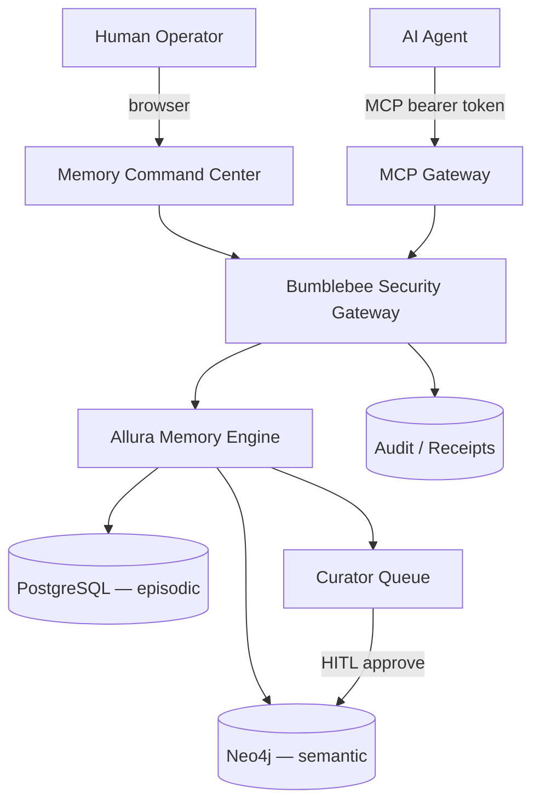
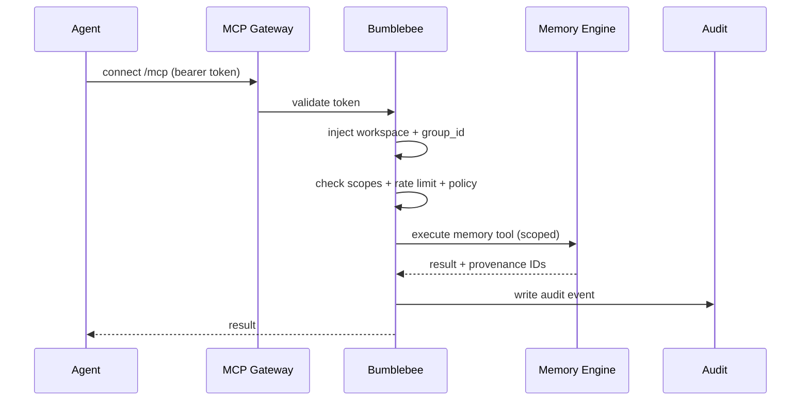
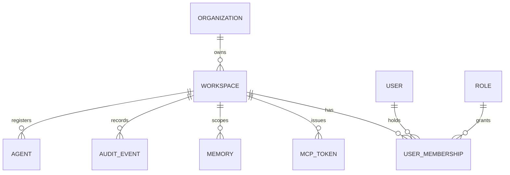

# Allura Hosted Platform — Blueprint

> [!NOTE]
> **AI-Assisted Documentation**
> Portions of this document were drafted with the assistance of an AI language model.
> Content has not yet been fully reviewed — this is a working design reference, not a final specification.
> AI-generated content may contain inaccuracies or omissions.
> When in doubt, defer to the source code, JSON schemas, and team consensus.

> Source of intent: [Notion — Allura Hosted Platform Plan](https://app.notion.com/p/3811d9be65b380b1a74ac388695a6f88)

---

## Summary

Allura Hosted Platform is a **multi-tenant governed AI memory system** for people, teams, and AI agents. It provides a **Memory Command Center** for humans, **Bumblebee** as the security gateway, and an **MCP Gateway** for agents (Claude, Codex, OpenCode, Cursor, and custom tools).

**Core product sentence:** Allura remembers. Bumblebee guards the hive. Agents connect through MCP. Humans approve what becomes trusted knowledge.

This Blueprint is the single source of design intent. All `DESIGN-*`, `SOLUTION-ARCHITECTURE`, `REQUIREMENTS-MATRIX`, `DATA-DICTIONARY`, and `RISKS-AND-DECISIONS` documents trace back to it.

---

## Core Concepts

| Concept | Definition |
|---------|-----------|
| **Organization** | Top-level tenant. Owns billing, users, and one or more workspaces. |
| **Workspace** | Isolation unit. Maps 1:1 to a `group_id`. Holds users, roles, agents, tokens, memories, and audit events. |
| **group_id** | Server-generated tenant scope key (pattern `^allura-[a-z0-9-]+$`). Enforced on every read/write. Never client-supplied. |
| **Memory** | A governed unit of knowledge. Episodic (raw trace, PostgreSQL) or semantic (approved knowledge, Neo4j). |
| **Curator** | The review queue where proposed memories await human approval before promotion. |
| **Bumblebee** | The policy gate in front of all MCP/API actions: auth, RBAC, scope, rate limits, group_id injection, audit. |
| **MCP Token** | A scoped bearer credential for agents. Stored as a hash, never raw. |
| **Receipt** | An append-only audit artifact proving an action happened (actor, scope, decision, evidence). |
| **Dream Run** | A platform-agnostic memory-refinement job that produces approval candidates, never trusted memory directly. |

---

## Business Requirements

| ID | Requirement |
|----|-------------|
| **B1** | A person or team can run a hosted, multi-tenant memory system with strict tenant isolation. |
| **B2** | Humans manage what AI agents remember through a warm Memory Command Center. |
| **B3** | Agents connect securely via MCP using scoped tokens, never human sessions. |
| **B4** | Only humans/reviewers promote memory to trusted knowledge; agents cannot self-approve. |
| **B5** | Every memory action shows evidence, approval state, and audit history. |
| **B6** | Operators can revoke/rotate credentials, lock workspaces, and offboard users. |
| **B7** | Backups exist and restore is provably testable. |
| **B8** | Developers can integrate via SDK, CLI, OpenAPI, and MCP config templates. |

---

## Functional Requirements

Grouped by domain area. Each maps to one or more `B#`.

### Auth & Tenancy (→ B1, B6)

| ID | Requirement |
|----|-------------|
| **F1** | Users can create an organization. |
| **F2** | Users can create a workspace; the system generates a valid `group_id`. |
| **F3** | Admins can invite employees and assign roles. |
| **F4** | Employees access only assigned workspaces. |
| **F5** | MFA is required for admin-level roles. |

### Bumblebee Security Gateway (→ B1, B3, B6)

| ID | Requirement |
|----|-------------|
| **F6** | Bumblebee injects `group_id` server-side on every action. |
| **F7** | Bumblebee validates MCP tokens and API keys (hash compare, expiry, revoke). |
| **F8** | Bumblebee enforces RBAC scope checks before any tool executes. |
| **F9** | Bumblebee applies rate limits per token/user/workspace/agent. |
| **F10** | Bumblebee scans for secrets before memory storage. |
| **F11** | Bumblebee supports workspace lock modes (normal, read-only, no-agent-writes, no-promotions, full lockdown). |
| **F12** | Bumblebee writes a security audit event for every permit and deny. |

### MCP Gateway (→ B3)

| ID | Requirement |
|----|-------------|
| **F13** | Agents connect to `/mcp` with a bearer token validated by Bumblebee. |
| **F14** | The gateway injects workspace + `group_id` and checks scopes before executing a memory tool. |
| **F15** | The agent cannot override `group_id`. |

### Memory Engine (→ B2, B4, B5)

| ID | Requirement |
|----|-------------|
| **F16** | Memory supports add, search, get, list, delete — all scoped by `group_id`. |
| **F17** | Episodic traces are append-only in PostgreSQL. |
| **F18** | Semantic knowledge is versioned in Neo4j via `SUPERSEDES`, never mutated. |
| **F19** | Every memory record preserves provenance, source, actor, confidence, review status. |

### Curator (→ B4, B5)

| ID | Requirement |
|----|-------------|
| **F20** | Proposed memories appear in a review queue with confidence and evidence preview. |
| **F21** | Reviewers approve/reject/request-evidence with required rationale. |
| **F22** | Agents cannot approve their own generated memories. |
| **F23** | Promotion history is retained. |

### Audit (→ B5, B7)

| ID | Requirement |
|----|-------------|
| **F24** | Every permit/deny/defer decision is logged with actor, role, token, workspace, group_id. |
| **F25** | Audit logs export to CSV and receipt packets. |

### Developer Platform (→ B8)

| ID | Requirement |
|----|-------------|
| **F26** | `@allura/sdk`, `allura` CLI, OpenAPI spec, and MCP config templates are provided. |
| **F27** | An SDK/MCP setup page lets users create a token, copy config, and test a connection. |
| **F28** | `allura doctor` validates a local agent's MCP connection. |

### Ops (→ B7)

| ID | Requirement |
|----|-------------|
| **F29** | Docker Compose deployment with backups and documented restore testing. |
| **F30** | Observability via Sentry / OpenTelemetry; quotas; billing deferred. |

### Dream Engine (→ B2, B4, B5)

| ID | Requirement |
|----|-------------|
| **F31** | Dream runs are platform-agnostic and produce Dream Candidates that require human approval. |
| **F32** | No provider can write trusted knowledge directly; secrets are redacted before processing. |

---

## Architecture

```
Allura Platform
├── Allura Memory Engine      — PostgreSQL episodic · Neo4j semantic · Curator queue · Audit receipts
├── Bumblebee Security Gateway — login · RBAC · MCP/API auth · group_id enforcement · rate limits · secret scan · audit
├── MCP Gateway               — Claude · Codex · OpenCode · Cursor · custom agents
├── Memory Command Center      — Overview · Memories · Curator · Agents · Bumblebee · Audit · Workflows · SDK/MCP · Settings
├── Developer Platform         — @allura/sdk · allura CLI · OpenAPI · MCP templates · workspace templates
└── Ops Layer                 — Docker Compose · backups · restore testing · observability · quotas · billing later
```

Named components and their responsibilities are detailed in [SOLUTION-ARCHITECTURE.md](./SOLUTION-ARCHITECTURE.md).

---

## Diagrams

### Component overview



### Agent request flow



### Multi-tenant entity model



---

## Data Model

Full field-level reference lives in [DATA-DICTIONARY.md](./DATA-DICTIONARY.md). Top-level entities:

| Entity | Purpose |
|--------|---------|
| Organization | Top-level tenant; billing + user root. |
| Workspace | Isolation unit; 1:1 with `group_id`. |
| User / UserMembership | A person and their role within a workspace. |
| MCPToken | Scoped agent credential (hash + prefix + scopes + expiry). |
| Agent | Registered MCP client metadata. |
| Memory | Episodic or semantic governed knowledge unit. |
| CuratorProposal | A pending memory awaiting approval. |
| AuditEvent | Append-only permit/deny/defer record. |
| DreamRun / DreamCandidate | Memory-refinement job and its approval candidates. |

---

## Execution Rules

- Tenant isolation is **always** enforced by server-side `group_id` injection (AD-01).
- Agents authenticate with scoped MCP tokens, not human sessions (AD-02).
- Raw MCP tokens are **never** stored, only hashes (AD-03).
- Agents cannot approve their own memory promotions (AD-04).
- All memory writes produce append-only audit records (AD-05).
- Semantic memory is versioned through supersession, not mutation (AD-06).
- Bumblebee is the policy gate in front of all MCP/API actions (AD-07).
- The dashboard is a control plane, not the source of memory truth (AD-08).

Decision records: [RISKS-AND-DECISIONS.md](./RISKS-AND-DECISIONS.md).

---

## Concurrency Rules

- Episodic writes are append-only; concurrent writers never contend on update locks.
- Promotions are serialized through the Curator queue; a proposal moves to `approved` exactly once.
- Token rotation invalidates the prior hash atomically; in-flight requests with the old token fail closed.

---

## API Surface

High-level grouping (full contracts in the `DESIGN-*` docs):

- **Auth/Tenancy:** `POST /orgs`, `POST /workspaces`, `POST /invites`, `POST /sessions`
- **Bumblebee:** `POST /tokens`, `POST /tokens/:id/rotate`, `POST /tokens/:id/revoke`, `POST /workspaces/:id/lock`
- **MCP Gateway:** `POST /mcp` (Streamable HTTP, SSE + JSON-RPC)
- **Memory:** `memory_add`, `memory_search`, `memory_get`, `memory_list`, `memory_delete`
- **Curator:** `GET /curator/pending`, `POST /curator/:id/approve`, `POST /curator/:id/reject`
- **Audit:** `GET /audit`, `GET /audit/export`
- **Dreams:** `POST /dreams`, `GET /dreams/:id`, `POST /dreams/:id/candidates/:cid/approve`

---

## Logging & Audit

- Persisted: every permit/deny/defer with actor, role, token prefix, workspace, group_id, decision, evidence IDs.
- Redacted: raw tokens, secrets, PII flagged by the secret scanner.
- Surfaced: Audit screen with filter + CSV/receipt export.

---

## Event-Driven Architecture

| Event | Producer | Consumer |
|-------|----------|----------|
| `memory.added` | Memory Engine | Curator, Audit |
| `curator.proposed` | Curator | Command Center, Audit |
| `curator.approved` / `curator.rejected` | Reviewer (HITL) | Memory Engine (Neo4j promote), Audit |
| `token.revoked` / `token.rotated` | Bumblebee | MCP Gateway, Audit |
| `dream.completed` | Dream Engine | Curator, Audit |

---

## References

- [SOLUTION-ARCHITECTURE.md](./SOLUTION-ARCHITECTURE.md)
- [RISKS-AND-DECISIONS.md](./RISKS-AND-DECISIONS.md)
- [DATA-DICTIONARY.md](./DATA-DICTIONARY.md)
- [REQUIREMENTS-MATRIX.md](./REQUIREMENTS-MATRIX.md)
- Design docs: [AUTH](./DESIGN-AUTH.md) · [BUMBLEBEE](./DESIGN-BUMBLEBEE.md) · [MCP-GATEWAY](./DESIGN-MCP-GATEWAY.md) · [MEMORY-COMMAND-CENTER](./DESIGN-MEMORY-COMMAND-CENTER.md) · [CURATOR](./DESIGN-CURATOR.md) · [AUDIT](./DESIGN-AUDIT.md)
- Security: [SECURITY.md](./SECURITY.md) · [THREAT-MODEL.md](./THREAT-MODEL.md)
- Ops: [DEPLOYMENT.md](./DEPLOYMENT.md) · [BACKUP-RESTORE.md](./BACKUP-RESTORE.md)
- Standards: [AI-GUIDELINES.md](./AI-GUIDELINES.md)
