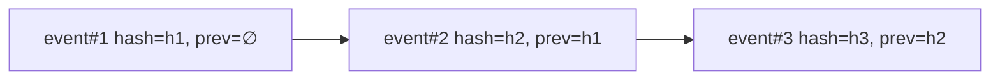

> [!CAUTION]
> **Not current.** Superseded by the canonical set in [`docs/allura/`](../allura/) (AD-50, PostgreSQL-only). This hosted-platform draft set is historical; do not use as implementation authority. Canonical: `BLUEPRINT.md`, `SOLUTION-ARCHITECTURE.md`, `DATA-DICTIONARY.md`, `REQUIREMENTS-MATRIX.md`, `RISKS-AND-DECISIONS.md`, `DESIGN-ALLURA.md` in `docs/allura/`.

# DESIGN-AUDIT — Audit & Receipts

> [!NOTE]
> **AI-Assisted Documentation**
> Portions of this document were drafted with the assistance of an AI language model.
> Content has not yet been fully reviewed — this is a working design reference, not a final specification.
> When in doubt, defer to the source code, JSON schemas, and team consensus.

Anchor: [BLUEPRINT.md](./BLUEPRINT.md) (F24–F25). Related: [DESIGN-GUARD.md](./DESIGN-GUARD.md), [BACKUP-RESTORE.md](./BACKUP-RESTORE.md).

## Overview

The Audit subsystem records every permit/deny/defer decision and every memory write as an **append-only, hash-chained** event. It is the evidence backbone for compliance and reversibility (AD-05, RK-06).

## Control Plane Audit Primitive (`syscall_trace`)

Traces enter the audit trail through the RuVix control plane's **SYSCALL 5: `trace`** (`src/control-plane/syscalls.ts`). It is an **audit-only** syscall — it runs the full `proof → policy → audit` gate via `executeSyscall`, validating proof, tenant policy, and actor identity, but it deliberately performs **no database write of its own**.

- **Why audit-only (H-005 fix):** the control plane's `resolveTarget()` would otherwise `INSERT` into `events` using the outer `traceData` wrapper as columns (e.g. `table`, `data`), producing a Postgres syntax error (a double-write bug). Instead, `syscall_trace` returns a validated `trace_id`, and the canonical event row is the **caller's** responsibility — written via `logTrace()` in `src/lib/postgres/trace-logger.ts` (or `createControlPlaneTraceLogger()` in `src/control-plane/audit/trace.ts`) through `insertEvent()`.
- **Return shape:** `{ trace_id }`, where `trace_id` matches `^audit-<group_id>-trace-…` (via `generateAuditId("trace", "audit", claims.group_id)`).
- **Tested behavior** (`src/control-plane/syscalls.test.ts`): returns success and a `trace_id` **without** calling `resolveTarget` (audit-only), and accepts arbitrary trace data without requiring a schema match. Both cases pass.

This keeps a single source of truth for the canonical event row while still forcing every trace through the control plane's proof/policy/tenant gate — the write is the caller's, the *authorization to write* is the control plane's.

## Functional Requirements

| ID | Implementation detail |
|----|-----------------------|
| F24 | Every decision is logged with actor, role, token prefix, workspace, group_id, action, decision. |
| F25 | `GET /audit/export` produces CSV and receipt packets. |

## API Reference

| Method | Path | Query | Response | Errors |
|--------|------|-------|----------|--------|
| GET | `/audit` | `group_id, actor, action, decision, from, to` | `[AuditEvent]` | 401, 403 |
| GET | `/audit/export` | `format=csv|receipt` | file stream | 401, 403 |

## Hash Chain

Each event stores `prev_hash` and `hash`; a broken chain indicates tampering.

## Business Rules / Constraints

- Append-only: no UPDATE/DELETE on audit rows (AD-05).
- Raw tokens/secrets are never stored; only `token_prefix` (RK-03).
- Export is permitted for `auditor`/`admin`/`owner` roles only.
- Chain verification runs in CI restore tests and in the `checkpoint-manager` skill.

## Use Cases

- **AUD-UC1:** Auditor filters by `decision=deny` for a workspace and exports CSV.
- **AUD-UC2:** Restore test verifies the hash chain end-to-end (RK-06, RK-07).
- **AUD-UC3:** Receipt packet export bundles evidence for a regulator review.

## MODEL_EVAL Bridge (PROPOSED — not yet built)

> [!WARNING]
> **Proposal, not implemented.** As of 2026-07-04 there is **no** wiring between the control plane audit trace (this repo) and MODEL_EVAL v1 (the `allura-team-ram` harness, `src/agent-executor.ts`). A grep for `syscall_trace` / control plane-witnessed outcomes in `allura-team-ram/src/` returns nothing. This section records the design intent so it is not lost; do not cite it as an existing capability.

MODEL_EVAL v1 currently derives a task's `outcome` from the **executor's own report** of the invocation result envelope — the model, in effect, grades its own homework (a limitation flagged by Bellard in the 2026-07-04 party review). The control plane audit trace is the natural fix: because `syscall_trace` runs the proof/policy gate and the canonical event is append-only and hash-chained, a **control plane-witnessed** trace is an *observed* outcome rather than a *claimed* one.

**Proposed shape:** MODEL_EVAL's per-task `TASK_COMPLETE` event references the `trace_id` the control plane emitted for that task; the `outcome` is derived from the witnessed trace's success/failure rather than the executor envelope. This closes the objectivity gap without a new subsystem — it reuses the hash-chained audit trail as the source of truth.

**Open questions for a future ADR:** cross-repo transport (the harness and the control plane are separate runtimes); how a harness task maps to a control plane `trace_id`; whether the bridge runs at write time or is reconciled at report time. Track under the standing backlog, not as shipped work.

## Important Constraints

- Audit writes must not block the request path beyond bounded latency; use durable append with backpressure.
- Chain head is checkpointed every 10 minutes (see [BACKUP-RESTORE.md](./BACKUP-RESTORE.md)).
