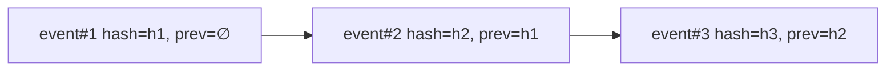

# DESIGN-AUDIT — Audit & Receipts

> [!NOTE]
> **AI-Assisted Documentation**
> Portions of this document were drafted with the assistance of an AI language model.
> Content has not yet been fully reviewed — this is a working design reference, not a final specification.
> When in doubt, defer to the source code, JSON schemas, and team consensus.

Anchor: [BLUEPRINT.md](./BLUEPRINT.md) (F24–F25). Related: [DESIGN-BUMBLEBEE.md](./DESIGN-BUMBLEBEE.md), [BACKUP-RESTORE.md](./BACKUP-RESTORE.md).

## Overview

The Audit subsystem records every permit/deny/defer decision and every memory write as an **append-only, hash-chained** event. It is the evidence backbone for compliance and reversibility (AD-05, RK-06).

## Functional Requirements

| ID | Implementation detail |
|----|-----------------------|
| F24 | Every decision is logged with actor, role, token prefix, workspace, group_id, action, decision. |
| F25 | `GET /audit/export` produces CSV and receipt packets. |

## API Reference

| Method | Path | Query | Response | Errors |
|--------|------|-------|----------|--------|
| GET | `/audit` | `group_id, actor, action, decision, from, to` | `[AuditEvent]` | 401, 403 |
| GET | `/audit/export` | `format=csv|receipt` | file stream | 401, 403 |

## Hash Chain

Each event stores `prev_hash` and `hash`; a broken chain indicates tampering.

## Business Rules / Constraints

- Append-only: no UPDATE/DELETE on audit rows (AD-05).
- Raw tokens/secrets are never stored; only `token_prefix` (RK-03).
- Export is permitted for `auditor`/`admin`/`owner` roles only.
- Chain verification runs in CI restore tests and in the `checkpoint-manager` skill.

## Use Cases

- **AUD-UC1:** Auditor filters by `decision=deny` for a workspace and exports CSV.
- **AUD-UC2:** Restore test verifies the hash chain end-to-end (RK-06, RK-07).
- **AUD-UC3:** Receipt packet export bundles evidence for a regulator review.

## Important Constraints

- Audit writes must not block the request path beyond bounded latency; use durable append with backpressure.
- Chain head is checkpointed every 10 minutes (see [BACKUP-RESTORE.md](./BACKUP-RESTORE.md)).
