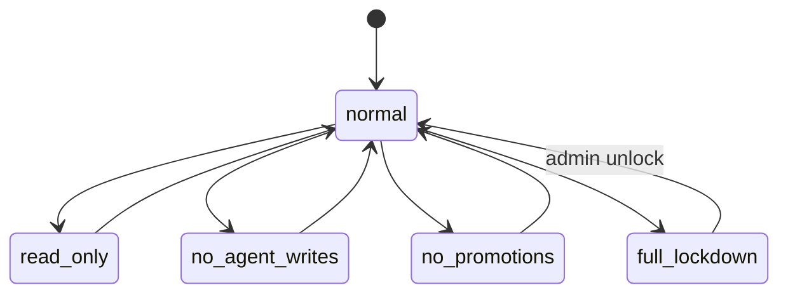

# DESIGN-AUTH — Authentication & Tenancy

> [!NOTE]
> **AI-Assisted Documentation**
> Portions of this document were drafted with the assistance of an AI language model.
> Content has not yet been fully reviewed — this is a working design reference, not a final specification.
> When in doubt, defer to the source code, JSON schemas, and team consensus.

Anchor: [BLUEPRINT.md](./BLUEPRINT.md) (F1–F5). Related: [DESIGN-BUMBLEBEE.md](./DESIGN-BUMBLEBEE.md).

## Overview

Covers human login, organizations, workspaces, membership, roles, and `group_id` generation. This area establishes identity and tenant scope; Bumblebee then enforces it on every request.

## Functional Requirements

| ID | Implementation detail |
|----|-----------------------|
| F1 | `POST /orgs` creates an organization owned by the caller. |
| F2 | `POST /orgs` generates the org `group_id` (`allura-<slug>`, validated against `^allura-[a-z0-9-]+$`); `POST /workspaces` creates a `workspace_id` sub-scope under it, sharing the org `group_id`. (ADR-001) |
| F3 | `POST /invites` + `POST /memberships` assign a role to a user in a workspace. |
| F4 | Session/token resolution restricts access to assigned workspaces only. |
| F5 | Admin/owner roles require `mfa_enabled = true`. |

## API Reference

| Method | Path | Body | Response | Errors |
|--------|------|------|----------|--------|
| POST | `/orgs` | `{name}` | `{id, group_id}` | 401, 409 |
| POST | `/workspaces` | `{org_id, name}` | `{id (workspace_id), group_id, lock_mode}` | 401, 403, 409 |
| POST | `/invites` | `{workspace_id, email, role}` | `{invite_id}` | 401, 403 |
| POST | `/memberships` | `{invite_token, user_id}` | `{membership_id, role}` | 401, 410 |
| POST | `/sessions` | `{email, password, mfa_code?}` | `{session}` | 401, 403 (MFA required) |

## State Machine — Workspace lock

## Business Rules / Constraints

- `group_id` is generated at **organization** creation, shared by all its workspaces, server-side and immutable (AD-01, ADR-001). Workspaces receive a `workspace_id` sub-scope; they do not mint new `group_id`s.
- A user may belong to multiple workspaces with different roles.
- Owner role cannot be removed if it is the last owner of a workspace.
- MFA enrollment is enforced before an admin/owner action is permitted (F5).

## Use Cases

- **AUTH-UC1:** Owner creates org (receives `group_id`) → creates workspace (receives `workspace_id` under the same `group_id`).
- **AUTH-UC2:** Admin invites employee; employee accepts and logs in; sees only assigned workspace.
- **AUTH-UC3:** Admin without MFA is blocked from admin actions until enrolled.

## Important Constraints

- Passwords/credentials never logged. Sessions are short-lived; refresh is server-validated.
- All tenancy decisions defer to Bumblebee at request time ([DESIGN-BUMBLEBEE.md](./DESIGN-BUMBLEBEE.md)).
