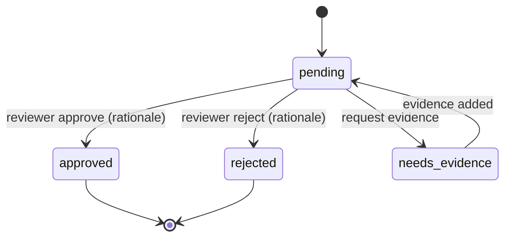

> [!CAUTION]
> **Not current.** Superseded by the canonical set in [`docs/allura/`](../allura/) (AD-50, PostgreSQL-only). This hosted-platform draft set is historical; do not use as implementation authority. Canonical: `BLUEPRINT.md`, `SOLUTION-ARCHITECTURE.md`, `DATA-DICTIONARY.md`, `REQUIREMENTS-MATRIX.md`, `RISKS-AND-DECISIONS.md`, `DESIGN-ALLURA.md` in `docs/allura/`.

# DESIGN-CURATOR — Memory Promotion (HITL)

> [!NOTE]
> **AI-Assisted Documentation**
> Portions of this document were drafted with the assistance of an AI language model.
> Content has not yet been fully reviewed — this is a working design reference, not a final specification.
> When in doubt, defer to the source code, JSON schemas, and team consensus.

Anchor: [BLUEPRINT.md](./BLUEPRINT.md) (F20–F23). Related: [DESIGN-AUDIT.md](./DESIGN-AUDIT.md), [RISKS-AND-DECISIONS.md](./RISKS-AND-DECISIONS.md).

## Overview

The Curator is the human-in-the-loop promotion pipeline. It proposes — never decides. A proposed memory waits in a review queue; only a human/reviewer can promote it to trusted (semantic) knowledge. Agents cannot self-approve (AD-04).

## Functional Requirements

| ID | Implementation detail |
|----|-----------------------|
| F20 | `GET /curator/pending` lists proposals with confidence + evidence preview. |
| F21 | `POST /curator/:id/approve` / `reject` require a rationale; `needs_evidence` requests more proof. |
| F22 | Approval requires a human/reviewer principal; agent principals are denied. |
| F23 | Promotion history is retained and viewable. |

## API Reference

| Method | Path | Body | Response | Errors |
|--------|------|------|----------|--------|
| GET | `/curator/pending` | — | `[{id, memory_id, confidence, evidence_ids, status}]` | 401, 403 |
| POST | `/curator/:id/approve` | `{rationale}` | `{status:'approved', version_id}` | 401, 403, 409 |
| POST | `/curator/:id/reject` | `{rationale}` | `{status:'rejected'}` | 401, 403 |
| POST | `/curator/:id/request-evidence` | `{note}` | `{status:'needs_evidence'}` | 401, 403 |

## State Machine — Proposal

## Business Rules / Constraints

- Approval writes a new semantic version and links `SUPERSEDES` to any prior (AD-06).
- A proposal transitions to `approved` exactly once (idempotent; 409 on repeat).
- Rationale is mandatory on approve/reject (RK-05).
- Every decision emits an audit receipt (AD-05).

## Use Cases

- **CUR-UC1:** Reviewer approves a proposal → new Neo4j version + receipt.
- **CUR-UC2:** Agent attempts approve → denied (AD-04).
- **CUR-UC3:** Reviewer requests evidence → status `needs_evidence`; agent supplies; re-queued.

## Important Constraints

- No autonomous promotion path exists for agents or providers.
- Superseded nodes are deprecated, never deleted.
