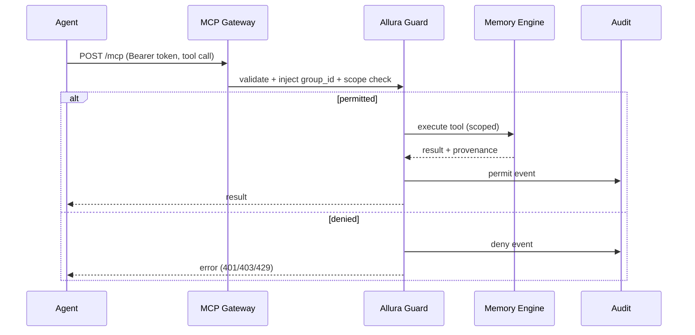
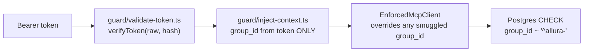

# DESIGN-MCP-GATEWAY — Agent Connectivity

> [!NOTE]
> **AI-Assisted Documentation**
> Portions of this document were drafted with the assistance of an AI language model.
> Content has not yet been fully reviewed — this is a working design reference, not a final specification.
> When in doubt, defer to the source code, JSON schemas, and team consensus.

Anchor: [BLUEPRINT.md](./BLUEPRINT.md) (F13–F15). Related: [DESIGN-GUARD.md](./DESIGN-GUARD.md).

## Overview

The MCP Gateway lets agents (Claude, Codex, OpenCode, Cursor, custom) connect to Allura over **Streamable HTTP** (SSE + JSON-RPC) at `/mcp`. Every call is validated and scoped by Allura Guard before any memory tool runs.

## Functional Requirements

| ID | Implementation detail |
|----|-----------------------|
| F13 | `/mcp` accepts a bearer MCP token; Allura Guard validates it per request. |
| F14 | Gateway resolves workspace + `group_id` and checks scopes before tool execution. |
| F15 | The `group_id` is server-injected; an agent-supplied `group_id` is ignored/rejected. |

## API Reference

| Method | Path | Transport | Notes |
|--------|------|-----------|-------|
| POST | `/mcp` | Streamable HTTP | Requires `Authorization: Bearer <token>` and `Accept: application/json, text/event-stream`; `mcp-session-id` for continuity. |

Exposed MCP tools (scoped): `memory_add`, `memory_search`, `memory_get`, `memory_list`, `memory_delete`, `receipt_create`. Reviewer tokens may additionally expose `review_*` and `memory_promote`.

## Agent Flow

## Coworker Onboarding (Scoped Tokens)

Human coworkers connect through the same gateway as agents, each via a **scoped MCP bearer token** bound to a `group_id` at mint time. Provisioning is scripted in `scripts/onboard-team.ts`, which onboards coworkers and then **proves** isolation against the live DB.

The enforcement chain (all four layers exist in code):

- **Token model** (`src/lib/mcp-token/repository.ts`): a token record binds `{ group_id, workspace_id, agent_name, token_prefix, token_hash, scopes, expires_at }`. The raw bearer is **never persisted** — only a hash (`src/lib/mcp-token/hash.ts`, `verifyToken`) plus a short prefix.
- **Injection is one-directional** (`src/lib/guard/inject-context.ts`, ADR-001 "Bumblebee step 2"): `group_id` + `workspace_id` + `scopes` come **only** from the validated token; a client-supplied `group_id` is never read. *The token decides the tenant.*
- **Proven, not asserted** (`scripts/onboard-team.ts`): onboarding Gabriel (`allura-gabriel`) and Samuel (`allura-samuel`) verifies (a) each bearer's calls resolve under its **own** injected `group_id`, and (b) a token cannot run another group's scoped query. Scopes default to `memory:read` + `memory:write`.

## Tenant Taxonomy — per-person vs per-project

The isolation mechanism is **taxonomy-agnostic**: a token binds to any `^allura-[a-z0-9-]+$` group, and the gateway enforces exactly that group. *What the groups represent is a configuration decision, not a code change.*

- **Per-person** (as shipped in `onboard-team.ts`): `allura-gabriel`, `allura-samuel` — each coworker gets a private graph.
- **Per-project** (the Faith Meats / Difference Driven split): mint project groups such as `allura-faith-meats` (already the canonical example in the kernel tenant validator) and `allura-difference-driven`, then bind each coworker's token to the project group they should see. **"Gabe sees Difference Driven"** = issue Gabe a token bound to `allura-difference-driven`.
- **The one real limitation:** one token binds to exactly one `group_id`. For a coworker who must span *multiple* project graphs in one session, either issue multiple scoped tokens or place genuinely-shared knowledge in a common tier (`global` / `allura-system`) that reads overlay via `include_global`. There is no single-token multi-group ACL today — that would be net-new work.

> Owner-only: minting real coworker tokens touches `ALLURA_MCP_TOKEN_SECRET` and live workspaces; run `onboard-team.ts` (or the tokens API) under the operator's control. This doc specifies the design; it does not issue credentials.

## Business Rules / Constraints

- Bearer token is validated on **every** request (no trust caching across requests).
- `group_id` override attempts are dropped and may be flagged as drift.
- Tool availability is a function of token scopes (least privilege).
- A token binds to exactly one `group_id`; multi-group visibility requires multiple tokens or a shared tier (no single-token multi-group ACL).

## Use Cases

- **MCP-UC1:** Claude connects with default agent scopes; calls `memory_search` and `memory_add` within its workspace only.
- **MCP-UC2:** Agent attempts `memory_promote` without scope → deny + audit (AD-04).
- **MCP-UC3:** Agent passes a foreign `group_id` → ignored; request scoped to token's workspace (F15, RK-01).

## Important Constraints

- Transport must support SSE; clients must send the documented `Accept` header.
- No gateway path bypasses Allura Guard.
