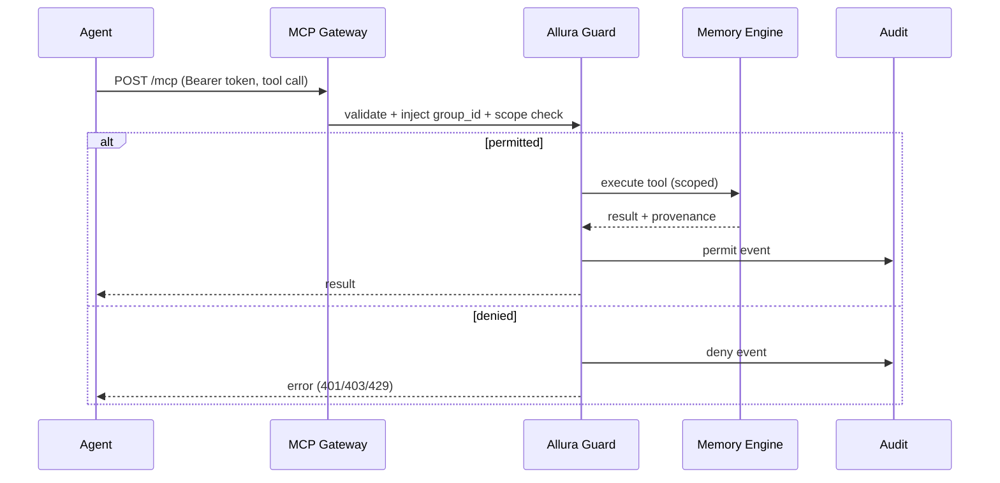

# DESIGN-MCP-GATEWAY — Agent Connectivity

> [!NOTE]
> **AI-Assisted Documentation**
> Portions of this document were drafted with the assistance of an AI language model.
> Content has not yet been fully reviewed — this is a working design reference, not a final specification.
> When in doubt, defer to the source code, JSON schemas, and team consensus.

Anchor: [BLUEPRINT.md](./BLUEPRINT.md) (F13–F15). Related: [DESIGN-GUARD.md](./DESIGN-GUARD.md).

## Overview

The MCP Gateway lets agents (Claude, Codex, OpenCode, Cursor, custom) connect to Allura over **Streamable HTTP** (SSE + JSON-RPC) at `/mcp`. Every call is validated and scoped by Allura Guard before any memory tool runs.

## Functional Requirements

| ID | Implementation detail |
|----|-----------------------|
| F13 | `/mcp` accepts a bearer MCP token; Allura Guard validates it per request. |
| F14 | Gateway resolves workspace + `group_id` and checks scopes before tool execution. |
| F15 | The `group_id` is server-injected; an agent-supplied `group_id` is ignored/rejected. |

## API Reference

| Method | Path | Transport | Notes |
|--------|------|-----------|-------|
| POST | `/mcp` | Streamable HTTP | Requires `Authorization: Bearer <token>` and `Accept: application/json, text/event-stream`; `mcp-session-id` for continuity. |

Exposed MCP tools (scoped): `memory_add`, `memory_search`, `memory_get`, `memory_list`, `memory_delete`, `receipt_create`. Reviewer tokens may additionally expose `review_*` and `memory_promote`.

## Agent Flow

## Business Rules / Constraints

- Bearer token is validated on **every** request (no trust caching across requests).
- `group_id` override attempts are dropped and may be flagged as drift.
- Tool availability is a function of token scopes (least privilege).

## Use Cases

- **MCP-UC1:** Claude connects with default agent scopes; calls `memory_search` and `memory_add` within its workspace only.
- **MCP-UC2:** Agent attempts `memory_promote` without scope → deny + audit (AD-04).
- **MCP-UC3:** Agent passes a foreign `group_id` → ignored; request scoped to token's workspace (F15, RK-01).

## Important Constraints

- Transport must support SSE; clients must send the documented `Accept` header.
- No gateway path bypasses Allura Guard.
