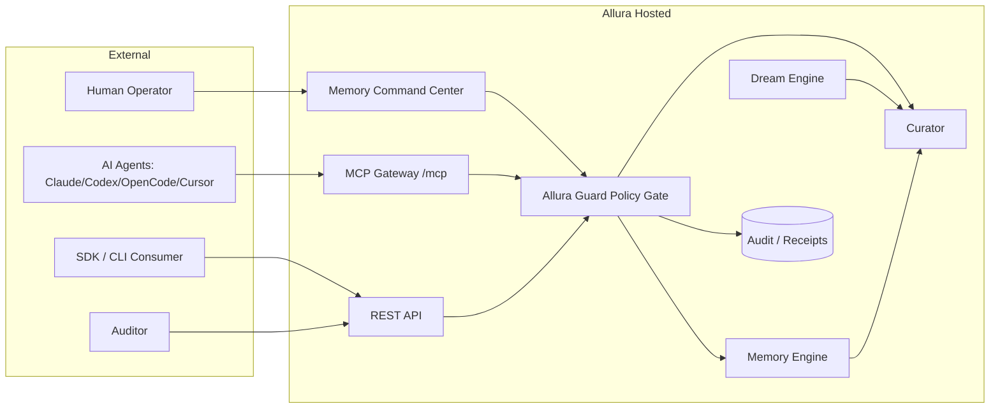
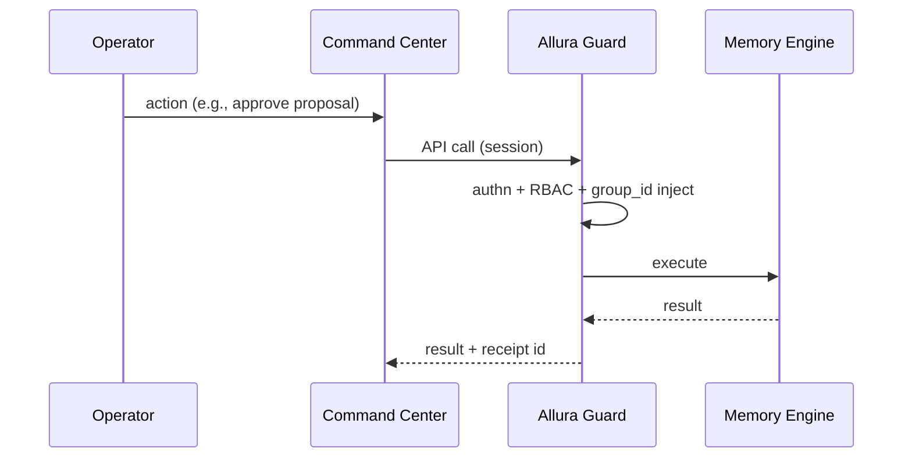
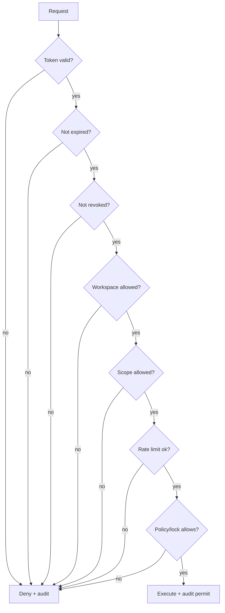
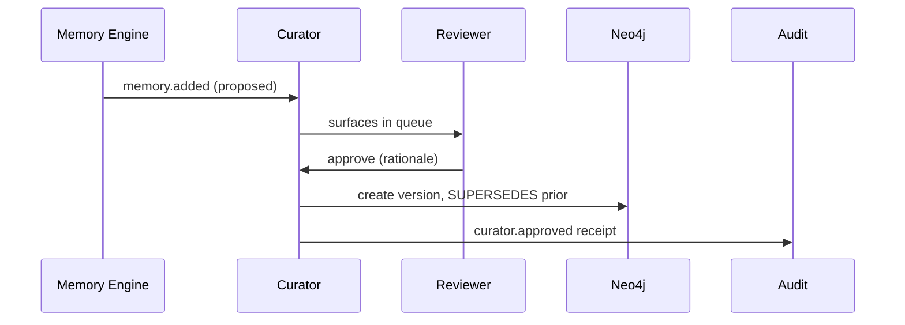

> [!CAUTION]
> **Not current.** Superseded by the canonical set in [`docs/allura/`](../allura/) (AD-50, PostgreSQL-only). This hosted-platform draft set is historical; do not use as implementation authority. Canonical: `BLUEPRINT.md`, `SOLUTION-ARCHITECTURE.md`, `DATA-DICTIONARY.md`, `REQUIREMENTS-MATRIX.md`, `RISKS-AND-DECISIONS.md`, `DESIGN-ALLURA.md` in `docs/allura/`.


# Allura Hosted Platform — Solution Architecture

> [!NOTE]
> **AI-Assisted Documentation**
> Portions of this document were drafted with the assistance of an AI language model.
> Content has not yet been fully reviewed — this is a working design reference, not a final specification.
> AI-generated content may contain inaccuracies or omissions.
> When in doubt, defer to the source code, JSON schemas, and team consensus.

Topological view — who calls what. Complements the data-and-API view in [BLUEPRINT.md](./BLUEPRINT.md).

---

## Architectural Positioning

Allura Hosted is a **governed control plane + data plane**: the Memory Command Center and MCP Gateway are entry points; **Allura Guard** is the single policy gate; the **Memory Engine** is the data plane. The dashboard never touches storage directly (AD-08).

### Consumer classes

| Consumer | Channel | Auth | Notes |
|----------|---------|------|-------|
| Human operator | HTTPS (browser) | Session + MFA (admins) | Acts through governed API only. |
| AI agent | MCP Streamable HTTP (`/mcp`) | Bearer MCP token | Scoped, hash-validated. |
| SDK / CLI consumer | HTTPS REST + OpenAPI | API key or MCP token | `@allura/sdk`, `allura` CLI. |
| Auditor | HTTPS (browser/API) | Session, `auditor` role | Read/export only. |
| Dream provider | Internal queue | Service-internal | Emits candidates only (AD-10). |

---

## System Boundary and External Actors



---

## Logical Topologies

### 1. Control plane (human operations)


Constraints: session + MFA for admin actions; all writes audited; UI cannot bypass BB.

### 2. Onboarding pipeline (org → workspace → token)

```mermaid
sequenceDiagram
  participant H as Owner/Admin
  participant API
  participant BB as Allura Guard
  H->>API: create org (→ group_id) → create workspace (→ workspace_id)
  API->>BB: generate org group_id; workspace_id sub-scope (server-side)
  H->>API: invite employee / create MCP token
  API->>BB: hash token, store prefix + scopes + expiry
  BB-->>H: raw token shown once
```
Constraints: org `group_id` server-generated at org creation; workspaces get a `workspace_id` sub-scope sharing it (AD-01, ADR-001); raw token shown once, stored as hash (AD-03).

### 3. Runtime request path (agent)

See [BLUEPRINT.md](./BLUEPRINT.md#agent-request-flow). Constraints: bearer token validated each request; scope + rate limit + lock-mode checked; `group_id` injected, never client-supplied (AD-01, AD-02, F15).

### 4. Enforcement (Allura Guard decision chain)



### 5. Event-driven (promotion + dreams)


Constraints: agents cannot approve (AD-04); promotion serialized; supersession only (AD-06).

---

## Interface Catalogue

| # | Direction | Channel | Payload | Governing AD/RK |
|---|-----------|---------|---------|-----------------|
| I1 | Operator → Command Center | HTTPS | UI actions | AD-08 |
| I2 | Agent → MCP Gateway | Streamable HTTP (SSE+JSON-RPC) | MCP tool calls | AD-02, AD-07, RK-03 |
| I3 | SDK/CLI → REST API | HTTPS+OpenAPI | typed requests | AD-07 |
| I4 | Allura Guard → Memory Engine | internal | scoped queries | AD-01, RK-01 |
| I5 | Curator → Neo4j | internal | versioned writes | AD-06 |
| I6 | Any → Audit | internal | append-only events | AD-05, RK-06 |
| I7 | Dream Engine → Curator | internal queue | candidates | AD-10, RK-02 |

---

## Risk-Architecture Traceability

| Topology | Addresses |
|----------|-----------|
| Enforcement chain (4) | RK-01, RK-03, RK-04, RK-10 |
| Onboarding pipeline (2) | RK-03, RK-09 |
| Event-driven (5) | RK-05, RK-06 |
| Runtime path (3) | RK-01, RK-02 |

---

## Key Architectural Constraints

- **MUST** route every read/write through Allura Guard; **MUST NOT** allow direct DB access from UI/SDK.
- **MUST** inject `group_id` server-side; **MUST NOT** accept a client-supplied `group_id`.
- **MUST** store token hashes only; **MUST NOT** log raw tokens or secrets.
- **MUST** append an audit event for every permit and deny.
- **MUST NOT** let any agent or provider promote memory autonomously.

---

## References

- [BLUEPRINT.md](./BLUEPRINT.md)
- [RISKS-AND-DECISIONS.md](./RISKS-AND-DECISIONS.md)
- [REQUIREMENTS-MATRIX.md](./REQUIREMENTS-MATRIX.md)
- Design docs: [AUTH](./DESIGN-AUTH.md) · [ALLURA GUARD](./DESIGN-GUARD.md) · [MCP-GATEWAY](./DESIGN-MCP-GATEWAY.md) · [MEMORY-COMMAND-CENTER](./DESIGN-MEMORY-COMMAND-CENTER.md) · [CURATOR](./DESIGN-CURATOR.md) · [AUDIT](./DESIGN-AUDIT.md)
