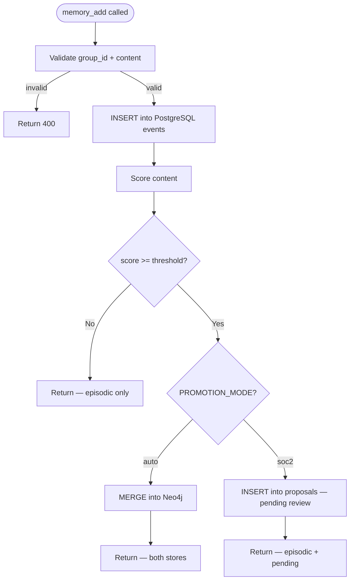
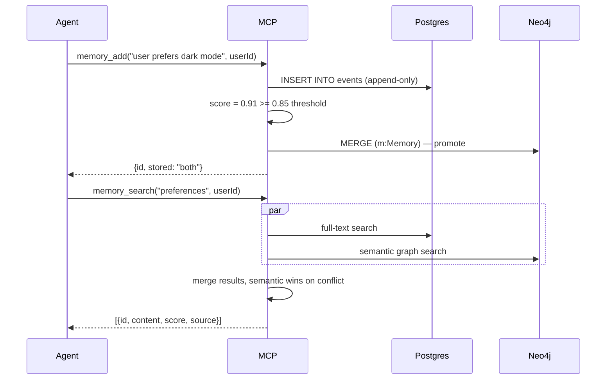
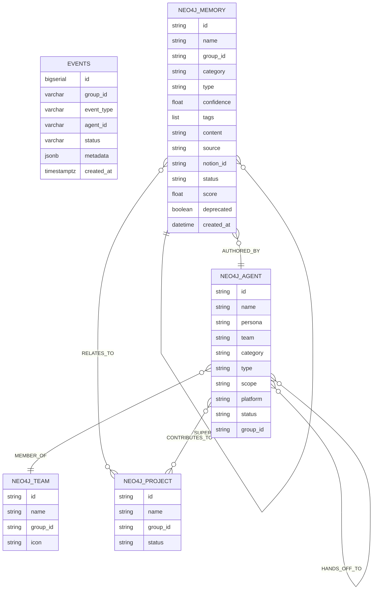

# Allura Blueprint

> [!NOTE]
> **AI-Assisted Documentation**
> Portions of this document were drafted with the assistance of an AI language model.
> Content has not yet been fully reviewed — this is a working design reference, not a final specification.
> When in doubt, defer to the source code, schemas, and team consensus.

Allura is a sovereign AI memory engine — a self-hosted, governed alternative to mem0.ai. It gives AI agents persistent, auditable, multi-tenant memory backed by a unified PostgreSQL architecture (pgvector for both episodic traces and semantic knowledge — Neo4j sunset 2026-07, see AD-50). The system enforces tenant isolation, append-only history, and versioned knowledge at the schema level — not by policy.

---

## Table of Contents

- [0) Brand Identity](#0-brand-identity)
- [1) Core Concepts](#1-core-concepts)
- [2) Requirements](#2-requirements)
- [3) Architecture](#3-architecture)
- [4) Diagrams](#4-diagrams)
- [5) Data Model](#5-data-model)
- [6) Execution Rules](#6-execution-rules)
- [7) Global Constraints](#7-global-constraints)
- [8) API Surface](#8-api-surface)
- [9) Logging & Audit](#9-logging--audit)
- [10) Admin Workflow](#10-admin-workflow)
- [11) References](#11-references)
- [12) Documentation Authority & Sync Contract](#12-documentation-authority--sync-contract)

---

## 0) Brand Identity

**Name:** allura (always lowercase in copy) / Allura Memory (legal / title context)  
**Tagline:** MEMORY THAT SHOWS ITS WORK  
**Positioning:** Warm + Connected — the AI memory layer for real life  
**Brand Promise:** We create spaces where connection thrives, community grows, and everyone belongs

### Core Values

| Value | Description |
|-------|-------------|
| MEMORY | Preserving what matters, faithfully |
| CONNECTION | Bridging people and their AI |
| CLARITY | Making memory visible, not hidden |
| TRUST | Governed, auditable, never opaque |
| EMPOWERMENT | Giving people agency over their own data |

### Target Persona

**Maya**, 31, Oakland — urban community organizer. Wants technology that feels warm, not soulless.  
Represents: urban millennials / Gen Z, ages 25–45.

### Brand Archetype

Caregiver 50% · Creator 30% · Explorer 20%

### Voice

| Dimension | Score |
|-----------|-------|
| Formality | 4/10 |
| Enthusiasm | 6/10 |
| Technicality | 3/10 |
| Humor | 4/10 |

**Use:** Community · Connection · Belonging · Together · Warmth · Inviting · Welcoming · Craft · Care · Celebrate · Amplify  
**Avoid:** "users" (→ "people") · frictionless · leverage · seamless · scalable

### Source of Truth

[`DESIGN-ALLURA.md`](./DESIGN-ALLURA.md) — brand canon and visual identity source, including Memory Command Center guidance
Full system: [`DESIGN-ALLURA.md`](./DESIGN-ALLURA.md)

---

## 1) Core Concepts

### Memory

A Memory is a unit of information an AI agent stores about a user, session, or context. Memories flow through two stores depending on their confidence score and the active promotion mode.

**States:** `episodic | semantic | deleted`

**Key fields:**

- `content` — the raw text of the memory
- `user_id` — the owner (scoped within a `group_id`)
- `group_id` — tenant namespace, must match `^allura-`
- `score` — confidence/relevance (0–1), determines promotion eligibility

---

### Episodic Memory (PostgreSQL)

Every memory write lands here first. Append-only. Never mutated. Provides the raw event log and audit trail.

**States:** `recorded` (terminal — no transitions)

**Key fields:**

- `event_type` — e.g. `memory_add`, `memory_delete`
- `metadata` — JSONB payload (content, query, score, etc.)
- `created_at` — immutable write timestamp

---

### Semantic Memory (Neo4j)

Promoted, curated knowledge. Versioned via `SUPERSEDES` relationships. Nodes are never edited — a new node is created that supersedes the prior one.

**States:** `active | deprecated`

**Key fields:**

- `id` — UUID
- `group_id` — tenant namespace
- `content` — memory content
- `score` — confidence score
- `deprecated` — true when a newer version exists

---

### Tenant (`group_id`)

The hard isolation boundary. Every read and write MUST include a valid `group_id`. Enforced by a PostgreSQL CHECK constraint (`group_id ~ '^allura-'`). No application-layer bypass is possible.

---

## 2) Requirements

### Engine Boundary and RuVector/RuVix Posture

Allura is the governed memory engine: PostgreSQL append-only episodic traces, Neo4j semantic promotion, MCP/API access, curator approval, and RuVix policy receipts. Dashboard and operator surfaces visualize and request governed actions; they are not core engine components and must not own canonical engine state.

Current runtime label: **pgvector bridge**. TALON readiness evidence on 2026-06-02 observed PostgreSQL `vector` extension `0.8.2`, `ruvector_function_count=0`, and `allura_memories_count` around `3392`. Until the `ruvector` extension/functions and feedback/search health are proven by runtime checks, docs and UI must not claim full RuVector.

### Graph Adapter Posture (AD-29, AD-49, Story 19.3)

The RuVector Graph Cutover is **complete** (Story 19.3, 2026-07-12). Allura now uses **RuVector graph backend as default**, with **Neo4j as fallback read-only mode** during the one-release transition period.

**Current stack:**

| Layer | Backend | Implementation | Status | Evidence |
|-------|---------|----------------|--------|----------|
| Vector search | pgvector (bridge) | `src/lib/ruvector/bridge.ts` | Active | `ruvector_function_count=0`, `vector=0.8.2` (TALON 2026-06-02) |
| Semantic/knowledge graph | IGraphAdapter (PG tables) | `src/lib/graph-adapter/` | **CUTOVER COMPLETE** | `GRAPH_BACKEND=ruvector` default, `neo4j` fallback available; 14/14 parity checks green (Story 19.3) |
| Native RuVector extension | ruvnet Rust crate | Not yet active | Not enabled | `ruvector_function_count=0` — stubs only (RK-21, Stage 2) |

**Runtime flag:**
- `GRAPH_BACKEND=ruvector` — uses PG tables for graph ops (RuVectorGraphAdapter, default)
- `GRAPH_BACKEND=neo4j` — uses Neo4j driver (legacy fallback)
- `GRAPH_DUAL_READ=true` — wraps selected backend with dual-read validation

This cutover removes the per-person Neo4j Community license limit (1 user), collapses two stores toward one engine, and enables self-hosted graphs. Neo4j remains as fallback for one release after the cutover (AD-49 consequence); Story 19.3 executed the flip to ruvector as default.

### Agent Factory Delivery Boundary

The Allura Agent Factory uses BMad Builder as an authoring and packaging layer while Allura remains the governance and memory authority. Factory modules, validators, and CI workflows live in this canonical repository so GitHub can execute the gates that protect them. A module is shippable only after structural validation, roster and tenant consistency checks, live tenant-isolation smoke evidence, and explicit packaging of a named team.

Factory CI does not imply native RuVector or an upstream governance package exists. Those claims remain blocked until native extension, smoke-test, and package source artifacts are present and independently verified.

RuVix governs action disposition with `Permit`, `Defer`, and `Deny` decisions. Any runtime/database, MCP configuration, cron, live RAM/Durham hook, RuVix enforcement, semantic promotion, Notion sync, or Done/Approved status change requires explicit approval and a receipt carrying `approval_required` when gated.

### API-First Scope and Optional Memory Command Center

Allura is an MCP/API-first memory engine with an optional RuVix-governed Memory Command Center for human operators. The engine remains usable through protocol and service interfaces without a browser, while the dashboard is the branded control plane for memory inspection, governance, curator decisions, audit evidence, graph exploration, and settings.

### Evidence-Gated Orchestration Positioning

Allura may expose governed orchestration records for teams, but this does not change the engine boundary. The memory engine stores run receipts, evidence, decisions, and reusable knowledge; it does not become an autonomous project manager. Corporate-facing language should say **evidence-gated, auditable, resumable runs** — never “hallucination-free.”

AD-35 now has an implemented process-engine foundation under
`src/lib/process-engine/` plus a headless runner in `scripts/process-run.ts`.
The canonical product contract remains a neutral `RunRecord` with separated
policy and runtime state. The current implementation is partial: event
persistence, gates, checkpoints, replay, DAG validation, and SDK primitives
exist, but process definitions are not durably versioned, checkpoint approval
does not yet continue remaining execution, doctor checks are absent, and no
first-class run API/product surface exists.

### E2E Readiness Status (as of 2026-06-14)

| Gate | Status | Notes |
|------|--------|-------|
| Live-DB 10-point engine acceptance gate | **PASSED** | All 10 engine unit/integration tests pass against real PostgreSQL and Neo4j (commit `f518b1eb`). Evidence in `bun run test:e2e` output. |
| Docker fresh-deploy (stranger-on-new-machine) | **UNVERIFIED** | `docker compose up` on a fresh machine has not been end-to-end smoke-tested. External volumes and network marked `external: true` will fail first `up` without prior manual setup. See AD-41 for the approved delivery sequence and INSTALL-DEPLOY-REVIEW.md in `docs/archive/allura/` for the outstanding checklist. |
| RuVector / full native extension | **NOT READY** | `ruvector_function_count=0` on 2026-06-02 (TALON). Label remains `pgvector bridge` until extension functions and feedback/search health checks pass (RK-21). |
| Graph adapter (IGraphAdapter, PG tables) | **READY** / **CUTOVER COMPLETE** | `GRAPH_BACKEND=ruvector` default, `neo4j` fallback; 14/14 parity checks green (AD-29, AD-49, RK-32, Story 19.3). |

No doc or UI surface may claim "production-ready" or "fresh-deploy verified" until the Docker fresh-deploy gate is independently executed and recorded in INSTALL-DEPLOY-REVIEW.md.

- **MCP tools** — `memory_add`, `memory_search`, `memory_get`, `memory_list`, `memory_delete`
- **API routes** — `/api/health/*`, `/api/memory/*`, `/api/curator/*`
- **CLI scripts** — `bun run curator:run`, `bun run curator:approve`, `bun run mcp:http`
- **Memory Command Center** — `/dashboard`, `/dashboard/memories`, `/dashboard/curator`, `/dashboard/governance`, `/dashboard/graph`, `/dashboard/audit`, `/dashboard/settings`

**Core goals:**
- Provide real-time system status and health via API endpoints
- Show memory search, insights, and audit trails through MCP tools and the optional Memory Command Center
- Preserve tenant isolation and governed approval flows
- Expose active `group_id` scope in all responses and dashboard pages
- Avoid fabricated data; degraded states must be explicit
- Require governance receipts for every dashboard mutation

**Non-goals:** ungated direct database editing, fabricated live metrics, decorative dashboard charts without source evidence, bulk approval without rationale, generated logo marks, or any dashboard action that bypasses MCP/API governance.

### RuVix-Governed Memory Command Center

The approved dashboard direction is a Memory Command Center, not a decorative product dashboard. It manages what the system remembers, why it remembers it, who approved it, what it can affect, and whether governance is holding.

| Area | Purpose | First-release requirements |
|------|---------|----------------------------|
| Overview | System health, queue status, freshness, degraded state | PostgreSQL, Neo4j, MCP gateway, curator, embeddings, active `group_id` |
| Memories | Search, inspect, filter, and understand memory records | State, source, confidence, actor, evidence ID, graph relationship, provenance drawer |
| Curator | Human decision surface for proposals | Approve, reject, request evidence, request changes, required rationale |
| Governance | RuVix policy control and status | Promotion mode, thresholds, role separation, tenant isolation, locks, drift warnings |
| Graph | Semantic relationship exploration | Real Neo4j data only, source receipts, fallback list when degraded |
| Audit | Compliance and evidence surface | Full event log, filters, CSV/export packet, receipt details |
| Settings | Read-mostly tenant and policy visibility | Tenant config, promotion mode, role matrix, endpoint health |

Every page must show active `group_id`, source of truth, freshness, degraded state, and a path to evidence. Every mutation must produce a governance receipt with intent, actor, source, policy, validation, and audit trail.

**Memory/provenance/export requirements:** export/copy surfaces are read-only; preserve source, actor/creator/approver, timestamp, status, confidence, `group_id`, evidence IDs, hash/previous-hash fields when present; degraded export failures must be explicit.

### Business Requirements

| #   | Requirement                                                                                  |
| --- | -------------------------------------------------------------------------------------------- |
| B1  | Developers integrate Allura with a 5-tool API matching mem0's UX                             |
| B2  | All memory is isolated by tenant (`group_id`) at the schema level                            |
| B3  | Every write produces an immutable audit record in PostgreSQL                                 |
| B4  | Promoted knowledge is versioned and never mutated in Neo4j                                   |
| B5  | The system is deployable via a single `docker compose up` command for core infra and app services |
| B6  | Agents connect via MCP (Model Context Protocol) through Team RAM-selected packaged MCP servers |
| B7  | Operators choose between human-gated (SOC2) and auto-promotion modes                         |
| B8  | Consumer memory viewer: no sidebar, search dominant, swipe to forget                         |
| B9  | Every memory shows provenance: "from conversation" or "added manually"                       |
| B10 | Memory usage indicator: "used N times this week" on expand                                   |
| B11 | Undo: recently forgotten memories recoverable within 30 days                                 |
| B12 | Enterprise admin view: tenant overview, SOC2 pending queue, audit log via API |
| B13 | Audit log exportable as CSV for compliance |
| B14 | TypeScript SDK (`@allura/sdk`) |
| B15 | BYOK encryption |
| B16 | Curator CLI: three-state approval workflow (Traces, Approved, Pending) |
| B17 | Curator sees confidence scores (60-100%) with one-sentence reasoning for uncertain proposals |
| B18 | Approve/reject decisions logged to audit trail with curator ID and timestamp |
| B19 | Auto-promote proposals >85% confidence without curator review (configurable) |
| B20 | MCP HTTP gateway deployable via Docker; backend engine in user's VPC/cloud |
| B21 | Authentication via API keys and RBAC (curator, admin, viewer roles) |
| B22 | Error tracking via Sentry; alerts on engine failures |
| B23 | Agents must persist all task activity as append-only raw traces for auditability |
| B24 | A curator process must turn raw traces into proposed insights without promoting them directly |
| B25 | No insight may become active knowledge until approved by a human or policy-controlled flow |
| B26 | Approved insights must be stored in Neo4j as immutable, versioned knowledge records |
| B27 | Agents must retrieve approved knowledge through a controlled retrieval layer |
| B28 | All reads/writes must pass through controlled APIs with project-level access and audit |
| B29 | The full loop from agent execution to knowledge reuse must be demonstrably end-to-end |
| B30 | Team RAM agents must integrate with BMAD planning and Allura Brain memory through a documented workflow, preserving `.opencode/agent/` as the live agent source of truth |
| B31 | Teams must be able to define evidence-gated orchestration runs that map familiar work ceremonies to governed Allura receipts without exposing internal agent-routing details |
| B32 | Supply-chain threat intelligence must preserve source provenance, tenant/workspace scope, evidence freshness, and human authority while remaining read-only toward inventoried endpoints and external enforcement systems |

---

### Functional Requirements

#### Memory Operations

| #   | Requirement                                                                                                |
| --- | ---------------------------------------------------------------------------------------------------------- |
| F1  | `memory_add(content, userId, metadata?)` — writes to Postgres; conditionally promotes to Neo4j             |
| F2  | `memory_search(query, userId, limit?)` — federated search across Postgres + Neo4j, merged by relevance     |
| F3  | `memory_get(memoryId)` — returns a single memory record by ID                                              |
| F4  | `memory_list(userId)` — returns all memories for a user within the tenant                                  |
| F5  | `memory_delete(memoryId)` — soft-delete: appends a deletion event to Postgres, marks Neo4j node deprecated |

#### Governance

| #   | Requirement                                                                                    |
| --- | ---------------------------------------------------------------------------------------------- |
| F6  | `PROMOTION_MODE=soc2` — score ≥ threshold queues for human approval; no autonomous Neo4j write |
| F7  | `PROMOTION_MODE=auto` — score ≥ `AUTO_APPROVAL_THRESHOLD` promotes immediately to Neo4j        |
| F8  | `group_id` CHECK constraint blocks writes with invalid tenant namespaces                       |
| F9  | `SUPERSEDES` relationship created on every Neo4j node update                                   |

#### Curator Dashboard

| #   | Requirement                                                                                         |
| --- | --------------------------------------------------------------------------------------------------- |
| F10 | `POST /api/curator/score` — scores proposal, returns {confidence, reasoning, tier}                  |
| F11 | `POST /api/curator/approve` — moves proposal to approved knowledge, promotes to Neo4j if tier ≥ 85% |
| F12 | `POST /api/curator/reject` — archives proposal to 7-day undo, logs to audit trail                   |
| F13 | `GET /api/curator/proposals` — returns pending proposals (emerging + adoption tiers only)           |
| F14 | Curator dashboard shows three tabs: Traces (raw), Approved (knowledge), Pending (decisions)         |
| F15 | Pending tab sorts by confidence (descending); shows confidence badge + reasoning + buttons          |
| F16 | Approved tab shows all approved knowledge (human + auto-promoted); sortable by date/confidence      |
| F17 | Tab 1 restricted to authenticated users with `admin` role (engineers only)                          |
| F18 | Audit log endpoint: `GET /api/audit/events` — returns curator decisions with timestamps             |
| F19 | Dashboard integrates Clerk for authentication and RBAC (curator, admin, viewer roles)               |

#### Infrastructure

| #   | Requirement                                                                                 |
| --- | ------------------------------------------------------------------------------------------- |
| F20 | Skills route agent work to packaged MCP servers (`neo4j-memory`, `database-server`, optional `neo4j-cypher`) rather than a custom all-in-one MCP runtime |
| F21 | `docker compose up` starts core infra and app services; packaged MCP servers are attached as focused external capabilities |
| F22 | Memory viewer UI at `/memory` lists, searches, and deletes memories                         |
| F23 | Curator dashboard deployed on Vercel; calls backend engine via `CURATOR_ENGINE_URL` env var |
| F24 | Vercel Functions (`/api/curator/*`) call Docker engine in VPC/cloud via HTTPS               |
| F25 | Error tracking: unhandled exceptions sent to Sentry; curator notified via email/Slack       |

#### Governed Memory Pipeline

| #   | Requirement                                                                                                          |
| --- | ------------------------------------------------------------------------------------------------------------------- |
| F26 | Agent task lifecycle events, tool calls, outputs, retries, and terminal status are persisted as append-only traces    |
| F27 | Raw trace storage is append-only; no UPDATE or DELETE on the `events` table                                        |
| F28 | Raw traces preserve provenance linking downstream insights back to source evidence                                   |
| F29 | Curator reads raw traces and generates proposed insights (not active insights)                                     |
| F30 | Each proposed insight includes summary, evidence links, confidence score, timestamp, and status                    |
| F31 | Proposed insights enter an approval flow before becoming active knowledge                                           |
| F32 | Every approval, rejection, or policy decision is recorded as an audit event with actor and timestamp                |
| F33 | Approved insights are written to Neo4j as immutable nodes; no in-place updates                                     |
| F34 | Changed insights create new nodes linked with `SUPERSEDES`, `DEPRECATED`, or `REVERTED` relationships             |
| F35 | Agents retrieve knowledge through a controlled retrieval service, not by querying databases directly                 |
| F36 | Retrieval supports semantic and structured queries with project and global scope                                    |
| F37 | All knowledge-system reads/writes pass through controlled endpoints enforcing project-level access                  |
| F38 | Agent permissions enforced and all access to trace/knowledge resources is audited                                  |
| F39 | A second agent can retrieve approved knowledge and use it correctly in a later task                                |
| F40 | The full lifecycle from trace capture to knowledge reuse is traceable, auditable, and reversible                   |
| F56 | Bumblebee V1 may ingest allowlisted advisory evidence, correlate verified exposure, create deduplicated alerts, and prepare simulated mitigation proposals; it must not activate policy, block CI/packages, change schedules, or perform containment |

#### Memory Command Center

| #   | Requirement |
| --- | ----------- |
| F41 | Memory Command Center exposes `/dashboard` (new chat), `/dashboard/search` (memory search), `/dashboard/scheduled-tasks` (dreams), `/dashboard/governance` (policy gates), `/dashboard/kanban` (work board), `/dashboard/graph` (knowledge graph), `/dashboard/mission-control` (ops console), and `/dashboard/settings` as the governed operator surface |
| F42 | `/dashboard/memories` preserves useful reference memory capabilities: memory search/list, insights, trace logs, provenance, extracted facts, and approval queue |
| F43 | `/work-board` uses Native Allura Kanban as the default planning source of truth; Notion, Linear, and GitHub Projects are optional sync adapters |
| F44 | `/resources` reads skills, agents, MCP servers, containers, cron jobs, and drift warnings from a declared Resource Manifest or generated manifest endpoint |
| F45 | `/agents` distinguishes TALON/IRIS native subagents from Team RAM/Durham CLI harness agents and external runtime agents |
| F46 | `/telemetry` surfaces model, prompt, tool, retry, rate-limit, failure, and degraded-state metrics without inventing missing measurements |
| F47 | Every Memory Command Center route displays its source-of-truth declaration and degraded-state behavior |
| F48 | Dashboard launch requires documented route parity, visual parity, source-of-truth parity, smoke tests, auth validation, and rollback plan |
| F49 | Governed runs capture a neutral tenant-scoped `RunRecord` and pin a process definition ID and immutable revision |
| F50 | Run policy declares allowed actions, approval breakpoints, measured quality gates, bounded attempts, and evidence required before Done |
| F51 | Run journals persist append-only execution evidence and continue from the first incomplete eligible step after approval without repeating completed side effects |
| F52 | Run doctor checks report stale, failed, incomplete, definition-drifted, unrecoverable, or approval-blocked runs before Done |
| F53 | Native projects and work items use PostgreSQL as operational state, link to runs, handoffs, evidence packets, and memory receipts, and move through audited transitions |
| F54 | The operator workspace provides mission-first navigation, Command Center behavior, a central work surface, and a right evidence/context inspector |
| F55 | Allura ships one governed desktop shell with secure connections, runtime supervision, updates, deep links, offline/read-only behavior, and reconnect recovery |

---

## 3) Architecture

### Components

| Component                | Responsibility                                 | Notes                                             |
| ------------------------ | ---------------------------------------------- | ------------------------------------------------- |
| Team RAM Orchestrator    | Selects skills, sequences retrieval, and synthesizes results | Brooks-led orchestration layer                    |
| Memory Skills            | Define behavior, guardrails, and escalation order | `.opencode/skills/allura-memory-skill/`, `.opencode/skills/memory-client/` |
| `neo4j-memory` server    | Approved memory recall and listing             | Packaged MCP server; primary memory surface       |
| `database-server`        | Raw trace, audit, and SQL evidence access      | Packaged MCP server; evidence layer               |
| `neo4j-cypher` server    | Targeted graph inspection and Cypher fallback  | Packaged MCP server; use only when needed         |
| Next.js API              | REST endpoints for dashboard + curator APIs    | `src/app/api/memory/`, `src/app/api/curator/`     |
| Memory Engine            | Core read/write/score/route logic              | `src/lib/memory/`                                 |
| Curator Scorer           | Computes confidence (60-100%) + reasoning      | `src/lib/curator/score.ts` (rule-based or Claude) |
| Dedup Engine             | Prevents duplicate Neo4j promotions            | `src/lib/dedup/`                                  |
| Budget + Circuit Breaker | Prevents runaway agent writes, enforces Kmax limits, auto-expires halted sessions | `src/lib/budget/`, `src/lib/circuit-breaker/` |
| Retrieval Gateway | Typed contract enforcement at the retrieval boundary — all agent reads pass through `SearchRequest`/`MemoryResult` typed contract | `src/lib/retrieval/contract.ts`, `src/lib/retrieval/policy.ts`, `src/lib/retrieval/startup-validator.ts` |
| Sync Contract Mappings | Resolves user_id→Agent and group_id→Project for relationship wiring on promoted memories | `src/lib/graph-adapter/sync-contract-mappings.ts` |
| Budget Admin API | `POST /api/admin/reset-budget` — reset halted sessions per group or globally | `src/mcp/canonical-http-gateway.ts` |
| Memory Command Center Shell | Approved governed dashboard for memories, curator work, RuVix governance, graph exploration, audit evidence, and settings | Launches only after source-of-truth, no-fabricated-data, auth, accessibility, route-smoke, and rollback gates pass |
| Allura Memory Reference Surface | Visual/product reference for the desired memory dashboard experience | `localhost:6420`; preserve capabilities in `/allura` |
| Native Allura Kanban | Default planning and execution board surfaced near the Memory Command Center when needed | Source of truth by default; external boards are adapters unless explicitly configured upstream |
| Board Sync Adapters | Optional Notion, Linear, and GitHub Projects projections | Mirror native Allura state by default; provider-neutral mapping into the internal card/project/lane model |
| Resource Manifest Adapter | Resource inventory adapter for skills, agents, MCP servers, containers, cron jobs, and drift warnings | `RESOURCE-MANIFEST.md` or generated manifest endpoint |
| PostgreSQL 16            | Episodic memory + audit trail + proposals      | Docker service                                    |
| Neo4j 5.26               | Semantic memory — versioned knowledge graph    | Docker service                                    |
| Memory Viewer            | `/memory` page — list, search, delete          | `src/app/memory/page.tsx`                         |
| Curator Dashboard        | `/curator` page — three-tab HITL governance UI | `src/app/curator/page.tsx`                        |
| Clerk Auth               | Multi-tenant authentication + RBAC             | SaaS (vercel.com)                                 |
| Sentry Monitor           | Error tracking + alerts                        | SaaS (sentry.io)                                  |

---

## 4) Diagrams

### Component Overview

```mermaid
graph TB
    subgraph Clients
        A[AI Agent]
        B[Memory Viewer UI]
        C[Curator Dashboard]
    end

    subgraph Orchestration
        D[Brooks / Team RAM]
        E[Memory Skills]
    end

    subgraph MCP_Servers[Packaged MCP Servers]
        F[neo4j-memory]
        G[database-server]
        K[neo4j-cypher<br/>(fallback)]
    end

    subgraph API
        L[Next.js API<br/>api/memory/]
        M[Curator API<br/>api/curator/]
    end

    subgraph Core
        N[Memory Engine]
        O[Curator Scorer]
        P[Dedup Engine]
        Q[Budget + Circuit Breaker]
    end

    subgraph Storage
        R[(PostgreSQL<br/>Episodic)]
        S[(Neo4j<br/>Semantic)]
    end

    A --> D
    D --> E
    E --> F
    E --> G
    E --> K
    B --> L
    C --> M
    F --> S
    G --> R
    K --> S
    L --> N
    M --> N
    N --> O
    N --> P
    N --> Q
    N --> R
    N --> S
```

---

### Execution Flow — `memory_add`



---

### Sequence Diagram — Agent Write + Search



---

### Data Model (ER Diagram)



---

## 5) Data Model

### `events` — PostgreSQL (Episodic Memory)

The primary append-only log. Every memory operation produces a row here. No UPDATE or DELETE ever.

| Field         | Type         | Required | Description                                                     |
| ------------- | ------------ | -------- | --------------------------------------------------------------- |
| `id`          | bigserial    | Yes      | Auto-increment primary key                                      |
| `group_id`    | varchar(255) | Yes      | Tenant identifier. CHECK: `group_id ~ '^allura-'`               |
| `event_type`  | varchar(100) | Yes      | `memory_add` · `memory_search` · `memory_delete` · `memory_get` |
| `agent_id`    | varchar(255) | Yes      | Source agent or user identifier                                 |
| `workflow_id` | varchar(255) | No       | Optional workflow grouping                                      |
| `status`      | varchar(50)  | Yes      | Default: `completed`                                            |
| `metadata`    | jsonb        | No       | Content, query, score, result count, etc.                       |
| `created_at`  | timestamptz  | Yes      | Immutable. DEFAULT NOW()                                        |

**`event_type` values**

| Value           | Description                         |
| --------------- | ----------------------------------- |
| `memory_add`    | A memory was written                |
| `memory_search` | A search was performed              |
| `memory_get`    | A single memory was fetched         |
| `memory_list`   | All memories for a user were listed |
| `memory_delete` | A memory was soft-deleted           |

### Planned Bumblebee V1 trust contract

Epic 26 is documentation-only until its later stories receive separate approval.
**Bumblebee Guard** names approved inventory reconciliation; **Bumblebee Threat
Watch** names advisory intake and correlation. Neither name grants a distinct
authority level.
The future contract treats advisory records, exposure findings, alerts, and simulated
mitigation proposals as scoped evidence objects; it does not create an enforcement
plane. Each object must retain its source identity, publication and fetch times,
verification/trust state, classification or redaction policy, evidence references,
and retention disposition. `group_id` and `workspace_id` are server-derived;
caller-supplied scope is never authoritative.

Allowed V1 intake lanes are: approved internal events, allowlisted scheduled advisory
polling, and periodic reconciliation against approved inventory. A verified match may
create a deduplicated alert and a simulated proposal only. Any policy activation,
CI/package block, change schedules, credential revocation, workspace lock, or
containment action requires a separately approved, human-authorized workflow with a
governance receipt.

---

### `Memory` Node — Neo4j (Semantic Memory)

Promoted, curated knowledge. Immutable after creation. Versioned via SUPERSEDES. See [DATA-DICTIONARY.md](./DATA-DICTIONARY.md#neo4j-memory) for full property details.

| Property     | Type          | Required | Description                                    |
| ------------ | ------------- | -------- | ---------------------------------------------- |
| `id`         | string (UUID) | Yes      | Unique identifier                              |
| `name`       | string        | Yes      | Short descriptive title                        |
| `group_id`   | string        | Yes      | Tenant namespace. Must match `^allura-`        |
| `category`   | string        | Yes      | Memory classification                          |
| `type`       | string        | Yes      | Memory type (procedural, declarative, etc.)     |
| `content`    | string        | Yes      | The memory content                             |
| `source`     | string        | Yes      | Origin (notion, curator, manual, conversation) |
| `notion_id`  | string        | No       | Notion page ID for bidirectional traceability  |
| `score`      | float         | Yes      | Confidence score (0–1)                         |
| `deprecated` | boolean       | Yes      | True when a newer version supersedes this node |
| `created_at` | datetime      | Yes      | Creation timestamp                             |

### `Agent` Node — Neo4j (Structural Context)

Represents an AI agent in the team. Seeded via `scripts/neo4j-seed-agents.cypher`. See [DATA-DICTIONARY.md](./DATA-DICTIONARY.md#neo4j-agent) for full property details.

| Property     | Type          | Required | Description                                    |
| ------------ | ------------- | -------- | ---------------------------------------------- |
| `id`         | string        | Yes      | Unique agent identifier                        |
| `name`       | string        | Yes      | Human-readable agent name                      |
| `persona`    | string        | Yes      | Agent persona description                       |
| `team`       | string        | Yes      | Team name                                       |
| `category`   | string        | Yes      | Agent classification (ram, durham, governance, ship) |
| `type`       | string        | Yes      | Agent type (executor, reviewer, curator, orchestrator, specialist, creative) |
| `scope`      | string        | Yes      | Operational scope (project, team, global)      |
| `platform`   | string        | Yes      | Platform (openclaw, claude, cursor, opencode)   |
| `status`     | string        | Yes      | Lifecycle status (active, inactive, retired)   |
| `group_id`   | string        | Yes      | Tenant namespace                                |
| `description`| string        | No       | Extended description of the agent's role        |

### `Team` Node — Neo4j (Structural Context)

Represents a team of agents. See [DATA-DICTIONARY.md](./DATA-DICTIONARY.md#neo4j-team) for full property details.

| Property     | Type          | Required | Description                                    |
| ------------ | ------------- | -------- | ---------------------------------------------- |
| `id`         | string        | Yes      | Unique team identifier                         |
| `name`       | string        | Yes      | Human-readable team name                       |
| `group_id`   | string        | Yes      | Tenant namespace                                |
| `icon`       | string        | No       | Emoji or icon identifier                        |
| `description`| string        | No       | Team description and purpose                    |

### `Project` Node — Neo4j (Structural Context)

Represents a project that agents contribute to and memories relate to. See [DATA-DICTIONARY.md](./DATA-DICTIONARY.md#neo4j-project) for full property details.

| Property     | Type          | Required | Description                                    |
| ------------ | ------------- | -------- | ---------------------------------------------- |
| `id`         | string        | Yes      | Unique project identifier                       |
| `name`       | string        | Yes      | Human-readable project name                    |
| `group_id`   | string        | Yes      | Tenant namespace                                |
| `status`     | string        | Yes      | Project status (active, planned, complete, on-hold) |
| `description`| string        | No       | Project description and scope                   |

**Relationships**

| Relationship | Pattern                    | Description                                     |
| ------------ | -------------------------- | ----------------------------------------------- |
| `SUPERSEDES` | `(v2)-[:SUPERSEDES]->(v1)` | v1 is marked `deprecated: true`. Never edit v1. |
| `AUTHORED_BY` | `(m:Memory)-[:AUTHORED_BY]->(a:Agent)` | Memory was authored by Agent. |
| `RELATES_TO` | `(m:Memory)-[:RELATES_TO]->(p:Project)` | Memory relates to Project. |
| `MEMBER_OF` | `(a:Agent)-[:MEMBER_OF]->(t:Team)` | Agent is a member of Team. |
| `CONTRIBUTES_TO` | `(a:Agent)-[:CONTRIBUTES_TO]->(p:Project)` | Agent contributes to Project. |
| `DELEGATES_TO` | `(a:Agent)-[:DELEGATES_TO]->(b:Agent)` | Chain of command delegation. |
| `ESCALATES_TO` | `(a:Agent)-[:ESCALATES_TO]->(b:Agent)` | Escalation path. |
| `HANDS_OFF_TO` | `(a:Agent)-[:HANDS_OFF_TO]->(b:Agent)` | Creative flow handoff (Durham). |
| `PROPOSES_TO` | `(a:Agent)-[:PROPOSES_TO]->(b:Agent)` | Curator proposes to Auditor. |
| `APPROVES_PROMOTION` | `(a:Agent)-[:APPROVES_PROMOTION]->(b:Agent)` | Auditor approves promotion. |

---

## 6) Execution Rules

### Promotion Decision

1. Score the content using the memory engine scorer
2. Compare against `AUTO_APPROVAL_THRESHOLD` (default: 0.85)
3. If `score < threshold` → Postgres only, return
4. If `score >= threshold` AND `PROMOTION_MODE=auto` → promote to Neo4j immediately
5. If `score >= threshold` AND `PROMOTION_MODE=soc2` → insert into proposals table, return with `pending_review: true`

### Deduplication

Before any Neo4j write, search for an existing node with matching `content` + `group_id` + `user_id`. If found and `score` is within `DUPLICATE_THRESHOLD`, skip the write and return the existing node ID.

### Failure Semantics

- Postgres write failure → terminal error, return 500, nothing promoted
- Neo4j write failure → log to Postgres as `promotion_failed` event, return episodic-only result (non-fatal)
- Score computation failure → treat score as 0, write Postgres only

### Soft Delete

`memory_delete` never removes rows. It appends an event of type `memory_delete` to Postgres and sets `deprecated: true` on the Neo4j node (if promoted). The original rows remain for audit purposes.

---

## 7) Global Constraints

- **`group_id` MUST match `^allura-`** — enforced by PostgreSQL CHECK constraint. Failure is a schema error, not an application error.
- **Postgres rows are append-only** — no UPDATE or DELETE on the `events` table under any circumstance.
- **Neo4j nodes are immutable** — updates create a new node with a `SUPERSEDES` edge to the prior node.
- **Circuit breaker trips at budget threshold** — agent runaway is cut off at the infrastructure layer, not application layer.

---

## 8) API Surface

### MCP Tools (Agent Interface)

| Tool            | Description                        |
| --------------- | ---------------------------------- |
| `memory_add`    | Add a memory for a user            |
| `memory_search` | Semantic search across both stores |
| `memory_get`    | Fetch a single memory by ID        |
| `memory_list`   | List all memories for a user       |
| `memory_delete` | Soft-delete a memory               |

### REST API (Dashboard Interface)

| Method   | Path                            | Description          |
| -------- | ------------------------------- | -------------------- |
| `POST`   | `/api/memory`                   | Add a memory         |
| `GET`    | `/api/memory?userId=&groupId=`  | List memories        |
| `GET`    | `/api/memory/[id]`              | Get memory by ID     |
| `DELETE` | `/api/memory/[id]`              | Soft-delete a memory |
| `GET`    | `/api/memory/search?q=&userId=` | Search memories      |
| `GET`    | `/api/memory/graph?group_id=`   | Read-only tenant-scoped graph view for dashboard; returns real Neo4j nodes/edges and total relationship count |
| `GET`    | `/api/health`                   | System health check  |
| `POST`   | `/api/admin/reset-budget`       | Reset halted budget sessions (auth required; body: `{group_id?}`) |
| `POST`   | `/api/memory/retrieval`         | Governed retrieval gateway — sole agent read path (AD-19) |

### Port Registry

Canonical service ports. **The 3000–3999 band is banned** (Next.js/React default — caused repeated collisions and orphaned containers). New services allocate by tier, incrementing +1 each: UI/frontends 4000+, APIs/backends 6000+, tools/workers/aux 7000+. Policy: [RISKS-AND-DECISIONS.md](./RISKS-AND-DECISIONS.md) AD-45. Claim a port via a PR that updates this table and `docker-compose.yml`.

| Service | Port | Tier |
| ------- | ---- | ---- |
| Allura Control Center UI (Next.js) | 4001 | UI (4000+) |
| Allura Control Center API (FastAPI) | 6001 | API (6000+) |
| MCP HTTP gateway | 5888 | infra (exempt) |
| PostgreSQL | 5432 | infra (exempt) — IGraphAdapter graph ops run here (AD-29, AD-49) |
| RuVector PG | 5433 | infra (exempt) — native extension port (not yet active; see AD-45, RK-21) |
| Neo4j bolt | 7687 | infra (exempt) |
| Neo4j HTTP | 7474 | infra (exempt) |
| legacy dashboard (sunset) | ~~3100~~ | retired with 3000-band ban |

---

## 9) Logging & Audit

| What                   | Where stored           | Notes                                               |
| ---------------------- | ---------------------- | --------------------------------------------------- |
| Every memory operation | `events` (Postgres)    | Append-only, permanent                              |
| Promotion decisions    | `events` (Postgres)    | `event_type: memory_promoted` or `promotion_failed` |
| Search queries         | `events` (Postgres)    | Includes result count in metadata                   |
| Neo4j node versions    | Neo4j SUPERSEDES chain | Full lineage preserved                              |

**Redacted fields:** passwords, API keys, raw credentials must never appear in `metadata` JSONB.

---

## 9.5) Event-Driven Architecture

Allura's internal coordination is event-driven: every significant state change emits an event to the PostgreSQL `events` table. Consumers subscribe by querying `event_type`; producers insert rows. This design enables loose coupling between subsystems (curator, Notion sync, audit export, dashboard) while preserving the append-only audit trail.

### Event Types

| Event Type | Producer | Consumer(s) | Description |
|------------|----------|-------------|-------------|
| `memory_add` | `memory_add` tool / REST API | Retrieval layer, curator, dashboard | A memory was written to PostgreSQL |
| `memory_search` | `memory_search` tool / REST API | Dashboard, audit export | A search query was executed |
| `memory_get` | `memory_get` tool | Dashboard | A single memory was fetched by ID |
| `memory_list` | `memory_list` tool | Dashboard | All memories for a user were listed |
| `memory_delete` | `memory_delete` tool / REST API | Dashboard, retrieval layer | A memory was soft-deleted |
| `memory_promoted` | Memory engine (auto-mode) | Dashboard, Notion sync worker (`notion-projection-sync`) | A memory was promoted to Neo4j |
| `promotion_failed` | Memory engine | Dashboard, Sentry alert | Neo4j write failed — episodic record retained |
| `promotion_queued` | Memory engine (SOC2 mode) | Dashboard, curator | Memory queued for human approval |
| `memory_restore` | `memory_restore` tool | Dashboard, retrieval layer | A soft-deleted memory was restored |
| `memory_update` | `memory_update` tool | Dashboard, retrieval layer | Append-only versioned update (SUPERSEDES chain) |
| `proposal_created` | Curator engine (trigger) | Dashboard, Notion sync worker | A canonical proposal was created for HITL review |
| `proposal_approved` | Curator approve CLI / API | Dashboard, Notion sync worker (`notion-projection-sync`), audit export | A proposal was approved and promoted to Neo4j |
| `proposal_rejected` | Curator reject CLI / API | Dashboard, Notion sync worker, audit export | A proposal was rejected |
| `knowledge_promotion` | Knowledge promotion path | Dashboard, audit export | Insight promoted via knowledge-promotion.ts |
| `notion_sync_pending` | Curator approve flow | Notion sync worker (`notion-sync-worker.ts`) | Proposal queued for Notion page creation |
| `tool_approved` | MCP catalog governance | Notion sync worker (`notion-projection-sync`) | MCP tool approved through catalog governance |
| `tool_denied` | MCP catalog governance | Notion sync worker (`notion-projection-sync`) | MCP tool denied through catalog governance |
| `sync_contract` | Curator approve / auto-promote | Notion sync worker, audit export | Sync contract mapping applied — user_id→Agent, group_id→Project relationships wired on promoted memory |
| `execution_succeeded` | Agent executor | Notion sync worker (`notion-projection-sync`) | Agent execution succeeded |
| `execution_failed` | Agent executor | Notion sync worker (`notion-projection-sync`), Sentry | Agent execution failed |
| `execution_blocked` | Agent executor | Notion sync worker (`notion-projection-sync`) | Agent execution blocked |
| `session_start` | Agent runtime | Dashboard, audit export | Agent session began |
| `session_end` | Agent runtime | Dashboard, audit export | Agent session ended |
| `neo4j_unavailable` | Circuit breaker / health check | Dashboard, Sentry | Neo4j backend was unreachable — system degraded gracefully |
| `request_trace` | HTTP TraceMiddleware | Dashboard, audit export | HTTP request traced (Story 1.2) |
| `health_check` | Health endpoint | Dashboard, monitoring | System health check performed |

### Event Flow Diagram

```mermaid
graph LR
    subgraph Producers
        A[memory_add/search/get/list/delete]
        B[Curator Engine]
        C[Curator Approve/Reject CLI]
        D[Knowledge Promotion]
        E[MCP Catalog Governance]
        F[Agent Runtime]
        G[TraceMiddleware]
    end

    subgraph Bus[(PostgreSQL events table\nappend-only)]
    end

    subgraph Consumers
        H[Dashboard UI]
        I[Notion Sync Worker]
        J[Retrieval Layer]
        K[Audit Export / CSV]
        L[Sentry Alerts]
    end

    A --> Bus
    B --> Bus
    C --> Bus
    D --> Bus
    E --> Bus
    F --> Bus
    G --> Bus

    Bus --> H
    Bus --> I
    Bus --> J
    Bus --> K
    Bus --> L
```

### Producer Reference

| Producer | Event Types Emitted | Source File |
|----------|-------------------|-------------|
| MCP tools (`memory_add` etc.) | `memory_add`, `memory_search`, `memory_get`, `memory_list`, `memory_delete` | `src/mcp/canonical-tools.ts` |
| MCP tools (update/restore) | `memory_update`, `memory_restore` | `src/mcp/canonical-tools.ts` |
| Memory engine (auto) | `memory_promoted` | `src/mcp/canonical-tools.ts` |
| Memory engine (SOC2) | `promotion_queued` | `src/mcp/canonical-tools.ts` |
| Memory engine (failure) | `promotion_failed` | `src/mcp/canonical-tools.ts` |
| Curator engine | `proposal_created` (via trigger) | `src/curator/index.ts` |
| Curator approve CLI/API | `proposal_approved` | `src/curator/approve-cli.ts`, `src/app/api/curator/approve/` |
| Curator reject CLI/API | `proposal_rejected` | `src/app/api/curator/reject/` |
| Knowledge promotion | `knowledge_promotion` | `src/lib/memory/knowledge-promotion.ts` |
| Notion sync queue | `notion_sync_pending` | `src/curator/notion-sync.ts` |
| MCP catalog governance | `tool_approved`, `tool_denied` | `supabase/migrations/20260423_mcp_catalog_governance.sql` |
| Agent runtime | `session_start`, `session_end`, `execution_succeeded`, `execution_failed`, `execution_blocked` | `src/agents/` |
| Circuit breaker | `neo4j_unavailable` | `src/lib/circuit-breaker/` |
| TraceMiddleware | `request_trace` | `src/middleware.ts` |
| Health endpoint | `health_check` | `src/app/api/health/` |

### Consumer Reference

| Consumer | Event Types Consumed | Source File |
|----------|---------------------|-------------|
| Dashboard UI | All `memory_*`, `proposal_*`, `promotion_*` | `src/lib/dashboard/api.ts`, `src/lib/dashboard/queries.ts` |
| Notion sync worker | `proposal_approved`, `proposal_rejected`, `memory_promoted`, `tool_approved`, `tool_denied`, `execution_*` | `src/curator/notion-projection-sync.ts`, `src/curator/notion-sync-worker.ts` |
| Retrieval layer | `memory_add` (for search indexing) | `src/lib/memory/retrieval-layer.ts` |
| Audit CSV export | All event types (filterable) | `src/app/api/audit/events/` |
| Sentry alerts | `promotion_failed`, `neo4j_unavailable`, `execution_failed` | `src/lib/observability/sentry.ts` |

---

## 10) Admin Workflow

1. Copy `.env.example` to `.env` and set `POSTGRES_PASSWORD`, `NEO4J_PASSWORD`, `PROMOTION_MODE`
2. Run `docker compose up -d` — starts core infra and app services such as Postgres, Neo4j, and the web/API layer
3. Configure Team RAM skills to use packaged MCP servers such as `neo4j-memory` and `database-server`; add `neo4j-cypher` only for targeted graph inspection
4. Set `group_id` to your tenant namespace (e.g. `allura-myproject`)
5. Agents call `memory_add` / `memory_search` — memories flow automatically
6. Open the optional Memory Command Center at `/dashboard/memories` to inspect and manage memories through governed UI contracts

---

## 11) References

- [SOLUTION-ARCHITECTURE.md](./SOLUTION-ARCHITECTURE.md)
- [DATA-DICTIONARY.md](./DATA-DICTIONARY.md)
- [RISKS-AND-DECISIONS.md](./RISKS-AND-DECISIONS.md)
- [DESIGN-ALLURA.md](./DESIGN-ALLURA.md) — UI/UX wireframes and design rules
- [DESIGN-ALLURA.md](./DESIGN-ALLURA.md#0-brand-identity) — allura brand identity (colors, typography, voice, logos)
- [SOLUTION-ARCHITECTURE.md](./SOLUTION-ARCHITECTURE.md) — Governed memory pipeline design
- [TEAM-RAM-INTEGRATION.md](../archive/bmad-legacy/TEAM-RAM-INTEGRATION.md) — Team RAM, BMAD, and Allura Brain operating contract (archived)
- [REQUIREMENTS-MATRIX.md](./REQUIREMENTS-MATRIX.md) — Competitive analysis and use case fit
- VALIDATION-GATE.md — Acceptance checklist and benchmark matrix (see E2E Readiness Status table above; gate file pending creation in `docs/archive/allura/`)
- `.opencode/skills/allura-memory-skill/` — memory workflow behavior and guardrails
- `.opencode/skills/memory-client/` — default search → work → log behavior
- `.opencode/skills/mcp-docker-memory-system/` — packaged MCP server discovery and configuration guidance
- `src/lib/memory/` — memory engine
- `src/lib/graph-adapter/neo4j-adapter.ts` — graph memory search must exclude `deprecated: true` nodes in normal recall
- `postgres-init/` — PostgreSQL schema SQL
- [MCP Protocol](https://modelcontextprotocol.io)
- [mem0.ai](https://mem0.ai) — primary competitor benchmark

---

## Appendix A: Personal AI OS Vision

Allura is the memory layer of a larger Personal AI Operating System:

```
┌──────────────────────────────────┐
│ Claude Code / OpenClaw / Cursor  │
│ (Agent Layer)                    │
└────────────┬─────────────────────┘
             │ MCP Protocol
             ↓
┌──────────────────────────────────┐
│ Brooks / Team RAM                │
│ - select skills                  │
│ - memory-first routing           │
│ - synthesize results             │
└────────────┬─────────────────────┘
             │ packaged MCP servers
    ┌────────┼───────────────┐
    ↓        ↓               ↓
neo4j-memory database-server neo4j-cypher
 (primary)     (evidence)      (fallback)
    ↓             ↓               ↓
    └────────┬────┴───────┬──────┘
             ↓            ↓
         PostgreSQL     Neo4j
         (Episodic)     (Semantic)
         Raw events     Approved facts
    ↓                 ↓
    └────────┬────────┘
             │
    ┌────────┴────────┐
    ↓                 ↓
Memory Command Center  MCP/API Clients
(Optional operator UI) (Primary engine path)
```

**Three Layers:**

1. **Agent Layer:** OpenClaw, Claude Code, Cursor — any MCP-compatible agent
2. **Memory Layer:** PostgreSQL (episodic) + Neo4j (semantic)
3. **Governance Layer:** RuVix rules, curator approval, audit receipts, and optional Memory Command Center controls

**Core Workflows:**

- Agent Task → Automatic Logging → PostgreSQL
- Claude Code Memory Commands → Team RAM skill routing → Focused MCP server calls
- Manual Insight Proposal → Pending queue → Neo4j (if approved)

---

## 12) Documentation Authority & Sync Contract

This section defines the single authority map between Notion templates/policy and repo implementation docs so agents never guess which surface owns truth.

### Authority Invariants

1. **Policy and templates are upstream in Notion.**
2. **Implementation canon is downstream in `docs/allura/` and is limited to the approved files listed in the authority map.**
3. **Agents do not auto-write repo content back to Notion template pages.**
4. **Canonical-now alignment:** PostgreSQL remains the append-only episodic evidence store, and Neo4j remains the canonical semantic knowledge graph. RuVector-derived capabilities may be adopted selectively for retrieval quality, witness receipts, and observability — but they do **not** replace canonical stores until a formal migration benchmark is approved.
5. **Residue** (reports, deliverables, ADR standalones, validation snapshots, benchmarks, prompts) goes to `docs/archive/allura/` or Allura Brain.

### Authority Map

| Notion Page                               | Repo Counterpart                                       | Authority Direction             | Who Edits                               |
| ----------------------------------------- | ------------------------------------------------------ | ------------------------------- | --------------------------------------- |
| Allura Blueprint                          | `docs/allura/BLUEPRINT.md`                             | Notion → repo                   | Edit Notion, sync to repo               |
| Solution Architecture: Allura             | `docs/allura/SOLUTION-ARCHITECTURE.md`                 | Notion → repo                   | Edit Notion, sync to repo               |
| ✨ AI Guidelines: Documentation Standards | `docs/AI-GUIDELINES.md` + `.opencode/AI-GUIDELINES.md` | Notion → repo                   | Edit Notion, patch both repo files      |
| Design                                    | `docs/allura/DESIGN-ALLURA.md`                         | Repo canonical (no Notion twin) | Edit repo directly                      |
| Memory System Design                      | `docs/allura/SOLUTION-ARCHITECTURE.md`                 | Repo canonical (no Notion twin) | Edit repo directly                      |
| Requirements Matrix                       | `docs/allura/REQUIREMENTS-MATRIX.md`                   | Repo canonical (no Notion twin) | Edit repo directly                      |
| Risks & Decisions                         | `docs/allura/RISKS-AND-DECISIONS.md`                   | Repo canonical (no Notion twin) | Edit repo directly                      |
| Data Dictionary                           | `docs/allura/DATA-DICTIONARY.md`                       | Repo canonical (no Notion twin) | Edit repo directly                      |
| BROOKS_ARCHITECT persona                  | `.claude/agents/brooks.md`                             | Notion → repo                   | Edit Notion persona, sync to agent file |

### Preflight Gate (mandatory before doc writes)

Before creating or updating documentation artifacts, agents must read this authority map and apply this check:

- If target is not one of the approved authority-map files under `docs/allura/` and not an approved archive/memory destination, **abort and reroute**.
- No net-new file creation is allowed in `docs/allura/` without updating this authority map and receiving explicit human approval.

---

## Appendix B: MCP Tool Reference

For Claude Code integration, Allura exposes three core tools via MCP:

### `memory_retrieve(query: string)`

**Purpose:** Search for memories

**Returns:**

```typescript
{
  episodic: string[],  // Raw traces from PostgreSQL
  semantic: string[],  // Approved facts from Neo4j
  count: number
}
```

**Use case:** Ask Claude Code "What's my coding style?" and get remembered patterns.

### `memory_write(event: string, metadata?: object)`

**Purpose:** Log an event to PostgreSQL

**Use case:** Claude Code auto-logs all tool calls. You can manually add context.

### `memory_propose_insight(title: string, statement: string)`

**Purpose:** Propose an insight for approval

**Use case:** You notice a pattern in your work, propose it explicitly for curator approval.

---

_See [SOLUTION-ARCHITECTURE.md](./SOLUTION-ARCHITECTURE.md) for implementation phases and deployment scenarios._
