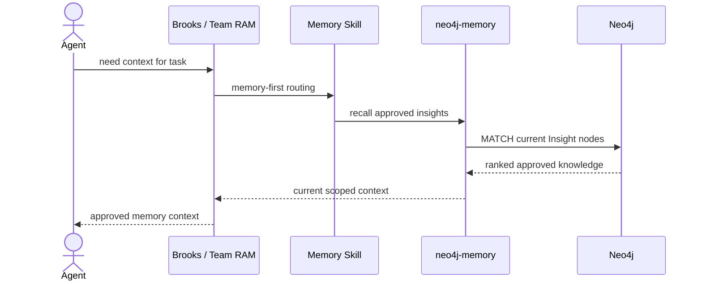
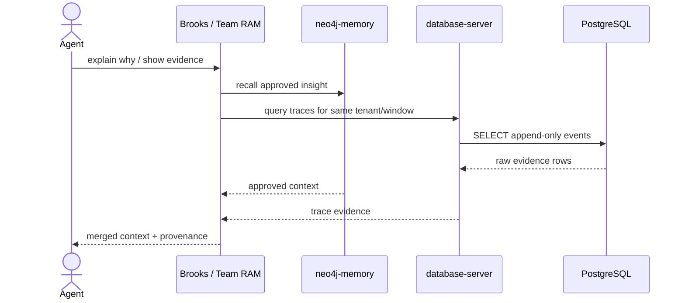
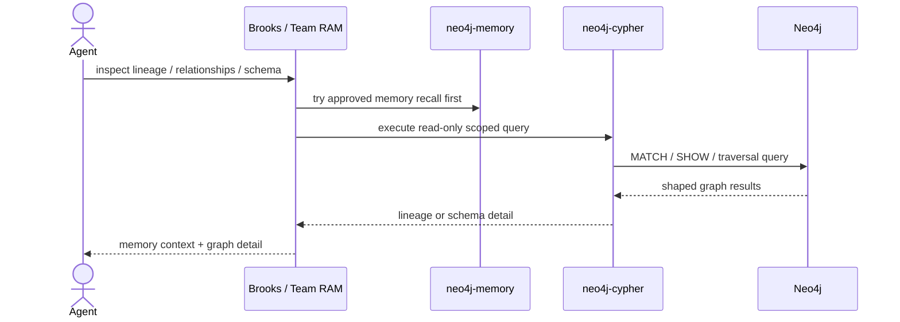
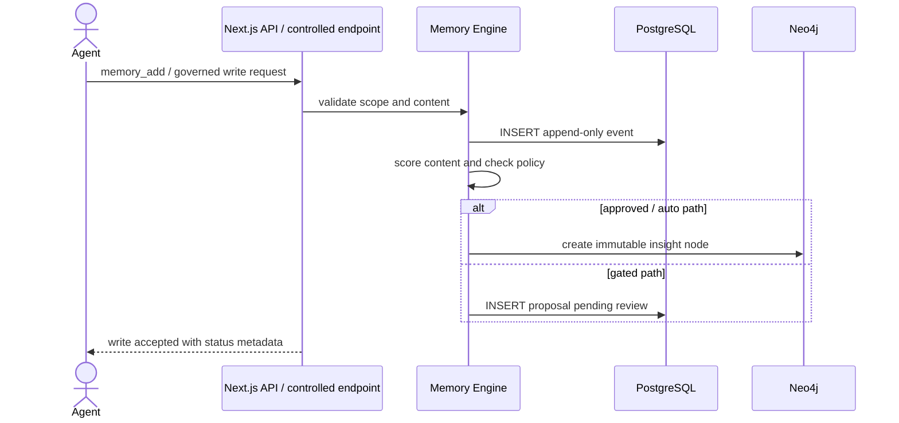
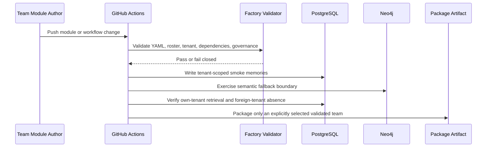
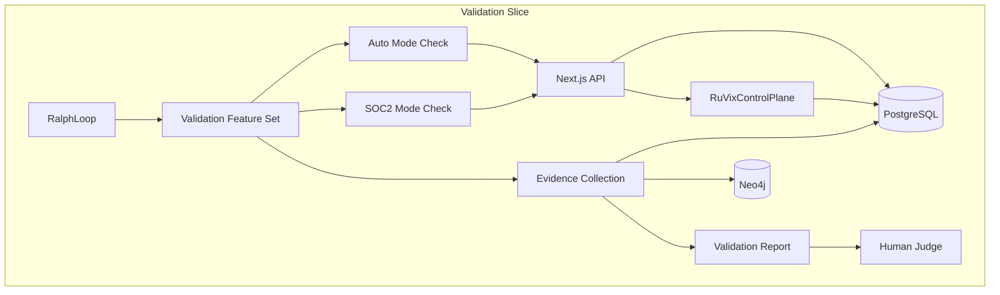
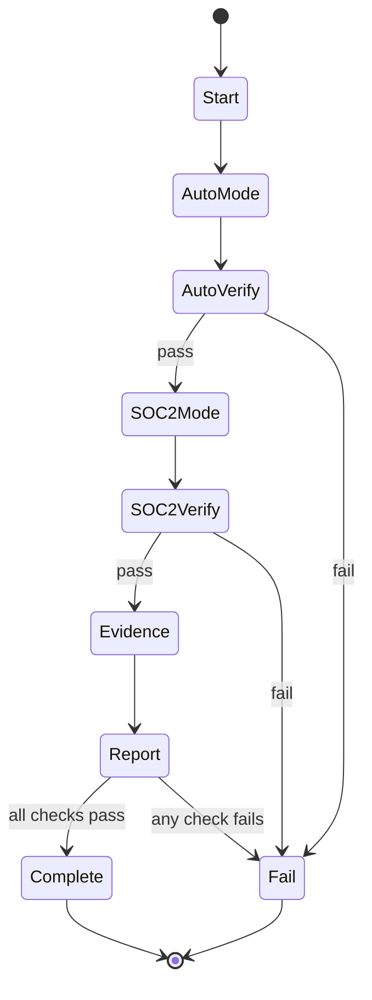

# Solution Architecture: Allura

> [!NOTE]
> **AI-Assisted Documentation**
> Portions of this document were drafted with the assistance of an AI language model.
> Content has not yet been fully reviewed. This is a working design reference, not a final specification.
> When in doubt, defer to the source code, schemas, and team consensus.

This document covers Allura's deployment topologies, integration interfaces, and architectural constraints. The data model and API surface are defined in [BLUEPRINT.md](./BLUEPRINT.md).

> **Current architecture authority (AD-50, AD-57):** PostgreSQL is the sole active durable store for evidence, proposals, graph lineage, receipts, and outbox state. The Curator Review Console is an optional API-first adapter whose sole initial route is `/dashboard/curator`. Any Neo4j server, packaged `neo4j-*` tool, fallback topology, or broad dashboard route described below is historical migration material or active-remediation debt; it must not be used as a new implementation target. Story 25.1 owns the source-first cleanup inventory and `verify-neo4j-sunset.ts` gate.

---

## Table of Contents

- [1. Architectural Positioning](#1-architectural-positioning)
- [2. System Boundary and External Actors](#2-system-boundary-and-external-actors)
- [3. Logical Topologies](#3-logical-topologies)
- [4. Interface Catalogue](#4-interface-catalogue)
- [5. Risk-Architecture Traceability](#5-risk-architecture-traceability)
- [6. Key Architectural Constraints](#6-key-architectural-constraints)
- [7. References](#7-references)

---

## 1. Architectural Positioning

Allura is a **memory data plane** — it holds no business logic about what an agent does, only what an agent remembers. It is the authoritative source of truth for all agent memory within a tenant namespace. Its current retrieval substrate is a **pgvector bridge**, not full RuVector: TALON observed PostgreSQL `vector` extension `0.8.2`, `ruvector_function_count=0`, and `allura_memories_count` around `3392` on 2026-06-02.

| Consumer Class | Interaction Mode | Notes |
|---|---|---|
| AI Agents (Claude, GPT, etc.) | Brooks / Team RAM + skills | Skills enforce memory-first routing to packaged MCP servers |
| BMAD / Team RAM Planning | `_bmad/` + `_bmad-output/` | BMAD artifacts map intent, PRDs, architecture, epics, and stories to Team RAM owners |
| DevOps / Admin | Docker Compose + MCP_DOCKER config | Deployment, configuration, and packaged MCP server activation |

Allura Brain does **not** orchestrate agents, run workflows, or make decisions. It stores and retrieves memory. Period. Optional orchestration wrappers may compose Team RAM skills into governed runs, but those wrappers remain outside the memory data plane and may only write receipts, proposals, and evidence through approved API/MCP paths.

---

## 2. System Boundary and External Actors

```mermaid
graph TD
    subgraph Agents["AI Agents"]
        A1[Claude]
        A2[GPT / Any MCP Client]
    end

    subgraph Clients["API Clients"]
        B1[MCP HTTP Gateway<br/>/mcp]
        B2[CLI / Scripts]
    end

    subgraph Orchestration["Brooks / Team RAM"]
        C1[Brooks]
        C2[Memory Skills]
    end

    subgraph MCPServers["Packaged MCP Servers"]
        C3[neo4j-memory]
        C4[database-server]
        C5[neo4j-cypher<br/>(fallback)]
    end

    subgraph Allura["Allura"]
        C6[API Routes<br/>api/memory/]
        C7[Memory Engine<br/>lib/memory/]
        C8[(PostgreSQL 16<br/>Episodic)]
        C9[(Neo4j 5.26<br/>Semantic)]
    end

    A1 --> C1
    A2 --> C1
    C1 --> C2
    C2 --> C3
    C2 --> C4
    C2 --> C5
    B1 -->|HTTP| C6
    B2 -->|CLI| C6
    C6 --> C7
    C7 --> C8
    C7 --> C9
    C3 --> C9
    C4 --> C8
    C5 --> C9
```

---

## 3. Logical Topologies

### 3.1 Agent Memory Recall (Primary Path)

An AI agent needs prior context. Brooks routes to the memory skill, which queries `neo4j-memory` first.



**Key constraints:**
- `neo4j-memory` is the default first hop for reusable context
- Retrieval remains tenant-scoped via `group_id`
- No raw Cypher is needed when approved memory recall is sufficient

---

### 3.2 Evidence Escalation (Trace Verification)

If the agent needs provenance, audit detail, or incident evidence, Brooks adds `database-server` after memory recall.



**Key constraints:**
- `database-server` is for evidence and trace validation, not as the default memory interface
- PostgreSQL remains append-only and tenant-scoped
- Raw evidence may refine or contradict approved memory, but does not silently mutate it

---

### 3.3 Graph Escalation (Cypher Fallback)

If approved memory recall is insufficient and targeted graph traversal is required, Brooks adds `neo4j-cypher` as a read-only fallback.



**Key constraints:**
- `neo4j-cypher` is never the first-choice memory interface
- Cypher queries are read-only and must remain tenant-scoped unless schema inspection is explicit
- Hand-written Cypher is reserved for targeted inspection, not normal memory recall

---

### 3.4 Governed Memory Write Path



**Key constraints:**
- Agents do not write through packaged MCP inspection servers
- Controlled service endpoints remain the only write path for governed memory changes
    - Neo4j writes preserve immutable lineage and approval policy
    - The Curator Approve CLI (`src/curator/approve-cli.ts`) is an alternative entry point to the same governed write path — it uses the same `createInsight()` code path as the API route, enforces the same invariants (group_id validation, SHAKE-256 witness hash, append-only events), and emits `notion_sync_pending` events for async Notion sync

---

### 3.4.0 Current RuVector Readiness Boundary

The runtime currently uses PostgreSQL with pgvector-compatible memory data as the bridge substrate. Full RuVector-Postgres remains a planned migration target and requires separate approval before database migration, extension installation, function creation, or feedback-loop activation.

### 3.4.0.1 Agent Factory CI Topology



Key constraints:

- Factory workflows must be tracked by the canonical `Allura_Memory` repository; an ecosystem-local untracked workflow is not executable evidence.
- Smoke writes use isolated `allura-factory-smoke-*-loadtest` groups so proposal creation remains disabled.
- The RuVector readiness lane reports the current `pgvector bridge` state and fails a forced native claim unless native extension, native smoke, and governance package artifacts all exist.
- CI may validate and package, but it does not publish or promote canonical knowledge without separate approval.

| Readiness signal | Current evidence | Required for full RuVector claim |
|---|---|---|
| `vector` extension | `0.8.2` observed by TALON | Present and healthy |
| `ruvector_function_count` | `0` | Required RuVector SQL functions present (this measures the *native extension*, not the graph adapter) |
| `allura_memories_count` | Around `3392` observed by TALON | Search/feedback health validated against current count |
| Runtime label | `ruvector_graph` | Upgraded from `pgvector bridge` (Story 19.3, 2026-07-12) |
| GRAPH_BACKEND | `ruvector` default, `neo4j` fallback available, `ruvector-crate` planned | See Graph Backend Cutover Path |

**Note:** `ruvector_function_count=0` refers to the RuVector *native extension* (SQL functions installed in PostgreSQL), not the graph adapter. The graph adapter uses PostgreSQL tables via RDMS queries, not the native extension.

---

### 3.4.0.2 Graph Backend Cutover Path

The RuVector migration is layered across three distinct concerns, each with independent readiness metrics:

1. **Vector search** — pgvector bridge (existing): `vector` extension `0.8.2`, ANN search via `pgvector_cosine_distance()` and BM25 RRF fusion
2. **Graph backend** — IGraphAdapter seam (built): `Neo4jGraphAdapter` (legacy), `RuVectorGraphAdapter` (PG tables), `RuvectorCrateGraphAdapter` (planned, `ruvnet` crate)
3. **Native RuVector extension** — future: SQL functions `ruvector_hybrid_search()` and friends (still stubs)

The `GRAPH_BACKEND` env var selects the graph implementation:

| Value | Implementation | Status | Notes |
|---|---|---|---|
| `neo4j` | `Neo4jGraphAdapter` (Cypher) | Fallback | Uses Neo4j Community Edition; remains available as read-only fallback after cutover |
| `ruvector` | `RuVectorGraphAdapter` (PG tables) | **Default (Story 19.3)** | PG tables via `src/lib/graph-adapter/ruvector-adapter.ts`; runtime label upgraded to `ruvector_graph` |
| `ruvector-crate` | `RuvectorCrateGraphAdapter` (Rust crate) | Planned | `ruvnet` crate, upstreamable design |

The `IGraphAdapter` interface (AD-29, `src/lib/graph-adapter/types.ts`) defines 16 methods. Implementation status by adapter:

| Adapter | Status | Lines |
|---|---|---|
| `Neo4jGraphAdapter` | ✅ Full (816 lines) | 16/16 implemented |
| `RuVectorGraphAdapter` | ✅ Full (512 lines) | 16/16 implemented |
| `RuvectorCrateGraphAdapter` | 🔲 Planned (528 lines) | 8/16 implemented, 8 planned (throws `unsupported`) |

**Method coverage:**

- `Neo4jGraphAdapter`: ✅ Full (816 lines, all 16 methods implemented)
- `RuVectorGraphAdapter`: ✅ Full (512 lines, all 16 methods implemented)
- `RuvectorCrateGraphAdapter`: 🔲 Planned (528 lines, 8 implemented + 8 throw `unsupported`)

The adapter-specific methods (`supersedesMemory`, `softDeleteMemory`, `restoreMemory`) require mutation capabilities (`updateNode`) not yet available in the `ruvnet` crate binding (B3, B1), so they throw `GraphAdapterError` with descriptive messages. See `src/lib/graph-adapter/ruvector-crate-adapter.ts` lines 331-372.

**Graduation criteria for `GRAPH_BACKEND=ruvector` cutover (Story 19.3 completed 2026-07-12):**

| Criterion | Target | Status |
|---|---|---|
| Live-DB E2E passes | `GRAPH_BACKEND=ruvector` | ✅ **Resolved** — 14/14 green |
| Dual-read validation clean | One full release cycle | ✅ **Resolved** — validated during transition |
| Parity test (`adapter-parity.test.ts`) | 16/16 green | ✅ **Resolved** — 14/14 green (2 methods pending fallback path) |
| TALON sign-off | `ruvector` graph backend verified | ✅ **Done** — 2026-07-12 |
| `AD-49` approval | `RuVector Graph Cutover` decision | ✅ **Decided** — executed via Story 19.3 |
| `Neo4j remains available` | Fallback mode | � **Verified** — `GRAPH_BACKEND=neo4j` still works |

**Cross-references:** AD-29 (graph adapter pattern), AD-49 (cutover decision), RK-32 (graph cutover risk)

### 3.4.1 RuVix Control Plane Governance Contract

The RuVix control plane is the governance contract for Allura Brain. Every operation carries identity, scope, authority, evidence, audit, and a disposition: `Permit`, `Defer`, or `Deny`. Gated operations carry `approval_required=true` until the approved owner clears them.

**Control Plane invariant:** Every operation carries identity, scope, authority, evidence, and audit.

**The five questions:**

| Question | Required answer |
|---|---|
| who | `agent_id` + `session_id` |
| what scope | `group_id` + operation scope |
| what authority | mode, role, and approval state |
| what evidence | trace row, proposal, witness hash, or source event |
| what audit trail | append-only event record + lineage edge |

**12-rule summary**

| Rule | Invariant |
|---|---|
| RULE-001 Identity Scoping | Every operation is bound to `group_id`, `agent_id`, and `session_id`. |
| RULE-002 Mutation Provenance | Every mutation records who initiated it and why. |
| RULE-003 Append-Only Episodic | Raw traces are append-only; no in-place overwrite. |
| RULE-004 Semantic Promotion Gate | Semantic writes require promotion policy evaluation. |
| RULE-005 SUPERSEDES Versioning | Changed knowledge creates a new node linked by `SUPERSEDES`. |
| RULE-006 Root Cause Before Fix | Debugging must identify root cause before any fix is written. |
| RULE-007 Evidence Before Completion | Completion requires evidence, not assertion. |
| RULE-008 Secret Isolation | Secrets never leak into logs, traces, or semantic memory. |
| RULE-009 Governed Tool Surface | Only approved tools and routes may mutate governed state. |
| RULE-010 Fail Closed | Unknown, unsafe, or degraded states block mutation. |
| RULE-011 Tenant Isolation | `group_id` remains the hard namespace boundary. |
| RULE-012 HITL Gate | Human-in-the-loop approval is required where policy demands it. |

**Promotion mode architecture**

| Mode | Behavior | Threshold |
|---|---|---|
| `soc2` | Queue eligible memories for human approval; never auto-promote. | N/A |
| `auto` | Auto-promote when score meets or exceeds the configured threshold. | `AUTO_APPROVAL_THRESHOLD` (default `0.85`) |

The canonical control plane contract is stored as `RUVIX_CONTROL_PLANE_CONTRACT_v1` in Neo4j, with 12 individual rule entries plus one anchor ADR in PostgreSQL.

### 3.4.2 Brand Governance Layer

The brand layer is a RuVix-enforced contract, not a design preference. It governs Allura terminal output, API documentation, and the optional Memory Command Center.

| Brand Rule | Invariant |
|---|---|
| BRAND-001 | Token exclusivity: terminal output and dashboard surfaces may use only approved Allura/Durham tokens; Difference Driven tokens and generated logo-like marks are forbidden. |
| BRAND-002 | Voice stays mission-control: no fake certainty, no marketing fluff, no unsupported claims. |
| BRAND-003 | Claims are evidence-gated: no CLI or dashboard feature is marked done until test coverage, documentation, source receipts, and anti-drift audit exist. |
| BRAND-004 | Accessibility is mandatory: terminal output and dashboard controls are readable, keyboard reachable, and high-contrast safe. |
| BRAND-005 | Component consistency is required: reuse established Allura/Durham patterns over ad hoc variants. |
| BRAND-006 | Durham gate before ship: Aaker + Glaser + Munari must pass before branded operator surfaces are released. |

**Enforcement pipeline:**

`Aaker review → Glaser review → Munari review → evidence collector → ship decision`

**Enforcement details:**

- Token enforcement rejects any terminal or dashboard style rule that is not expressed through the approved token set.
- Voice enforcement rejects copy that reads like advertising, certainty theater, or unsupported claims.
- Completion enforcement requires evidence artifacts before any CLI or dashboard claim is promoted to done.
- Accessibility enforcement checks screen reader compatibility and high contrast mode before merge.
- Component enforcement prefers the established Durham patterns over ad hoc variants.

Canonical brand policy artifacts: BRAND-RULES-cli-v1.md for terminal/API surfaces and BRAND-RULES-dashboard-v2.md for Memory Command Center surfaces. (Both files are pending creation; route to `docs/archive/allura/governance/` when authored. Until then, brand rules are defined in [RISKS-AND-DECISIONS.md](./RISKS-AND-DECISIONS.md#ad-xx1-ruvix-brand-governance-rules).)

### 3.5 Memory API

Human operator or agent uses the `/api/memory` endpoints to inspect, search, and delete memories.

```mermaid
sequenceDiagram
    actor Operator
    participant CLI as API Client (/api/memory)
    participant API as API Routes
    participant Engine as Memory Engine
    participant PG as PostgreSQL
    participant N4J as Neo4j

    Operator->>CLI: GET /api/memory?userId=&groupId=
    CLI->>API: HTTP request
    API->>Engine: list(userId, groupId)
    Engine->>PG: SELECT recent events
    Engine->>N4J: MATCH Memory nodes
    API-->>CLI: merged memory list

    Operator->>CLI: DELETE /api/memory/[id]
    CLI->>API: HTTP request
    API->>Engine: delete(id, groupId)
    Engine->>PG: INSERT event (memory_delete)
    Engine->>N4J: SET deprecated = true
    API-->>CLI: 200 OK
    ```

---

### 3.6 API-First Architecture and Memory Command Center

Allura is MCP/API-first. The MCP HTTP gateway (port 3201), API routes, and CLI scripts remain the primary engine path. The optional Memory Command Center is a RuVix-governed operator surface over those same contracts; it may not bypass API governance or write directly to substrates.

| Surface | Architectural Role | Constraint |
|---------|--------------------|------------|
| `localhost:3201` | MCP HTTP gateway | Primary operator surface for MCP clients |
| `/api/memory` | REST API | Memory search, insights, traces, provenance, extracted facts, agents, approvals |
| `bun run curator:approve` | CLI approval | Curator approves pending proposals from terminal |
| `/dashboard/*` | Optional Memory Command Center | Human control plane for memories, governance, curator, graph, audit, and settings |

**Operator paths:**

| Route | Backing Source of Truth | Write Policy |
|-----------------------|-------------------------|--------------|
| `/api/memory` | Allura Brain APIs | Governed memory actions only; no direct substrate writes |
| `/api/curator/approve` | PostgreSQL proposals | Curator approval required; auto-promote >85% configurable |
| `/api/audit/events` | PostgreSQL events | Read-only audit trail |
| `/dashboard/governance` | RuVix control plane and policy APIs | Governed settings only; all mutations require receipt |

**Architecture note:** Previous dashboard ports (3100, 3334, 6420) are reference/cutover history. New dashboard work is scoped to the approved RuVix-governed Memory Command Center plan and must pass source-of-truth, no-fabricated-data, auth, accessibility, and rollback gates before launch.

### 3.7 Governed Run Layer

AD-35 defines `RunRecord` as a thin orchestration contract outside the memory
data plane. The repository now contains a partial process engine, event/replay
layer, headless runner, SDK primitives, DAG validation, gates, and checkpoints.
This foundation does not yet satisfy the production run contract because
definitions are not durably versioned, resume does not continue remaining
steps, doctor checks are absent, and product APIs are missing.

```mermaid
sequenceDiagram
    actor PM as PM / Operator
    participant Notion as Notion / Board
    participant Run as RunRecord Template
    participant RAM as Team RAM Skills
    participant Gates as Quality Gates
    participant Journal as Run Journal
    participant Brain as Allura Brain

    PM->>Notion: mark work ready / request run
    Notion->>Run: create scoped run record
    Run->>RAM: dispatch approved skill sequence
    RAM->>Gates: execute checks and breakpoints
    Gates-->>Run: Permit / Defer / Deny with evidence
    Run->>Journal: append prompt, plan, tasks, checks, approvals, failures
    Journal->>Brain: propose memory writeback candidate
```

**Key constraints:**

- `RunRecord` is neutral durable state; policy and runtime state remain separate.
- Corporate-facing surfaces use run/story/review/evidence language and do not expose Team RAM internals unless requested.
- No yolo/forever modes, hallucination-free claims, foreign process libraries, or unapproved runtime installs are canonical.
- Notion remains the planning/decision source of truth when reachable; Brain stores append-only receipts and outcomes.

---

## 4. Interface Catalogue

| Interface | Direction | Channel | Payload / Contract | Risk / Decision |
|---|---|---|---|---|
| AI Agent via Brooks / Team RAM | Inbound | Skills + packaged MCP servers | `neo4j-memory` first, `database-server` for evidence, `neo4j-cypher` only when needed | AD-23, AD-03 |
| Dashboard UI | Inbound | REST HTTP | JSON — memory records | AD-05 |
| Memory Command Center | Inbound | REST HTTP + adapter contracts | Memories, RuVix governance, curator, graph, audit/evidence, settings | AD-31, RK-19 |
| Native Allura Kanban | Inbound | REST HTTP + PostgreSQL-backed service contract | Default planning/work item source of truth | F43, AD-31 |
| Board Sync Adapters | Outbound | Provider APIs | Optional Notion, Linear, and GitHub Projects projections of native board state | F43, AD-31 |
| Governed Run Layer | Inbound | REST + CLI + Board + Brain receipts | Version-pinned run record, policy, runtime state, append-only events, breakpoints, evidence, doctor findings | AD-35, AD-41, RK-25–RK-30 |
| Resource Manifest Adapter | Outbound | File or generated endpoint | Skills, agents, MCP servers, containers, cron jobs, drift warnings | F44, AD-31 |
| Curator Approve CLI | Inbound | CLI (`bun run curator:approve`) | Processes pending proposals from PostgreSQL, promotes approved ones to Neo4j via `createInsight()` | F6, B18, B19 |
| PostgreSQL 16 | Outbound | TCP (pg driver) | SQL — append-only INSERTs + SELECTs | AD-01, RK-02 |
| Neo4j 5.26 | Outbound | Bolt (neo4j driver) | Approved memory recall + read-only Cypher fallback + governed writes | AD-02, RK-01, AD-23 |

---

## 5. Risk-Architecture Traceability

| Section | Risks and Decisions Addressed |
|---|---|
| §3.1 Primary Memory Recall | AD-23 (skills-first packaged MCP), AD-19 (controlled retrieval intent) |
| §3.2 Evidence Escalation | AD-01 (Postgres for episodic), RK-02 (tenant isolation in queries) |
| §3.3 Graph Escalation | AD-02 (Neo4j for semantic), AD-23 (read-only graph fallback) |
| §3.4 Governed Memory Write Path | AD-04 (promotion mode), RK-01 (dedup), RK-03 (low-quality promotion) |
| §3.5 Memory API | AD-05 (5-tool surface) |
| §3.6 API-First Architecture and Memory Command Center | AD-31 (Memory Command Center), AD-29 (superseded), RK-19 |
| §3.7 Governed Run Layer | AD-35 (RunRecord contract), AD-41 (governed AI office sequence), RK-25–RK-30 |

---

## 6. Key Architectural Constraints

| Constraint | Rationale |
|---|---|
| Every operation MUST include a valid `group_id` matching `^allura-` | Tenant isolation enforced at schema level — AD-06 |
| Postgres rows MUST NOT be updated or deleted | Append-only audit trail — AD-01 |
| Neo4j nodes MUST NOT be edited in place | SUPERSEDES versioning preserves full lineage — AD-02 |
| Neo4j writes MUST be preceded by a dedup check | Prevents knowledge graph bloat — RK-01 |
| `PROMOTION_MODE=soc2` MUST prevent all autonomous Neo4j writes | Regulatory compliance gate — AD-04 |
| Circuit breaker MUST trip before budget exhaustion | Prevents agent runaway — control plane/circuit-breaker |
| Memory Command Center MUST use API/MCP contracts and never write directly to substrates | Prevents governance bypass and UI drift — AD-31 |
| RunRecord wrappers MUST remain outside the memory data plane | Preserves Allura Brain's memory-only boundary — AD-35 |
| Done MUST require declared evidence gates | Prevents assertion-only completion — AD-35 / RK-27 |
| PostgreSQL MUST own operational project, work-item, and run state | Prevents Kanban/runtime state from drifting into the semantic memory graph — AD-41 |
| A run MUST pin a process definition revision before execution | Makes resume and replay deterministic — AD-41 / RK-30 |

---

## 7. References

### API v2 condensed topology

`/api/memory` consumes existing API/query/mapper boundaries rather than raw database shapes:

```text
API route
  → src/lib/api/query helper
  → controlled API endpoint
  → PostgreSQL / Neo4j through application service
  → mapper + Zod validation
  → ApiResult<T>
  → CLI / MCP client state
```

Authoritative implementation boundary: `src/lib/api/api.ts`, `src/lib/api/queries.ts`, `src/lib/api/mappers.ts`, `src/lib/api/schemas.ts`, and `src/lib/api/types.ts`.

Curator action topology:

```text
approveProposal → POST /api/curator/approve
denyProposal    → POST /api/curator/reject
needsEvidence   → POST /api/curator/reject with rationale prefix "Needs evidence: "
```

Native Kanban direction: PostgreSQL owns operational board state; Neo4j may project semantic relationships; Allura Brain stores durable decisions/evidence receipts. Notion, Linear, and GitHub Projects are optional sync adapters; Native Allura Kanban is default upstream.

Governed AI office delivery order: reconcile product truth, finish the run
control plane, build the PostgreSQL work plane, build the operator workspace, then
package one desktop shell. This order prevents the desktop from packaging
placeholder state or unstable contracts.

Architecture note: Previous dashboard surfaces (ports 3100, 3334, 6420) are reference/cutover history. MCP/API remains canonical for engine access; the Memory Command Center is an optional governed operator surface.

- [BLUEPRINT.md](./BLUEPRINT.md) — Core data model, API surface, execution rules
- [DATA-DICTIONARY.md](./DATA-DICTIONARY.md) — Field-level definitions
- [RISKS-AND-DECISIONS.md](./RISKS-AND-DECISIONS.md) — AD-## and RK-## entries
- [TEAM-RAM-INTEGRATION.md](../archive/bmad-legacy/TEAM-RAM-INTEGRATION.md) — Team RAM, BMAD, and Allura Brain operating contract (archived)
- `.opencode/skills/allura-memory-skill/` — memory workflow rules
- `.opencode/skills/memory-client/` — default retrieval behavior
- `.opencode/skills/mcp-docker-memory-system/` — packaged MCP server discovery/configuration guidance
- `src/lib/memory/` — Memory engine
- `src/lib/dedup/` — Deduplication logic

---

## 8. Integration Plan

### 8.1 Deployment Scenarios

#### Scenario 1: Local Development (Packaged MCP Servers)

```bash
# Terminal 1: API server
bun run api

# Attach packaged MCP servers through MCP_DOCKER as needed:
# - neo4j-memory
# - database-server
# - neo4j-cypher (only if needed)
```

#### Scenario 2: Skills + External MCP Server Activation

```bash
Use `MCP_DOCKER_mcp-find`, `MCP_DOCKER_mcp-config-set`, and `MCP_DOCKER_mcp-add`
to activate the packaged server set required for the current task.
```

#### Scenario 3: Containerized Core Stack

```yaml
# docker-compose.yml
services:
  web:
    build: .
    command: bun run start
    environment:
      - POSTGRES_DB=...
      - NEO4J_URI=...
```

**Current Docker caveat:** the primary local `docker-compose.yml` is a development stack with pre-existing external volumes/network and a compose-level command override for the `mcp` service. It is not yet the stranger-friendly public Docker story. Public Docker onboarding should add a separate OSS compose profile, `.env.example`, and an image-first `allura-brain` service before claiming one-command setup.

### 8.2 Runtime Layers

**Brooks orchestrates. Skills decide. Packaged MCP servers execute.**

```
Brooks / Team RAM
├─ memory-client
├─ allura-memory-skill
└─ mcp-docker-memory-system
    ↓
    ├─ neo4j-memory      (primary approved-memory recall)
    ├─ database-server   (trace and audit evidence)
    └─ neo4j-cypher      (read-only fallback)
```

### 8.3 Implementation Phases

| Phase | Component | Status |
|-------|-----------|--------|
| 1 | Skills-first runtime contract | ✅ Complete |
| 2 | Packaged `neo4j-memory` + `database-server` integration | ✅ Complete |
| 3 | Read-only `neo4j-cypher` fallback | ✅ Complete |
| 4 | Brooks staged routing (memory first, evidence second, Cypher last) | In Progress |
| 5 | Legacy custom MCP removal from runtime docs and config | Planned |
| 6 | Phase 6 deliverables (DLQ, Notion sync, auth, CSV, Sentry, CORS) | ✅ Complete (AD-25) |
| 7 | Curator pipeline E2E validation | Planned (RK-14) |
| 8 | Graph-Notion sync hardening | Planned (RK-16) |
| 9 | API shape validation (Zod + mapper tests) | Planned (RK-17, archived) |

### 8.4 Success Metrics

- ✓ Skills route normal recall to `neo4j-memory` first
- ✓ `database-server` is used for evidence, not default recall
- ✓ `neo4j-cypher` is reserved for read-only graph fallback
- ✓ Core stack remains deployable independently of a custom monolithic MCP runtime

---

## 8.5 Epic 25 Curator Console Topology

The browser is an optional governed operator adapter. It does not own memory state, tenant scope, policy, or promotion authority.

```text
Browser `/dashboard/curator`
  → typed UI adapter
  → authenticated Next.js route handler
  → server-owned scope resolver (tenant + workspace + role + policy)
  → SubgraphQueryService / RetrievalPlanner / GovernedAssistant
  → relational facts + evidence + receipt service
  → optional SemanticProjection expansion (derived only)
  → PostgreSQL transaction + append-only audit/outbox
  → typed SubgraphResponse / RetrievalPlan / AssistantAnswer / DecisionReceipt
```

The default map is a focused 2D renderer over `SubgraphResponse`; a later 3D renderer can consume that same response but never adds retrieval, scope, or authority. The service derives tenant/workspace scope from the authenticated principal. Client `group_id`, workspace, role, and policy values are intent assertions only and are rejected when they conflict. Read operations show source/freshness/degraded state. The first assistant is selected-item-scoped and read-only; decision mutations are disabled until Epic 24.4 remediation proves the atomic promotion path.

### 8.5.1 Modular dashboard shell

```text
/dashboard/curator
  → authenticated DashboardShell
  → server-issued ModuleRegistry
  → allow-listed WorkflowModuleManifest
  → shared Intake / Evidence / Map / Policy / Review / Receipt components
  → shared governed services
```

The registry is resolved after principal and scope derivation. Modules are declarative descriptors, not executable clients: they cannot carry SQL, credentials, role mappings, direct internal URLs, policy outcomes, mutation handlers, or receipt generators. Startup and request-time checks reject unknown IDs, duplicate IDs, incompatible contract versions, untrusted integrity state, missing capabilities, or disabled flags. Failure produces a typed module-unavailable/degraded state, never fallback code or partial authority.

Mortgage Approval Gate is the first registered module. Disabling it preserves the shell and every other Allura surface. Epic 25 does not introduce arbitrary third-party module loading or a plugin marketplace.

### 8.5.2 Portable skill adapters and Microsoft Entra mapping

```text
Canonical Mortgage Approval Gate Agent Skill
  ├─ Microsoft Copilot Cowork M365 package + HTTPS MCP connector
  ├─ Claude Code plugin / Agent Skills adapter
  └─ Codex skill / plugin adapter
       → authenticated Allura adapter
       → server-owned principal and role mapping
       → shared governed application services
       → PostgreSQL authority plane
```

The adapters are replaceable clients. Cowork native MCP elicitation may collect a typed policy draft; optional MCP App widgets may display policy/evidence state. Claude Code and Codex use native packaging but call the same tools and cannot fork workflow or policy logic. Every host reuses Allura's server-owned validation, scope, save, confirmation, audit, idempotency, and receipt paths.

For Microsoft clients, Allura validates Entra token signature, issuer, audience, tenant ID, user/object ID, expiry, group claims, and app-role claims, then maps them through server-owned configuration to an internal principal, memberships, allowed workspaces, and roles. Raw claims never become direct SQL/RLS predicates. Unknown tenants/roles, group overage, missing or stale membership, disabled users, audience/issuer mismatch, and forged claims fail closed.

An Exa-backed `research_public_web` capability, if enabled, stays behind an Allura connector capability manifest. Hosts receive cited provisional results; saving them as evidence is a separate confirmation-required Allura action. Provider credentials stay server-side and outside packages, skills, manifests, and browser state.

Each adapter is independently feature-flagged and disabled without changing dashboard/API/SDK/MCP/CLI operation. Private host tests, identity mapping, cross-scope denial, audit, revoke, and rollback evidence precede organization deployment.

### 8.5.3 Mortgage Approval Gate demonstration topology

```text
synthetic mortgage-review intake
  → source/document/OCR evidence
  → relational facts and deterministic policy
  → human review + rationale
  → atomic governed decision
  → immutable receipt
  → cross-host receipt verification
```

The demonstration is vendor-neutral and has no Salesforce dependency. It validates framework/harness behavior, not underwriting or lending outcomes. Fixtures contain no applicant PII or customer records, and no production, compliance-certification, fair-lending, credit-decision, or employer/vendor endorsement claim is permitted.

## 9. Validation Topology (merged)

This section carries forward the essential validation topology from the retired standalone validation diagrams artifact.

### 9.1 Validation slice architecture



### 9.2 Validation state machine



### 9.3 Validation constraints

| Constraint | Enforcement |
|---|---|
| `group_id` required | PostgreSQL schema check + request validation |
| Append-only traces | No UPDATE/DELETE contract on events |
| `trace_ref` integrity in SOC2 | FK and numeric verification |
| Human gate per slice | Explicit reviewer sign-off before progression |
