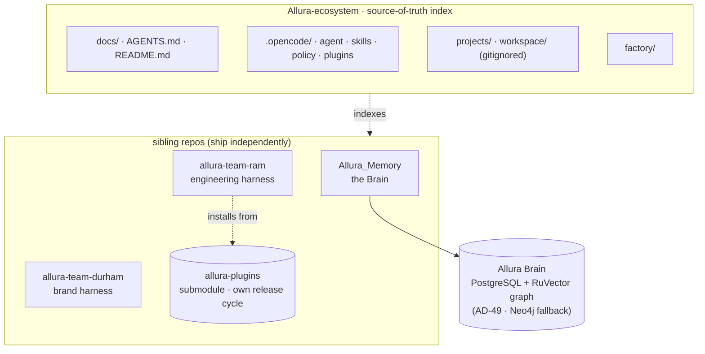
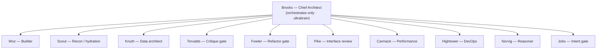
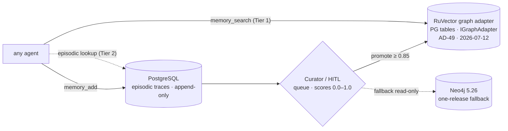
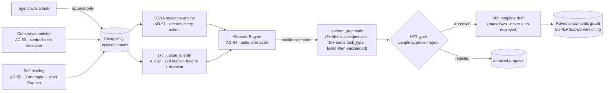

# Allura Ecosystem — Architecture

> The map of the system. Diagrams are Mermaid so GitHub renders them and they stay
> version-controlled (no stale screenshots). Detail lives in linked docs; this stays lean.
> **Canonical architecture source:** [`allura-memory/docs/allura/BLUEPRINT.md`](../allura-memory/docs/allura/BLUEPRINT.md).
> Source of truth for planning is Notion — this mirrors it. Updated 2026-07-25 to reflect
> the RuVector graph cutover (AD-49, 2026-07-12) and the Genesis Engine (AD-51–55, 2026-07-17).

Allura is a **governed memory engine** for AI agents — the layer that lets agents store what
they did, turn raw activity into trusted knowledge, and retrieve that knowledge later with
full auditability and reversibility. The core principle: **logs are not knowledge.** Raw
agent activity is cheap and noisy; knowledge is expensive, versioned, and approved. Allura
keeps these in separate layers and never lets them collapse into each other. Everything in
the ecosystem — every runtime, plugin, harness, and vertical app — rides on this same
governed Brain.

---

## 0. The Six Layers (never collapse them)

These layers are non-negotiable. Each one has a single job; collapsing any two breaks
auditability, versioning, or reversibility.

1. **Raw Trace Store — append-only.** All agent activity (events, tool calls, outputs,
   retries) goes to PostgreSQL. Append-only, forever. Never overwrite, never mutate a
   historical row. Every write carries `group_id` (pattern `^allura-[a-z0-9-]+$`).
2. **Curator Pipeline — proposes, never decides.** A service reads raw traces, finds
   patterns and learnings, and emits proposed Insights into an approval queue. It cannot
   create active knowledge. Its only output is a candidate waiting for approval.
3. **Versioned Knowledge — immutable nodes.** Insights are immutable. To change one,
   create a new Insight and link it: `SUPERSEDES`, `DEPRECATED`, or `REVERTED`. Never edit
   a node in place. Every Insight carries summary, evidence (linked to traces), confidence,
   timestamp, status, `group_id`.
4. **Approval — nothing goes active without it.** No Insight becomes active without
   human or policy approval. Approvals are recorded as audit events. This is the HITL
   gate; agents cannot promote their own knowledge.
5. **Retrieval Layer — agents never touch the database.** Agents query a service, not a
   store. The service reads approved Insights, optionally pulls raw traces, supports
   semantic + structured queries, and returns scoped context (project + global).
6. **Policy / API Layer — one controlled door.** All reads and writes go through governed
   endpoints enforcing tenant-level access, agent permissions, and audit logging.

The same loop holds whether the runtime is a Team RAM harness, a Co-Clawed pair, or a
vertical app. One Brain, one governance model, many products on top.

---

## 1. Ecosystem map



`Allura-ecosystem` is the **index** — not a code repo. Code lives in 10 sibling repos (see
`README.md`). Governance lives in `.opencode/` (agents, skills, policies, plugins). The
**Brain** is the shared governed memory every agent reads and writes through MCP.

---

## 2. Team RAM — the surgical team

One architect (Brooks) holds conceptual integrity; specialists keep their craft. Model tier
per agent is set in the model registry (`allura-plugins/docs/models.yaml`).



Agents are defined once in `.opencode/agent/`; per-runtime mirrors are generated. The only
per-runtime difference is the model. Hand-editing a mirror is forbidden — CI fails on drift.

---

## 3. The Brain — memory data-flow (RuVector primary, AD-49)

Dual-layer on one PostgreSQL engine: episodic traces land first (append-only), promoted
insights graduate to the semantic knowledge graph through a human-in-the-loop curator. The
semantic graph runs on the **RuVector graph adapter** (`IGraphAdapter` backed by PG tables)
as of the AD-49 cutover (2026-07-12). `GRAPH_BACKEND=ruvector` is the production default;
`GRAPH_BACKEND=neo4j` remains as read-only fallback for one release (AD-50 formalized the
Neo4j sunset on 2026-07-17). Append-only throughout; `group_id = allura-system` on every read
and write.



**Runtime flag:**

| `GRAPH_BACKEND` | Adapter | Status |
|-----------------|---------|--------|
| `ruvector` (default) | `RuVectorGraphAdapter` (PG tables) | Production · AD-49 cutover complete 2026-07-12 · 14/14 parity green |
| `neo4j` | `Neo4jGraphAdapter` | Read-only fallback for one release (AD-50 sunset 2026-07-17) |
| `ruvector-crate` | `RuvectorCrateGraphAdapter` (Rust) | Opt-in spike (Path B, 13/16 methods) |
| `GRAPH_DUAL_READ=true` | wraps selected backend | Safety net — dual-read validation during cutover |

The cutover removes the per-person Neo4j Community license wall (1 user), collapses two
stores toward one engine, and enables self-hosted graphs. Native RuVector extension
functions (`ruvector_function_count > 0`) remain Stage 2, gated on TALON evidence (RK-21).

---

## 4. The RuVector boundary — RuVector executes, Allura governs

RuVector and Allura have a hard boundary. Each side owns its concerns and does not reach
across. **Depend on the interface, not the implementation.** RuVector is a high-performance
execution substrate Allura calls; it never sees or enforces tenancy, approval, or lineage —
those stay in the Allura API layer.

| RuVector owns (the engine) | Allura owns (the governance) |
|---|---|
| Vector storage | Tenancy (`group_id`) |
| Retrieval (HNSW, GNN, Graph RAG) | HITL approval / curator |
| Routing (Tiny Dancer, semantic routing) | Knowledge promotion |
| DAG execution (rudag) | SUPERSEDES versioning |
| Circuit breakers (tiny-dancer) | Append-only audit history |

If RuVector enforced `group_id`, we'd have to re-implement governance if we ever swapped
engines. By keeping the boundary hard, Allura's governance works regardless of the retrieval
engine underneath. See `.opencode/policy/ruvector-boundary.md` and
`docs/archive/factory-planning/allura-ruvector-integration-adr.md`.

---

## 5. The self-improvement loop (Genesis Engine — AD-51 through AD-55)

The Genesis Engine is the Level 4 self-evolution layer, unparked by the Captain on
2026-07-17. It watches what agents do and proposes new skills — but it never decides. People
approve every proposal. The loop:



| AD | Component | Role |
|----|-----------|------|
| AD-51 | SONA trajectory engine | Records every agent action as a trajectory — the raw dataset for pattern detection. Async write — never blocks the operation being recorded. |
| AD-52 | Skill-usage telemetry | Every skill load logged with name, success/fail, token count, duration. Append-only, `group_id` stamped. Feeds Genesis + weekly audit. |
| AD-53 | Coherence monitor | Scans recent memories for semantic conflicts (entity-attribute, temporal, duplicate-with-different-fact). pgvector cosine similarity finds candidates; HITL reviews high-severity. |
| AD-54 | Genesis Engine | Analyzes trajectories + skill usage to detect repeated patterns. Generates proposals with confidence scores. HITL gate: approved proposals create skill template drafts (markdown), **never auto-deployed**. |
| AD-55 | Self-healing | Health monitor checks PostgreSQL, MCP container, disk, memory. Auto-recovery (restart, recovery scripts) — max 3 attempts before alerting Captain via Brain `memory_add`. |

All Level 4 writes go through the kernel `syscall_mutate` (AD-40). HITL gates remain on all
self-modification. See epic: `_bmad-output/planning-artifacts/epic-level-4-pattern-learning.md`.

---

## 6. Agent sync — one persona, two runtimes

The body lives once in `.opencode/agent/`; `.claude` mirrors are generated. The **only**
per-runtime difference is the model. Hand-editing a mirror is forbidden — CI fails on drift.

```mermaid
flowchart LR
  SRC["`.opencode/agent/core/*.md`<br/>SOURCE OF TRUTH"] --> GEN["sync-agents.mjs"]
  MAP["`models.map.json`<br/>per-runtime model by tier"] --> GEN
  GEN --> MIRROR["`.claude/agents/*.md`<br/>generated mirror (do not edit)"]
  GEN -->|"--check"| CI{"CI drift gate<br/>exit 1 on drift"}
```

---

## Related docs

- **Canonical architecture:** [`allura-memory/docs/allura/BLUEPRINT.md`](../allura-memory/docs/allura/BLUEPRINT.md) — sections 0–12 (brand, concepts, requirements, architecture, data model, API surface, audit, admin, references, doc authority).
- **Canonical risks & decisions:** [`allura-memory/docs/allura/RISKS-AND-DECISIONS.md`](../allura-memory/docs/allura/RISKS-AND-DECISIONS.md) — AD-49 (RuVector cutover), AD-50 (Neo4j sunset), AD-51–55 (Level 4 self-improvement), RK-21 (RuVector overclaim), RK-32 (cutover risk, resolved).
- Consolidation plan & goal: [`ALLURA-CONSOLIDATION-PLAN.md`](./ALLURA-CONSOLIDATION-PLAN.md), [`ALLURA-CONSOLIDATION-GOAL.md`](./ALLURA-CONSOLIDATION-GOAL.md)
- Target layout: [`ALLURA-LAYOUT.md`](./ALLURA-LAYOUT.md)
- RuVector integration plan: [`docs/archive/factory-planning/ruvector-cicd-execution-plan.md`](./archive/factory-planning/ruvector-cicd-execution-plan.md)
- RuVector boundary ADR: [`docs/archive/factory-planning/allura-ruvector-integration-adr.md`](./archive/factory-planning/allura-ruvector-integration-adr.md)
- Journal entries: [`journal/`](./journal/)

---

## Non-negotiable constraints (mirrors AGENTS.md)

- **`group_id` on every read/write** — pattern `^allura-[a-z0-9-]+$`. Missing it is a hard failure.
- **PostgreSQL traces are append-only** — no `UPDATE`/`DELETE` on trace rows, ever.
- **Neo4j versioning via `SUPERSEDES`** — never mutate historical nodes. Applies to both
  Neo4j and RuVector graph adapters via `IGraphAdapter`.
- **`GRAPH_BACKEND=ruvector` is the production default** (AD-49) — Neo4j is fallback only.
  Do not flip back without AD-49 governance.
- **HITL required for promotion** — agents cannot autonomously promote to the semantic
  graph; route through `curator:approve`. The Genesis Engine proposes; people approve.
- **DB ops via MCP tools only** — never `docker exec`.
- **`allura-*` namespace only** — flag any `roninclaw-*` as drift.
- **Do not collapse the six layers.** Do not treat logs as knowledge. Do not allow direct
  writes to the semantic graph without approval.
- **Prioritize auditability, versioning, and clarity over speed.**

---

## Current state vs. plan (drift log)

> Updated 2026-07-25. The consolidation move (Phases 0/1/2/4) is **DONE**. The Turborepo
> apps/packages/tooling layout (Phase 3) is **deprioritized** — `Allura-ecosystem` is now
> the source-of-truth index, not a code monorepo. The RuVector graph cutover (AD-49,
> 2026-07-12) is complete and is the final structural step. Real on-disk state:

| Path | Status | Notes |
| --- | --- | --- |
| `projects/allura-memory-mcp/` | **Present** | Photo agent MVP (v3) — self-hosted fal.ai photo editor + memory. See `DESIGN.md`. Gitignored local artifact. |
| `workspace/` | **Present** | Local scratch working area (`memory/`, `readme-edits/`). Gitignored. |
| `.opencode/policy/` | **Present** | 10 governance policies including `ruvector-boundary.md`, `append-only-traces.md`, `supersedes-versioning.md`. |
| `.opencode/plugins/` | **Present** | Local plugin hooks (`allura-governance.ts`). |
| `.opencode/skills/` | **Present** | 25 skills — see ALLURA-LAYOUT.md for the full table. 13 newer governance/craft skills added since 2026-06-14. |
| `allura-memory/`, `Agent-Harnesses/Allura-TeamRam/`, `allura-plugins/` | **Submodules** | Decision: keep as submodules. Each ships independently with its own release cycle. |
| `web/payload/auntie-ny/` | **Present, gitignored** | 93 MB, upstream clone is source of truth. |
| `web/payload/dd-site-payload/` | **Present, gitignored** | 6.6 GB, gitignored sibling. |

**Mermaid diagram in §1 shows the current state, not a target.** The RuVector graph
adapter is the production semantic backend (AD-49, 2026-07-12); Neo4j 5.26 is read-only
fallback for one release (AD-50 sunset 2026-07-17).
