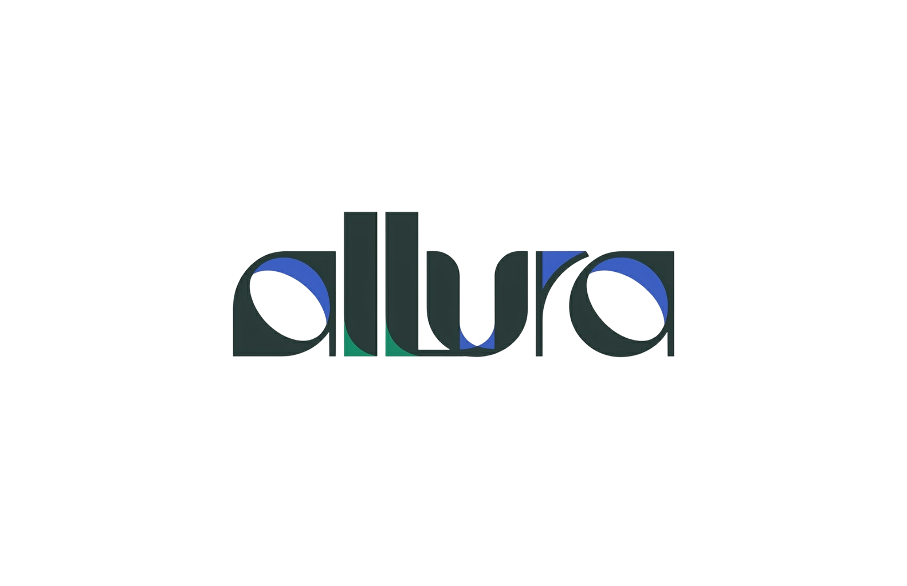
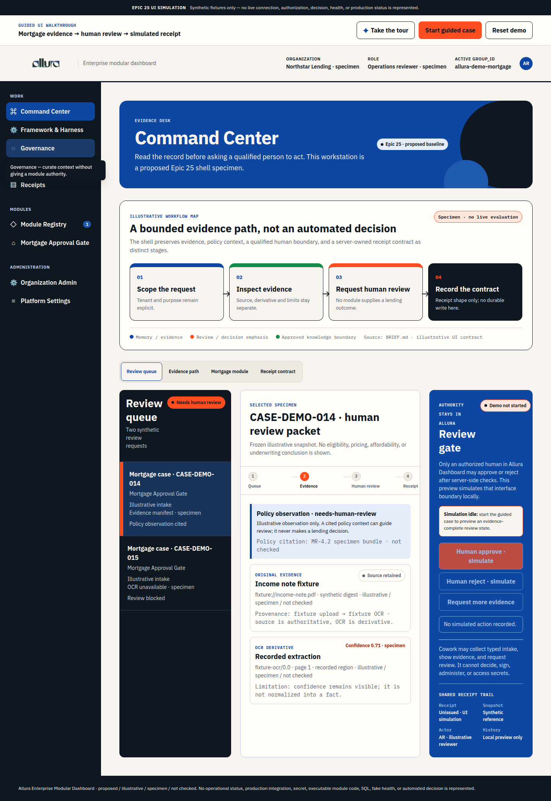
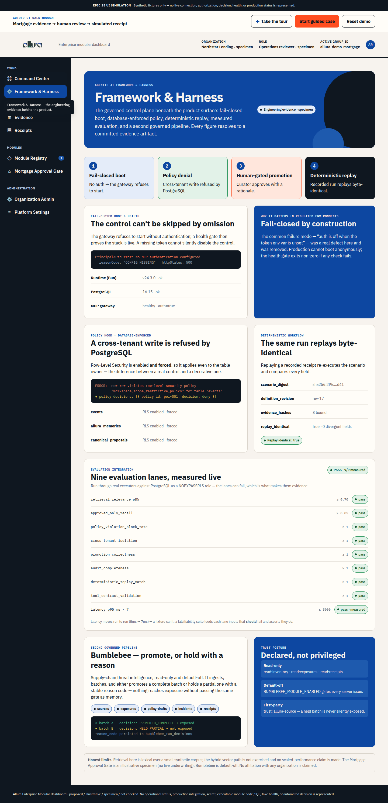
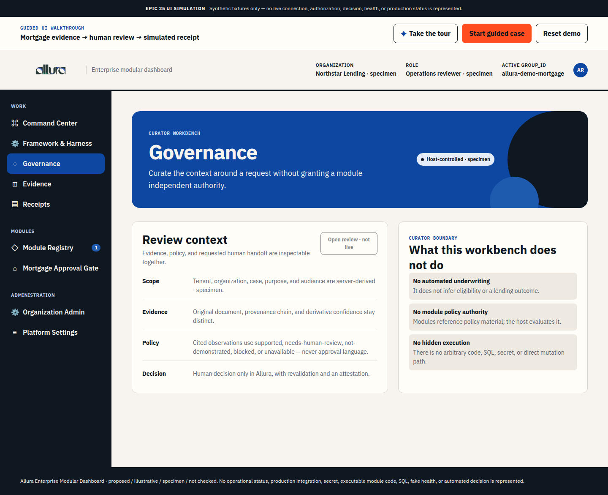
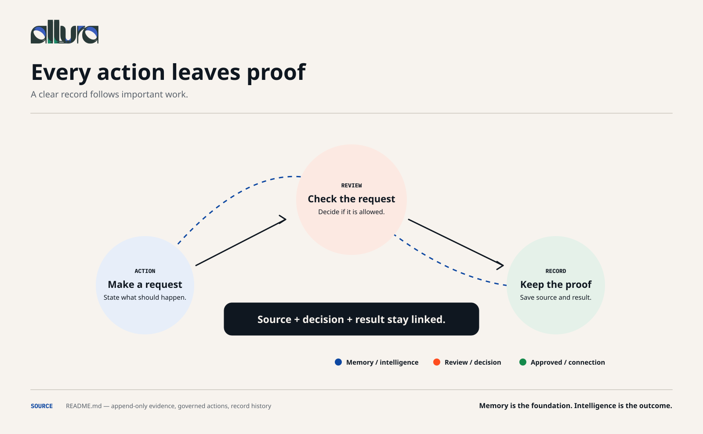
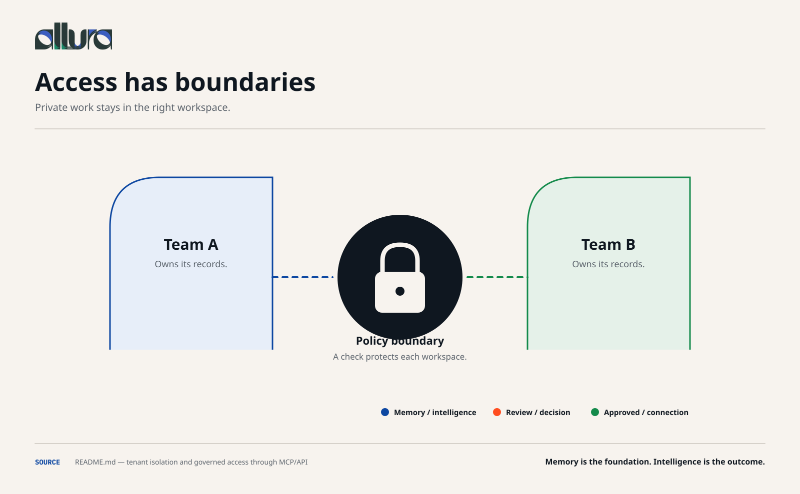
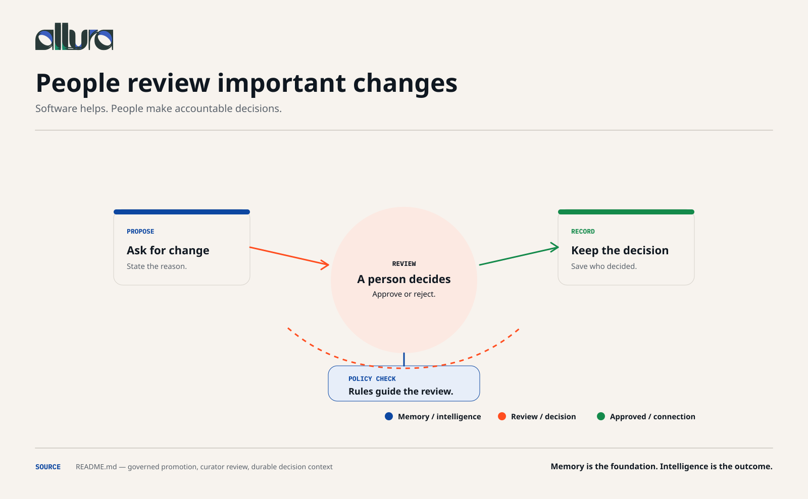
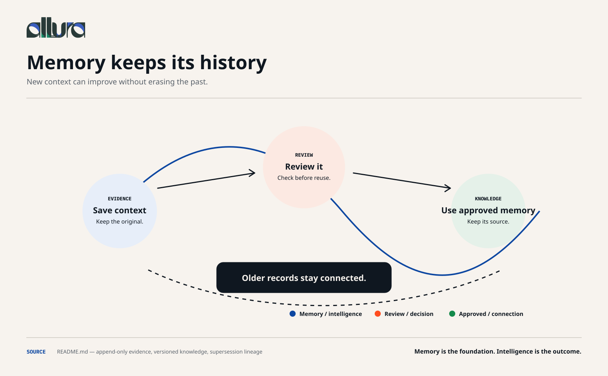
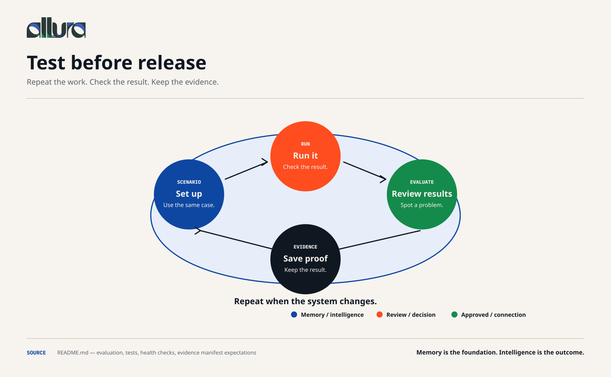
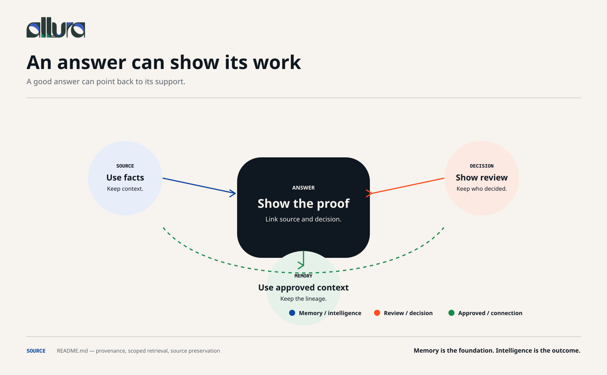

  

<h1 align="center">Agentic AI Framework &amp; Harness — Portfolio</h1>

  <strong>An evidence-first case study of the Allura governed control plane.</strong> 
  Reusable agent framework, deterministic harness, policy hooks, governed memory, and measured evaluation — each claim resolves to a committed artifact.

  <a href="https://allura-governed-demo.vercel.app"><strong>▶ Open the live interactive demo</strong></a>

---

## Live interactive demo

A self-contained, self-guided walkthrough of the governed operator surface — no install, no Docker, one link.

  

- **Nine surfaces, one shell** — Command Center, Framework &amp; Harness, Governance, Evidence, Receipts, Module Registry, Mortgage Approval Gate, Organization Admin, Platform Settings.
- **Guided tour** — a 14-stop coached walkthrough (dim + spotlight + popover) that opens the Framework view, walks each surface, and runs a live review case. Auto-runs once, replayable via **Take the tour**; hover any control for a one-line hint.
- **Framework &amp; Harness view** — the engineering case: fail-closed boot, database-enforced policy denial, deterministic replay, nine live evaluation lanes, and the Bumblebee promote-or-held pipeline.

  

  

> The demo uses synthetic specimen data only. It makes no claim of affiliation with, deployment by, or endorsement from any organization.

## Evidence infographics

Six editable visuals explaining how Allura turns captured context into trusted intelligence. Each links to its full-size PNG; editable SVGs and full descriptions are in the [evidence infographic set](evidence-infographics/README.md).

|  |  |
| --- | --- |
|  <strong>Every action leaves proof</strong> |  <strong>Access has boundaries</strong> |
|  <strong>People review important changes</strong> |  <strong>Memory keeps its history</strong> |
|  <strong>Test before release</strong> |  <strong>An answer can show its work</strong> |

## Deliverables

| Artifact | What it is |
| --- | --- |
| [`interactive-demo/`](interactive-demo/) | The self-contained dashboard demo ([live](https://allura-governed-demo.vercel.app)) — see its [README](interactive-demo/README.md). |
| `evidence-infographics/` | Six editable SVG infographics (+ PNG renders) with embedded accessibility metadata. |
| `deck/Allura-Agentic-AI-Framework-Harness-Portfolio.pptx` | A ten-slide presentation with speaker-note sources. |
| [`ROLE-MAPPING.md`](ROLE-MAPPING.md) | Role requirements mapped to inspectable Allura evidence. |
| [`SOURCES.md`](SOURCES.md) · [`ALT-TEXT.md`](ALT-TEXT.md) | Provenance and accessible descriptions. |
| [`BRAND-AUDIT.md`](BRAND-AUDIT.md) · [`BRAND-SOURCE-RESOLUTION.md`](BRAND-SOURCE-RESOLUTION.md) · [`qa/BRAND-RELEASE-GATE.md`](qa/BRAND-RELEASE-GATE.md) | The remediation decision and release review. |

## How each claim is grounded

Every figure in the demo and deck resolves to a committed artifact:

- Framework &amp; harness architecture — [`FRAMEWORK.md`](../../../FRAMEWORK.md)
- Captured demo runs — [`DEMO-EVIDENCE-PACK.md`](../DEMO-EVIDENCE-PACK.md)
- Raw logs — [`artifacts/portfolio-demo/`](../../../artifacts/portfolio-demo/)
- Case study — [`principal-engineer-case-study.md`](../principal-engineer-case-study.md)

## Presentation boundary

This is a role-aligned technical case study. It makes no claim that Allura is in use by, endorsed by, or associated with any specific employer. Retrieval in the demo is lexical over a small synthetic corpus — no scaled-performance claim is made. Quantitative statements are limited to the cited evidence artifacts.
